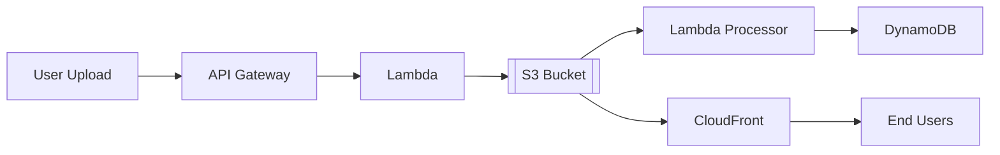

# :octicons-cloud-16: AWS S3 (Simple Storage Service)

> Object storage built for the internet. Store and retrieve any amount of data from anywhere.

S3 is AWS's foundational storage service—think of it as an infinitely scalable hard drive accessible via HTTP. It's where you store files, backups, static websites, data lakes, and pretty much anything that needs reliable, cheap storage. 99.999999999% (11 nines) durability means you'll lose yourself before you lose your data.

---

## :octicons-zap-16: Quick Start

=== "Essential Commands"
    ```bash
    # Upload file - most common operation
    aws s3 cp local-file.txt s3://my-bucket/path/file.txt  # (1)!

    # Download file
    aws s3 cp s3://my-bucket/file.txt ./local-file.txt  # (2)!

    # Sync directory (like rsync)
    aws s3 sync ./local-dir s3://my-bucket/path/ --delete  # (3)!

    # List bucket contents
    aws s3 ls s3://my-bucket/path/  # (4)!

    # Remove file
    aws s3 rm s3://my-bucket/file.txt  # (5)!

    # Make bucket
    aws s3 mb s3://my-unique-bucket-name --region us-east-1  # (6)!
    ```

    1. :octicons-info-16: Uploads single file, sets metadata automatically
    2. :octicons-info-16: Downloads to local filesystem
    3. :octicons-info-16: `--delete` removes files in S3 not in local (careful!)
    4. :octicons-info-16: Lists objects with prefix filtering
    5. :octicons-info-16: Permanent deletion (no recycle bin unless versioning enabled)
    6. :octicons-info-16: Bucket names must be globally unique across ALL AWS accounts

=== "Python SDK"
    ```python
    import boto3
    from botocore.exceptions import ClientError

    # Initialize client
    s3 = boto3.client('s3')

    # Upload file with metadata
    def upload_file(file_path, bucket, key):
        try:
            s3.upload_file(
                file_path,
                bucket,
                key,
                ExtraArgs={
                    'ACL': 'private',  # Don't leak shit
                    'ContentType': 'text/plain',
                    'Metadata': {
                        'uploaded-by': 'my-app'
                    }
                }
            )
            return True
        except ClientError as e:
            print(f"Upload failed: {e}")
            return False

    # Download file
    def download_file(bucket, key, local_path):
        try:
            s3.download_file(bucket, key, local_path)
            return True
        except ClientError as e:
            print(f"Download failed: {e}")
            return False

    # Generate presigned URL (temporary download link)
    def get_download_url(bucket, key, expiration=3600):
        """Generate URL valid for 1 hour"""
        try:
            url = s3.generate_presigned_url(
                'get_object',
                Params={'Bucket': bucket, 'Key': key},
                ExpiresIn=expiration
            )
            return url
        except ClientError as e:
            print(f"URL generation failed: {e}")
            return None
    ```

=== "Terraform"
    ```hcl
    # S3 bucket with security best practices
    resource "aws_s3_bucket" "data" {
      bucket = "my-company-data-${var.environment}"

      tags = {
        Name        = "data-bucket"
        Environment = var.environment
        ManagedBy   = "terraform"
      }
    }

    # Block public access (CRITICAL)
    resource "aws_s3_bucket_public_access_block" "data" {
      bucket = aws_s3_bucket.data.id

      block_public_acls       = true
      block_public_policy     = true
      ignore_public_acls      = true
      restrict_public_buckets = true
    }

    # Enable versioning (data protection)
    resource "aws_s3_bucket_versioning" "data" {
      bucket = aws_s3_bucket.data.id

      versioning_configuration {
        status = "Enabled"
      }
    }

    # Server-side encryption (always encrypt)
    resource "aws_s3_bucket_server_side_encryption_configuration" "data" {
      bucket = aws_s3_bucket.data.id

      rule {
        apply_server_side_encryption_by_default {
          sse_algorithm = "AES256"
        }
      }
    }
    ```

!!! tip "Real Talk :octicons-light-bulb-16:"
    - **Bucket names are globally unique** - `my-bucket` is taken, use `company-project-env-bucket-uuid`
    - **Block public access by default** - 90% of S3 breaches are misconfigured public buckets
    - **Enable versioning** - Costs pennies, saves your ass when you accidentally delete something
    - **Use lifecycle policies** - Transition old data to Glacier, save 80% on storage costs
    - **Always encrypt** - AES256 is free, KMS costs but gives audit trails

---

## :octicons-book-16: Core Concepts

### Buckets

Containers for objects. Think of them as top-level folders, but they're actually separate namespaces.

```bash
# Create bucket with specific region
aws s3api create-bucket \
  --bucket my-bucket \
  --region us-west-2 \
  --create-bucket-configuration LocationConstraint=us-west-2
```

**Why this matters:** Buckets live in a specific region (affects latency and cost), but names are globally unique. Choose your region based on where your users/services are.

### Objects

Files stored in buckets. Can be 0 bytes to 5TB. Each object has a key (path), metadata, and data.

```bash
# Upload with storage class
aws s3 cp file.txt s3://my-bucket/data/file.txt \
  --storage-class INTELLIGENT_TIERING
```

**Why this matters:** Storage class affects cost and retrieval time. Use STANDARD for frequent access, INTELLIGENT_TIERING for unpredictable patterns.

### Keys (Paths)

Object identifier within a bucket. Looks like a file path but S3 is actually flat—no real directories.

!!! warning "Common Mistake :octicons-alert-16:"
    Keys like `data/2024/01/file.txt` look hierarchical, but S3 treats this as a single string. The S3 console fakes directories for UX. When listing, every object with prefix `data/2024/` gets scanned—can be slow and expensive on millions of objects.

---

## :octicons-checklist-16: Common Use Cases

### Use Case 1: Static Website Hosting

**Scenario:** Host HTML/CSS/JS site without servers

=== "CLI"
    ```bash
    # Enable website hosting
    aws s3 website s3://my-bucket/ \
      --index-document index.html \
      --error-document error.html

    # Upload site files
    aws s3 sync ./dist s3://my-bucket/ \
      --acl public-read \
      --cache-control "max-age=86400"

    # Get website URL
    echo "http://my-bucket.s3-website-us-east-1.amazonaws.com"
    ```

=== "Python"
    ```python
    def deploy_website(bucket, local_dir):
        """Deploy static website to S3"""
        s3 = boto3.client('s3')

        # Configure bucket as website
        s3.put_bucket_website(
            Bucket=bucket,
            WebsiteConfiguration={
                'IndexDocument': {'Suffix': 'index.html'},
                'ErrorDocument': {'Key': 'error.html'}
            }
        )

        # Upload files with correct MIME types
        import mimetypes
        import os

        for root, dirs, files in os.walk(local_dir):
            for file in files:
                local_path = os.path.join(root, file)
                s3_path = os.path.relpath(local_path, local_dir)

                content_type, _ = mimetypes.guess_type(file)

                s3.upload_file(
                    local_path,
                    bucket,
                    s3_path,
                    ExtraArgs={
                        'ContentType': content_type or 'application/octet-stream',
                        'CacheControl': 'max-age=86400'
                    }
                )
    ```

=== "Terraform"
    ```hcl
    # Website bucket
    resource "aws_s3_bucket" "website" {
      bucket = "my-site-${random_id.suffix.hex}"
    }

    resource "aws_s3_bucket_website_configuration" "website" {
      bucket = aws_s3_bucket.website.id

      index_document {
        suffix = "index.html"
      }

      error_document {
        key = "error.html"
      }
    }

    # Public read policy
    resource "aws_s3_bucket_policy" "website" {
      bucket = aws_s3_bucket.website.id

      policy = jsonencode({
        Version = "2012-10-17"
        Statement = [
          {
            Sid       = "PublicReadGetObject"
            Effect    = "Allow"
            Principal = "*"
            Action    = "s3:GetObject"
            Resource  = "${aws_s3_bucket.website.arn}/*"
          }
        ]
      })
    }
    ```

**Result:** Website accessible at `http://bucket-name.s3-website-region.amazonaws.com`

---

### Use Case 2: Backup & Disaster Recovery

**Scenario:** Automated backups with lifecycle management

=== "CLI"
    ```bash
    # Upload backup with metadata
    aws s3 cp /var/backups/db-$(date +%Y%m%d).sql.gz \
      s3://my-backups/databases/ \
      --storage-class STANDARD_IA \
      --metadata backup-date=$(date +%Y%m%d),source=prod-db

    # Configure lifecycle (transition to Glacier after 30 days)
    aws s3api put-bucket-lifecycle-configuration \
      --bucket my-backups \
      --lifecycle-configuration file://lifecycle.json
    ```

    **lifecycle.json:**
    ```json
    {
      "Rules": [
        {
          "Id": "TransitionToGlacier",
          "Status": "Enabled",
          "Prefix": "databases/",
          "Transitions": [
            {
              "Days": 30,
              "StorageClass": "GLACIER"
            },
            {
              "Days": 90,
              "StorageClass": "DEEP_ARCHIVE"
            }
          ],
          "Expiration": {
            "Days": 365
          }
        }
      ]
    }
    ```

=== "Python"
    ```python
    def backup_to_s3(local_file, bucket, prefix):
        """Upload backup with intelligent tiering"""
        s3 = boto3.client('s3')

        key = f"{prefix}/{datetime.now().strftime('%Y/%m/%d')}/{os.path.basename(local_file)}"

        try:
            s3.upload_file(
                local_file,
                bucket,
                key,
                ExtraArgs={
                    'StorageClass': 'STANDARD_IA',
                    'ServerSideEncryption': 'AES256',
                    'Metadata': {
                        'backup-date': datetime.now().isoformat(),
                        'source': os.environ.get('HOSTNAME', 'unknown')
                    }
                }
            )
            print(f"Backup uploaded: s3://{bucket}/{key}")
            return True
        except ClientError as e:
            print(f"Backup failed: {e}")
            return False
    ```

=== "Terraform"
    ```hcl
    # Backup bucket with lifecycle
    resource "aws_s3_bucket" "backups" {
      bucket = "company-backups-${var.region}"
    }

    resource "aws_s3_bucket_lifecycle_configuration" "backups" {
      bucket = aws_s3_bucket.backups.id

      rule {
        id     = "database-backups"
        status = "Enabled"

        filter {
          prefix = "databases/"
        }

        transition {
          days          = 30
          storage_class = "GLACIER"
        }

        transition {
          days          = 90
          storage_class = "DEEP_ARCHIVE"
        }

        expiration {
          days = 365
        }
      }
    }
    ```

**Result:** Automated cost optimization—recent backups in STANDARD_IA (~$0.0125/GB), 30-day old in GLACIER (~$0.004/GB), 90-day old in DEEP_ARCHIVE (~$0.00099/GB)

---

### Use Case 3: Data Lake Storage

**Scenario:** Store raw data for analytics (Athena, EMR, Redshift Spectrum)

=== "CLI"
    ```bash
    # Upload data partitioned by date
    aws s3 cp data.parquet \
      s3://my-datalake/events/year=2024/month=01/day=26/ \
      --storage-class INTELLIGENT_TIERING

    # Query with Athena (after creating table)
    aws athena start-query-execution \
      --query-string "SELECT * FROM events WHERE year=2024 AND month=01 LIMIT 10" \
      --result-configuration OutputLocation=s3://my-results/
    ```

=== "Python"
    ```python
    import pandas as pd
    import pyarrow as pa
    import pyarrow.parquet as pq

    def upload_to_datalake(df, bucket, table, date):
        """Upload DataFrame as partitioned Parquet"""
        s3 = boto3.client('s3')

        # Convert to Parquet (compressed)
        parquet_buffer = io.BytesIO()
        df.to_parquet(parquet_buffer, compression='snappy', index=False)
        parquet_buffer.seek(0)

        # Upload with partition key
        key = f"{table}/year={date.year}/month={date.month:02d}/day={date.day:02d}/data.parquet"

        s3.upload_fileobj(
            parquet_buffer,
            bucket,
            key,
            ExtraArgs={
                'StorageClass': 'INTELLIGENT_TIERING',
                'ContentType': 'application/octet-stream'
            }
        )

        print(f"Uploaded: s3://{bucket}/{key}")
    ```

=== "Terraform"
    ```hcl
    # Data lake bucket
    resource "aws_s3_bucket" "datalake" {
      bucket = "company-datalake-${var.environment}"
    }

    # Athena integration
    resource "aws_athena_database" "events" {
      name   = "events_db"
      bucket = aws_s3_bucket.datalake.bucket
    }

    resource "aws_glue_catalog_table" "events" {
      name          = "events"
      database_name = aws_athena_database.events.name

      storage_descriptor {
        location      = "s3://${aws_s3_bucket.datalake.bucket}/events/"
        input_format  = "org.apache.hadoop.hive.ql.io.parquet.MapredParquetInputFormat"
        output_format = "org.apache.hadoop.hive.ql.io.parquet.MapredParquetOutputFormat"

        ser_de_info {
          serialization_library = "org.apache.hadoop.hive.ql.io.parquet.serde.ParquetHiveSerDe"
        }

        columns {
          name = "user_id"
          type = "string"
        }

        columns {
          name = "event_type"
          type = "string"
        }

        columns {
          name = "timestamp"
          type = "bigint"
        }
      }

      partition_keys {
        name = "year"
        type = "int"
      }

      partition_keys {
        name = "month"
        type = "int"
      }

      partition_keys {
        name = "day"
        type = "int"
      }
    }
    ```

**Result:** Petabyte-scale analytics with SQL queries, pay only for data scanned

---

## :octicons-gear-16: Configuration & Best Practices

### Security :octicons-shield-check-16:

!!! danger "Critical Security :octicons-stop-16:"
    - **Block public access by default** - Prevents accidental leaks (Capital One breach)
    - **Enable MFA Delete** - Requires multi-factor auth to delete objects/disable versioning
    - **Use bucket policies + IAM** - Defense in depth, both layers must allow access
    - **Enable access logging** - Track who accessed what, when (required for compliance)
    - **Encrypt everything** - SSE-S3 is free, SSE-KMS costs but gives audit trail

=== "IAM Policy"
    ```json
    {
      "Version": "2012-10-17",
      "Statement": [
        {
          "Effect": "Allow",
          "Action": [
            "s3:ListBucket",
            "s3:GetBucketLocation"
          ],
          "Resource": "arn:aws:s3:::my-bucket"
        },
        {
          "Effect": "Allow",
          "Action": [
            "s3:GetObject",
            "s3:PutObject",
            "s3:DeleteObject"
          ],
          "Resource": "arn:aws:s3:::my-bucket/data/*",
          "Condition": {
            "StringEquals": {
              "s3:x-amz-server-side-encryption": "AES256"
            }
          }
        }
      ]
    }
    ```

=== "Bucket Policy"
    ```json
    {
      "Version": "2012-10-17",
      "Statement": [
        {
          "Sid": "EnforceHTTPS",
          "Effect": "Deny",
          "Principal": "*",
          "Action": "s3:*",
          "Resource": [
            "arn:aws:s3:::my-bucket",
            "arn:aws:s3:::my-bucket/*"
          ],
          "Condition": {
            "Bool": {
              "aws:SecureTransport": "false"
            }
          }
        },
        {
          "Sid": "EnforceEncryption",
          "Effect": "Deny",
          "Principal": "*",
          "Action": "s3:PutObject",
          "Resource": "arn:aws:s3:::my-bucket/*",
          "Condition": {
            "StringNotEquals": {
              "s3:x-amz-server-side-encryption": "AES256"
            }
          }
        }
      ]
    }
    ```

### Performance :octicons-rocket-16:

**Optimization strategies:**

1. **Multipart uploads** - Required for files >5GB, faster for anything >100MB
2. **Transfer Acceleration** - CloudFront edge locations, 50-500% faster for global uploads
3. **S3 Select** - Query CSV/JSON in-place, retrieve subset instead of entire file
4. **Request rate** - 3,500 PUT/COPY/POST/DELETE, 5,500 GET/HEAD per prefix per second
5. **Use prefixes for high throughput** - `data/001/`, `data/002/` instead of `data/` for parallel access

```bash
# Multipart upload (automatic with aws s3 cp for large files)
aws s3 cp large-file.zip s3://my-bucket/ \
  --storage-class STANDARD_IA

# Transfer Acceleration
aws s3 cp huge-file.dat s3://my-bucket/ \
  --endpoint-url https://my-bucket.s3-accelerate.amazonaws.com

# S3 Select (query 1GB file, retrieve 1MB)
aws s3api select-object-content \
  --bucket my-bucket \
  --key data.json \
  --expression "SELECT * FROM S3Object[*] WHERE price > 100" \
  --expression-type SQL \
  --input-serialization '{"JSON": {"Type": "DOCUMENT"}}' \
  --output-serialization '{"JSON": {}}' \
  output.json
```

### Cost Optimization :octicons-credit-card-16:

!!! info "Pricing Model :octicons-info-16:"
    - **Storage**: $0.023/GB/month (STANDARD), $0.0125/GB (STANDARD_IA), $0.004/GB (GLACIER)
    - **Requests**: $0.005 per 1,000 PUT, $0.0004 per 1,000 GET
    - **Data Transfer**: First 1GB free/month, then $0.09/GB out to internet
    - **Free Tier**: 5GB storage, 20,000 GET, 2,000 PUT requests/month (12 months)

**Cost-saving tips:**

- :octicons-check-16: **Use INTELLIGENT_TIERING** - Auto-moves to cheaper tier, $0.0025/1000 objects monitoring fee
- :octicons-check-16: **Lifecycle policies** - Auto-transition old data to Glacier (80% savings)
- :octicons-check-16: **CloudFront for GET-heavy** - Cache at edge, reduce S3 GET requests by 90%+
- :octicons-check-16: **Delete incomplete multipart uploads** - Zombie uploads cost money
- :octicons-check-16: **Compress before upload** - Gzip saves 60-90% on text files

```bash
# Abort incomplete multipart uploads older than 7 days
aws s3api put-bucket-lifecycle-configuration \
  --bucket my-bucket \
  --lifecycle-configuration '{
    "Rules": [{
      "Id": "DeleteIncompleteUploads",
      "Status": "Enabled",
      "AbortIncompleteMultipartUpload": {
        "DaysAfterInitiation": 7
      }
    }]
  }'
```

### Reliability :octicons-shield-16:

**High availability configuration:**

```bash
# Enable versioning (protects against deletes)
aws s3api put-bucket-versioning \
  --bucket my-bucket \
  --versioning-configuration Status=Enabled

# Cross-region replication
aws s3api put-bucket-replication \
  --bucket my-bucket \
  --replication-configuration file://replication.json
```

**replication.json:**
```json
{
  "Role": "arn:aws:iam::account-id:role/replication-role",
  "Rules": [{
    "Status": "Enabled",
    "Priority": 1,
    "Filter": {},
    "Destination": {
      "Bucket": "arn:aws:s3:::my-bucket-replica",
      "ReplicationTime": {
        "Status": "Enabled",
        "Time": {"Minutes": 15}
      },
      "Metrics": {
        "Status": "Enabled",
        "EventThreshold": {"Minutes": 15}
      }
    },
    "DeleteMarkerReplication": {"Status": "Enabled"}
  }]
}
```

---

## :octicons-tools-16: Advanced Patterns

??? example "Pattern 1: Presigned URLs for Secure Uploads :octicons-code-16:"
    **When to use:** Allow users to upload directly to S3 without AWS credentials

    ```python
    import boto3
    from datetime import timedelta

    class SecureUploader:
        """Generate presigned URLs for direct uploads"""

        def __init__(self, bucket: str, region: str = 'us-east-1'):
            self.s3 = boto3.client('s3', region_name=region)
            self.bucket = bucket

        def generate_upload_url(self, key: str, content_type: str, expiration: int = 3600):
            """Generate presigned POST URL"""
            conditions = [
                {"bucket": self.bucket},
                ["starts-with", "$key", key],
                {"Content-Type": content_type},
                ["content-length-range", 0, 10485760]  # 10MB max
            ]

            fields = {
                "Content-Type": content_type
            }

            response = self.s3.generate_presigned_post(
                Bucket=self.bucket,
                Key=key,
                Fields=fields,
                Conditions=conditions,
                ExpiresIn=expiration
            )

            return response

    # Usage in API
    uploader = SecureUploader('my-uploads')
    upload_data = uploader.generate_upload_url(
        key=f"uploads/{user_id}/{filename}",
        content_type="image/jpeg",
        expiration=3600  # 1 hour
    )

    # Return to client
    # {
    #   "url": "https://my-uploads.s3.amazonaws.com",
    #   "fields": {"key": "uploads/123/photo.jpg", ...}
    # }

    # Client uploads directly to S3 (no server involved)
    ```

    **Benefits:**
    - :octicons-check-16: No files pass through your server (saves bandwidth/processing)
    - :octicons-check-16: Scales to millions of concurrent uploads
    - :octicons-check-16: Secure (time-limited, size-limited, content-type restricted)

??? example "Pattern 2: Event-Driven Processing with Lambda :octicons-code-16:"
    **When to use:** Automatically process files when uploaded (resize images, parse logs, etc.)

    ```python
    import boto3
    import json
    from PIL import Image
    import io

    def lambda_handler(event, context):
        """Triggered when object uploaded to S3"""
        s3 = boto3.client('s3')

        # Parse S3 event
        for record in event['Records']:
            bucket = record['s3']['bucket']['name']
            key = record['s3']['object']['key']

            # Skip if not image
            if not key.lower().endswith(('.jpg', '.jpeg', '.png')):
                continue

            # Download image
            response = s3.get_object(Bucket=bucket, Key=key)
            img_data = response['Body'].read()

            # Resize image
            img = Image.open(io.BytesIO(img_data))
            img.thumbnail((800, 800), Image.LANCZOS)

            # Upload thumbnail
            buffer = io.BytesIO()
            img.save(buffer, format='JPEG', quality=85)
            buffer.seek(0)

            thumbnail_key = key.replace('/uploads/', '/thumbnails/')
            s3.put_object(
                Bucket=bucket,
                Key=thumbnail_key,
                Body=buffer,
                ContentType='image/jpeg'
            )

            print(f"Created thumbnail: {thumbnail_key}")

        return {'statusCode': 200}
    ```

    **S3 Event Notification:**
    ```json
    {
      "LambdaFunctionConfigurations": [{
        "Id": "ImageProcessor",
        "LambdaFunctionArn": "arn:aws:lambda:region:account:function:image-processor",
        "Events": ["s3:ObjectCreated:*"],
        "Filter": {
          "Key": {
            "FilterRules": [{
              "Name": "prefix",
              "Value": "uploads/"
            }, {
              "Name": "suffix",
              "Value": ".jpg"
            }]
          }
        }
      }]
    }
    ```

    **Benefits:**
    - :octicons-check-16: Real-time processing (triggered in milliseconds)
    - :octicons-check-16: Serverless (no infrastructure to manage)
    - :octicons-check-16: Scalable (processes millions of files in parallel)

??? example "Pattern 3: Object Lock for Compliance :octicons-code-16:"
    **When to use:** Prevent deletion/modification for regulatory compliance (WORM storage)

    ```python
    def create_compliant_bucket(bucket_name: str, region: str = 'us-east-1'):
        """Create S3 bucket with Object Lock for compliance"""
        s3 = boto3.client('s3', region_name=region)

        # Create bucket with Object Lock
        s3.create_bucket(
            Bucket=bucket_name,
            ObjectLockEnabledForBucket=True,
            CreateBucketConfiguration={'LocationConstraint': region}
        )

        # Configure default retention
        s3.put_object_lock_configuration(
            Bucket=bucket_name,
            ObjectLockConfiguration={
                'ObjectLockEnabled': 'Enabled',
                'Rule': {
                    'DefaultRetention': {
                        'Mode': 'GOVERNANCE',  # or 'COMPLIANCE'
                        'Years': 7
                    }
                }
            }
        )

        print(f"Compliance bucket created: {bucket_name}")

    # Upload with specific retention
    def upload_with_retention(bucket, key, file_path):
        """Upload object with legal hold"""
        s3 = boto3.client('s3')

        s3.upload_file(
            file_path,
            bucket,
            key,
            ExtraArgs={
                'ObjectLockMode': 'COMPLIANCE',
                'ObjectLockRetainUntilDate': datetime(2031, 1, 1),
                'Metadata': {
                    'retention-reason': 'regulatory-requirement',
                    'document-type': 'financial-record'
                }
            }
        )
    ```

    **Benefits:**
    - :octicons-check-16: Immutable storage (cannot be deleted, even by root)
    - :octicons-check-16: Meets SEC Rule 17a-4, FINRA, HIPAA requirements
    - :octicons-check-16: Legal hold capability for litigation

---

## :octicons-alert-16: Troubleshooting

### Common Issues

#### Issue 1: Access Denied Errors

**Symptoms:**
- `An error occurred (AccessDenied) when calling the GetObject operation`
- HTTP 403 Forbidden

**Solution:**
```bash
# Check IAM permissions
aws iam get-user-policy --user-name my-user --policy-name S3Access

# Check bucket policy
aws s3api get-bucket-policy --bucket my-bucket

# Check bucket ACL
aws s3api get-bucket-acl --bucket my-bucket

# Check object ACL
aws s3api get-object-acl --bucket my-bucket --key my-file.txt

# Check public access block
aws s3api get-public-access-block --bucket my-bucket

# Test with different profile
aws s3 ls s3://my-bucket/ --profile admin
```

**Why this happens:** S3 security is layered (IAM policy + bucket policy + ACL + public access block). ALL layers must allow access. One "Deny" overrides all "Allow".

---

#### Issue 2: Slow Upload/Download Speeds

**Symptoms:**
- Uploads taking minutes for small files
- Timeout errors on large files

**Solution:**
```bash
# Enable Transfer Acceleration
aws s3api put-bucket-accelerate-configuration \
  --bucket my-bucket \
  --accelerate-configuration Status=Enabled

# Use accelerated endpoint
aws s3 cp large-file.zip s3://my-bucket/ \
  --endpoint-url https://s3-accelerate.amazonaws.com

# Use multipart for large files (automatic with aws s3 commands)
aws configure set default.s3.multipart_threshold 64MB
aws configure set default.s3.multipart_chunksize 16MB

# Check network path
ping s3.amazonaws.com
traceroute s3.amazonaws.com
```

**Why this happens:** Distance from AWS region, network congestion, or inefficient transfer method (single stream vs. multipart).

---

#### Issue 3: Unexpected Storage Costs

**Symptoms:**
- Bill shows TBs of storage but bucket only has GBs
- High request costs

**Solution:**
```bash
# Find large objects
aws s3 ls s3://my-bucket/ --recursive --human-readable --summarize | sort -k 1 -h -r | head -20

# Check versioning (old versions cost money!)
aws s3api list-object-versions --bucket my-bucket --max-items 10

# Find incomplete multipart uploads (zombie costs)
aws s3api list-multipart-uploads --bucket my-bucket

# Abort old multipart uploads
aws s3api list-multipart-uploads --bucket my-bucket --query 'Uploads[].{Key: Key, UploadId: UploadId}' --output text | \
  while read key upload_id; do
    aws s3api abort-multipart-upload --bucket my-bucket --key "$key" --upload-id "$upload_id"
  done

# Analyze storage classes
aws s3api list-objects-v2 --bucket my-bucket --output json | \
  jq -r '.Contents[] | "\(.StorageClass) \(.Size)"' | \
  awk '{storage[$1]+=$2} END {for (sc in storage) print sc, storage[sc]/1024/1024/1024, "GB"}'
```

**Why this happens:** Versioning keeps all versions (deleted files still cost money), incomplete multipart uploads, or data in expensive storage class.

---

### Debugging Tips :octicons-bug-16:

```bash
# Enable S3 access logging
aws s3api put-bucket-logging \
  --bucket my-bucket \
  --bucket-logging-status '{
    "LoggingEnabled": {
      "TargetBucket": "my-logs-bucket",
      "TargetPrefix": "s3-access-logs/"
    }
  }'

# Enable CloudTrail for data events (API calls)
aws cloudtrail put-event-selectors \
  --trail-name my-trail \
  --event-selectors '[{
    "ReadWriteType": "All",
    "IncludeManagementEvents": true,
    "DataResources": [{
      "Type": "AWS::S3::Object",
      "Values": ["arn:aws:s3:::my-bucket/*"]
    }]
  }]

# Check bucket metrics
aws s3api get-bucket-metrics-configuration \
  --bucket my-bucket \
  --id EntireBucket

# Test presigned URL generation
aws s3 presign s3://my-bucket/file.txt --expires-in 300
```

---

## :octicons-law-16: Limits & Quotas

| Resource | Default Limit | Hard Limit | Adjustable? |
|----------|--------------|------------|-------------|
| Buckets per account | 100 | 1,000 | :octicons-check-16: Yes (soft limit) |
| Object size | 5 TB | 5 TB | :octicons-x-16: No |
| PUT/COPY/POST/DELETE requests | 3,500/sec/prefix | Unlimited* | :octicons-check-16: Auto-scales |
| GET/HEAD requests | 5,500/sec/prefix | Unlimited* | :octicons-check-16: Auto-scales |
| Bucket policy size | 20 KB | 20 KB | :octicons-x-16: No |
| Metadata size | 2 KB | 2 KB | :octicons-x-16: No |

*S3 automatically scales to handle high request rates

!!! tip "Request Limit Increase :octicons-arrow-up-16:"
    S3 scales automatically for request rates. For buckets, use AWS Service Quotas:
    ```bash
    aws service-quotas request-service-quota-increase \
      --service-code s3 \
      --quota-code L-DC2B2D3D \
      --desired-value 200
    ```

---

## :octicons-link-16: Integration & Related Services

### Works With

- **CloudFront** - CDN for fast global delivery
  - Example: [CDN Setup](../aws-cloudfront.md)
- **Lambda** - Event-driven file processing
  - Example: [Serverless](../aws-lambda.md)
- **Athena** - SQL queries on S3 data
  - Example: [Analytics](../aws-athena.md)
- **Glacier** - Long-term archival
  - Example: [Backup Strategy](../../sysadmin/storage-backup.md)
- **IAM** - Access control
  - Example: [Security](../cloud-security.md)

### Common Architectures



**Use case:** Serverless file upload and delivery system with automatic processing

---

## :octicons-mortar-board-16: Learning Resources

### Official Documentation :octicons-book-16:
- [AWS S3 Documentation](https://docs.aws.amazon.com/s3/)
- [AWS CLI S3 Reference](https://awscli.amazonaws.com/v2/documentation/api/latest/reference/s3/index.html)
- [Boto3 S3 Documentation](https://boto3.amazonaws.com/v1/documentation/api/latest/reference/services/s3.html)

### Best Practices :octicons-star-16:
- [S3 Security Best Practices](https://docs.aws.amazon.com/AmazonS3/latest/userguide/security-best-practices.html)
- [Performance Guidelines](https://docs.aws.amazon.com/AmazonS3/latest/userguide/optimizing-performance.html)

### Community :octicons-people-16:
- [AWS Forums - S3](https://forums.aws.amazon.com/forum.jspa?forumID=24)
- [Stack Overflow](https://stackoverflow.com/questions/tagged/amazon-s3)
- [r/aws on Reddit](https://reddit.com/r/aws)

---

## :octicons-checklist-16: Quick Reference

### Essential CLI Commands

```bash
# Bucket operations
aws s3 mb s3://my-bucket --region us-east-1
aws s3 ls
aws s3 rb s3://my-bucket --force

# Object operations
aws s3 cp file.txt s3://my-bucket/
aws s3 cp s3://my-bucket/file.txt ./
aws s3 mv s3://bucket/old.txt s3://bucket/new.txt
aws s3 rm s3://my-bucket/file.txt
aws s3 sync ./local s3://bucket/ --delete

# Presigned URLs
aws s3 presign s3://my-bucket/file.txt --expires-in 3600

# Metadata
aws s3api head-object --bucket my-bucket --key file.txt
```

### CloudFormation Snippet

```yaml
Resources:
  MyBucket:
    Type: AWS::S3::Bucket
    Properties:
      BucketName: my-app-data
      VersioningConfiguration:
        Status: Enabled
      BucketEncryption:
        ServerSideEncryptionConfiguration:
          - ServerSideEncryptionByDefault:
              SSEAlgorithm: AES256
      PublicAccessBlockConfiguration:
        BlockPublicAcls: true
        BlockPublicPolicy: true
        IgnorePublicAcls: true
        RestrictPublicBuckets: true
      LifecycleConfiguration:
        Rules:
          - Id: TransitionToIA
            Status: Enabled
            Transitions:
              - TransitionInDays: 30
                StorageClass: STANDARD_IA
              - TransitionInDays: 90
                StorageClass: GLACIER
      Tags:
        - Key: Environment
          Value: production
```

---

## :octicons-note-16: Notes & Tips

!!! tip "Pro Tips :octicons-light-bulb-16:"
    1. **Use S3 Inventory** - Daily/weekly reports of all objects, storage classes, encryption status
    2. **Enable requester pays** - Make users pay for their GET requests (useful for public datasets)
    3. **S3 Batch Operations** - Bulk operations on billions of objects (tag, copy, restore)
    4. **S3 Select & Glacier Select** - Query compressed CSV/JSON without downloading (90% cost savings)

!!! warning "Watch Out For :octicons-alert-16:"
    - **Eventual consistency** - Old behavior; now all requests are strongly consistent
    - **List operations are expensive** - $0.005 per 1,000 requests, can add up on large buckets
    - **Cross-region data transfer** - $0.02/GB between regions (use same-region when possible)
    - **Versioning costs** - Old versions count toward storage (set lifecycle expiration)

---

## :octicons-link-external-16: Related Pages

- [AWS Overview](../index.md)
- [AWS CloudFront (CDN)](./cloudfront.md)
- [AWS Lambda (Serverless)](./lambda.md)
- [AWS IAM (Security)](./iam.md)
- [Cloud Security](../cloud-security.md)
- [FinOps](../finops.md)
- [Terraform](../terraform.md)

**Cross-references:**
- [SysAdmin / Backup Strategy](../../sysadmin/storage-backup.md) - For backup best practices
- [DevOps / CI/CD](../../devops/cicd.md) - For artifact storage
- [Container / Registry](../../containerization/docker.md) - For image storage alternatives

---

**Last Updated:** January 26, 2026
**AWS S3 Version:** Latest
**Tested Regions:** us-east-1, us-west-2, eu-west-1

---

_Built with :octicons-heart-16: for practical cloud documentation_
