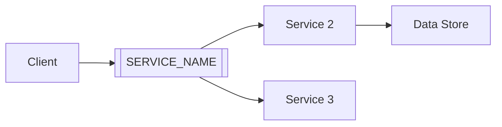

# :octicons-cloud-16: AWS [SERVICE_NAME]

> [ONE_SENTENCE_DESCRIPTION_OF_SERVICE]

[2-3 sentence intro explaining what this service is, why it exists, and when you'd use it. Be practical and direct.]

---

## :octicons-zap-16: Quick Start

=== "Essential Commands"
    ```bash
    # [Action 1] - [what it does]
    aws [service] [command] [flags]  # (1)!

    # [Action 2] - [what it does]
    aws [service] [command] [flags]  # (2)!

    # [Action 3] - [what it does]
    aws [service] [command] [flags]  # (3)!
    ```

    1. :octicons-info-16: [Explanation of command 1]
    2. :octicons-info-16: [Explanation of command 2]
    3. :octicons-info-16: [Explanation of command 3]

=== "Python SDK"
    ```python
    import boto3
    from botocore.exceptions import ClientError

    # Initialize client
    client = boto3.client('[service-name]')

    # Example operation
    def example_operation():
        try:
            response = client.[method](
                Parameter='value',
                AnotherParam='value'
            )
            return response
        except ClientError as e:
            print(f"Error: {e}")
            return None
    ```

=== "Terraform"
    ```hcl
    # [SERVICE_NAME] resource
    resource "aws_[resource_type]" "example" {
      # Required parameters
      parameter_1 = "value"
      parameter_2 = "value"

      # Optional but recommended
      tags = {
        Name        = "my-resource"
        Environment = "production"
        ManagedBy   = "terraform"
      }
    }
    ```

!!! tip "Real Talk :octicons-light-bulb-16:"
    - **Key point 1** - Practical advice
    - **Key point 2** - Common gotcha
    - **Key point 3** - Best practice
    - **Key point 4** - Cost consideration

---

## :octicons-book-16: Core Concepts

### [Concept 1]

[Explanation of first key concept. Use clear language.]

```bash
# Example demonstrating concept 1
aws [service] [command]
```

**Why this matters:** [Practical explanation]

### [Concept 2]

[Explanation of second key concept.]

```bash
# Example demonstrating concept 2
aws [service] [command]
```

**Why this matters:** [Practical explanation]

### [Concept 3]

[Explanation of third key concept.]

!!! warning "Common Mistake :octicons-alert-16:"
    [Describe a common mistake people make with this concept and how to avoid it]

---

## :octicons-checklist-16: Common Use Cases

### Use Case 1: [Name]

**Scenario:** [Describe when you'd need this]

=== "CLI"
    ```bash
    # Step 1: [Action]
    aws [service] [command] \
      --param1 value1 \
      --param2 value2

    # Step 2: [Action]
    aws [service] [command] \
      --param value
    ```

=== "Python"
    ```python
    def use_case_1():
        """[Brief description]"""
        client = boto3.client('[service]')

        # Step 1
        response = client.[method](
            Param='value'
        )

        # Step 2
        result = client.[method](
            ResourceId=response['Id']
        )

        return result
    ```

=== "Terraform"
    ```hcl
    # Complete use case in Terraform
    resource "aws_[resource]" "example" {
      parameter = "value"
    }
    ```

**Result:** [What you get after completing this use case]

---

### Use Case 2: [Name]

**Scenario:** [Describe when you'd need this]

[Follow same pattern as Use Case 1]

---

### Use Case 3: [Name]

**Scenario:** [Describe when you'd need this]

[Follow same pattern as Use Case 1]

---

## :octicons-gear-16: Configuration & Best Practices

### Security :octicons-shield-check-16:

!!! danger "Critical Security :octicons-stop-16:"
    - **[Security point 1]** - Why it matters
    - **[Security point 2]** - Common vulnerability
    - **[Security point 3]** - Best practice

=== "IAM Policy"
    ```json
    {
      "Version": "2012-10-17",
      "Statement": [
        {
          "Effect": "Allow",
          "Action": [
            "[service]:Read*",
            "[service]:List*"
          ],
          "Resource": "*"
        },
        {
          "Effect": "Allow",
          "Action": [
            "[service]:Write*",
            "[service]:Update*"
          ],
          "Resource": "arn:aws:[service]:region:account:resource/*",
          "Condition": {
            "StringEquals": {
              "aws:RequestedRegion": "us-east-1"
            }
          }
        }
      ]
    }
    ```

=== "Resource Policy"
    ```json
    {
      "Version": "2012-10-17",
      "Statement": [
        {
          "Sid": "AllowSpecificAccess",
          "Effect": "Allow",
          "Principal": {
            "AWS": "arn:aws:iam::account-id:role/role-name"
          },
          "Action": "[service]:*",
          "Resource": "*"
        }
      ]
    }
    ```

### Performance :octicons-rocket-16:

**Optimization strategies:**

1. **[Strategy 1]** - [Description and impact]
2. **[Strategy 2]** - [Description and impact]
3. **[Strategy 3]** - [Description and impact]

```bash
# Example: [Optimization technique]
aws [service] [command] --optimized-flag
```

### Cost Optimization :octicons-credit-card-16:

!!! info "Pricing Model :octicons-info-16:"
    - **[Pricing dimension 1]**: $X per unit
    - **[Pricing dimension 2]**: $Y per operation
    - **Free Tier**: [Description of free tier limits]

**Cost-saving tips:**

- :octicons-check-16: **[Tip 1]** - Potential savings
- :octicons-check-16: **[Tip 2]** - Cost avoidance
- :octicons-check-16: **[Tip 3]** - Monitoring strategy

### Reliability :octicons-shield-16:

**High availability configuration:**

```bash
# Multi-region setup
aws [service] [command] --region us-east-1
aws [service] [command] --region us-west-2
```

**Backup and disaster recovery:**

```bash
# Backup configuration
aws [service] create-backup --resource-id [id]

# Restore from backup
aws [service] restore-backup --backup-id [id]
```

---

## :octicons-tools-16: Advanced Patterns

??? example "Pattern 1: [Name] :octicons-code-16:"
    **When to use:** [Scenario description]

    ```python
    # Complete implementation
    import boto3
    from typing import Dict, List

    class [ServiceName]Manager:
        """[Description]"""

        def __init__(self, region: str = 'us-east-1'):
            self.client = boto3.client('[service]', region_name=region)

        def method_1(self, param: str) -> Dict:
            """[Description]"""
            try:
                response = self.client.[operation](
                    Parameter=param
                )
                return response
            except ClientError as e:
                print(f"Error: {e}")
                raise

        def method_2(self, params: List[str]) -> List[Dict]:
            """[Description]"""
            results = []
            for param in params:
                result = self.method_1(param)
                results.append(result)
            return results

    # Usage
    manager = [ServiceName]Manager()
    result = manager.method_1('value')
    ```

    **Benefits:**
    - :octicons-check-16: [Benefit 1]
    - :octicons-check-16: [Benefit 2]
    - :octicons-check-16: [Benefit 3]

??? example "Pattern 2: [Name] :octicons-code-16:"
    **When to use:** [Scenario description]

    [Follow same structure as Pattern 1]

??? example "Pattern 3: [Name] :octicons-code-16:"
    **When to use:** [Scenario description]

    [Follow same structure as Pattern 1]

---

## :octicons-alert-16: Troubleshooting

### Common Issues

#### Issue 1: [Problem Description]

**Symptoms:**
- [Symptom 1]
- [Symptom 2]

**Solution:**
```bash
# Diagnosis
aws [service] describe-[resource] --resource-id [id]

# Fix
aws [service] fix-command --parameters
```

**Why this happens:** [Explanation]

---

#### Issue 2: [Problem Description]

**Symptoms:**
- [Symptom 1]
- [Symptom 2]

**Solution:**
```bash
# Step-by-step fix
aws [service] [command1]
aws [service] [command2]
```

**Why this happens:** [Explanation]

---

#### Issue 3: [Problem Description]

**Symptoms:**
- [Symptom 1]
- [Symptom 2]

**Solution:**
[Follow same pattern]

---

### Debugging Tips :octicons-bug-16:

```bash
# Enable debug logging
aws [service] [command] --debug > debug.log 2>&1

# Check CloudWatch Logs
aws logs tail /aws/[service]/[resource-name] --follow

# Describe resource details
aws [service] describe-[resource] --resource-id [id] --output json | jq '.'
```

---

## :octicons-law-16: Limits & Quotas

| Resource | Default Limit | Hard Limit | Adjustable? |
|----------|--------------|------------|-------------|
| [Resource 1] | X per account | Y per account | :octicons-check-16: Yes |
| [Resource 2] | X per region | Y per region | :octicons-x-16: No |
| [Resource 3] | X per minute | Y per minute | :octicons-check-16: Yes |

!!! tip "Request Limit Increase :octicons-arrow-up-16:"
    Use AWS Service Quotas console or:
    ```bash
    aws service-quotas request-service-quota-increase \
      --service-code [service-code] \
      --quota-code [quota-code] \
      --desired-value [new-limit]
    ```

---

## :octicons-link-16: Integration & Related Services

### Works With

- **[Service 1]** - [How they integrate]
  - Example: [service-name](../service-name.md)
- **[Service 2]** - [How they integrate]
  - Example: [service-name](../service-name.md)
- **[Service 3]** - [How they integrate]
  - Example: [service-name](../service-name.md)

### Common Architectures



**Use case:** [Description of this architecture]

---

## :octicons-mortar-board-16: Learning Resources

### Official Documentation :octicons-book-16:
- [AWS [SERVICE_NAME] Documentation](https://docs.aws.amazon.com/[service]/)
- [AWS CLI Reference](https://awscli.amazonaws.com/v2/documentation/api/latest/reference/[service]/index.html)
- [Boto3 Documentation](https://boto3.amazonaws.com/v1/documentation/api/latest/reference/services/[service].html)

### Best Practices :octicons-star-16:
- [AWS Well-Architected Framework](https://aws.amazon.com/architecture/well-architected/)
- [Service-specific Best Practices](https://docs.aws.amazon.com/[service]/latest/userguide/best-practices.html)

### Community :octicons-people-16:
- [AWS Forums](https://forums.aws.amazon.com/)
- [Stack Overflow](https://stackoverflow.com/questions/tagged/amazon-[service])
- [r/aws on Reddit](https://reddit.com/r/aws)

---

## :octicons-checklist-16: Quick Reference

### Essential CLI Commands

```bash
# List resources
aws [service] list-[resources]

# Describe resource
aws [service] describe-[resource] --resource-id [id]

# Create resource
aws [service] create-[resource] --parameters

# Update resource
aws [service] update-[resource] --resource-id [id] --parameters

# Delete resource
aws [service] delete-[resource] --resource-id [id]

# Tag resource
aws [service] tag-resource \
  --resource-arn [arn] \
  --tags Key=Name,Value=my-resource
```

### CloudFormation Snippet

```yaml
Resources:
  MyResource:
    Type: AWS::[Service]::[ResourceType]
    Properties:
      Property1: value1
      Property2: value2
      Tags:
        - Key: Name
          Value: my-resource
        - Key: Environment
          Value: production
```

---

## :octicons-note-16: Notes & Tips

!!! tip "Pro Tips :octicons-light-bulb-16:"
    1. **[Tip 1]** - [Practical advice]
    2. **[Tip 2]** - [Time-saving trick]
    3. **[Tip 3]** - [Cost optimization]
    4. **[Tip 4]** - [Security hardening]

!!! warning "Watch Out For :octicons-alert-16:"
    - **[Gotcha 1]** - [What to avoid]
    - **[Gotcha 2]** - [Common mistake]
    - **[Gotcha 3]** - [Expensive operation]

---

## :octicons-link-external-16: Related Pages

- [AWS Overview](../index.md)
- [Related Service 1](./related-service-1.md)
- [Related Service 2](./related-service-2.md)
- [Cloud Security](../cloud-security.md)
- [FinOps](../finops.md)
- [Terraform](../terraform.md)

**Cross-references:**
- [SysAdmin / Monitoring](../../sysadmin/monitoring-logging.md) - For CloudWatch integration
- [DevOps / CI/CD](../../devops/cicd.md) - For deployment pipelines
- [Container / ECS/EKS](../../containerization/kubernetes.md) - For container orchestration

---

**Last Updated:** [DATE]
**AWS Service Version:** [VERSION if applicable]
**Tested Regions:** us-east-1, us-west-2, eu-west-1

---

_Built with :octicons-heart-16: for practical cloud documentation_
