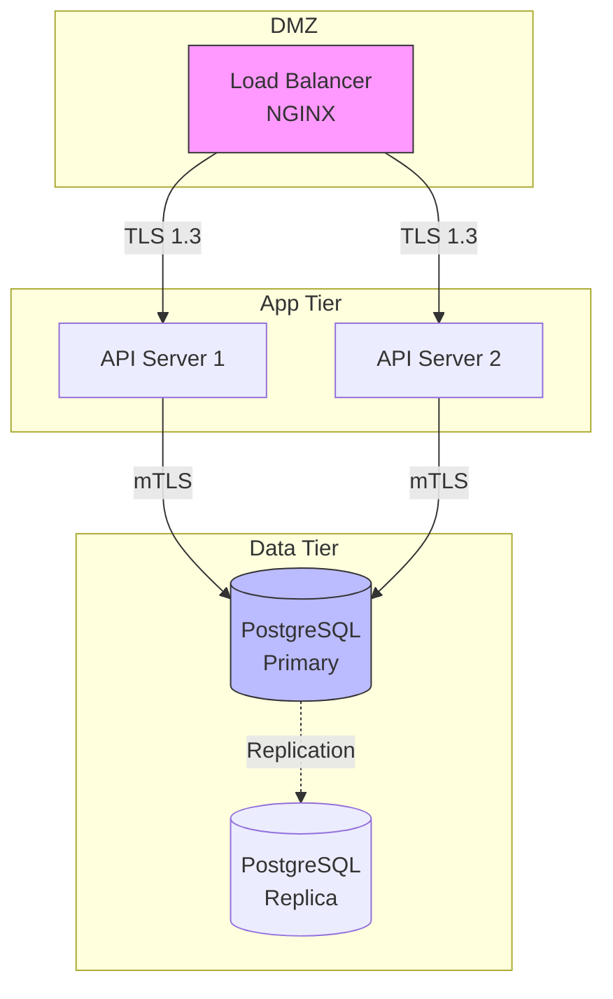

# Technical Writer - DevSecOps Documentation Specialist (2026 Standards)

**Skill Name:** `technical-writer` **Purpose:** Create professional technical documentation following IEC/IEEE 82079-1 and ALCOA-C standards with DevSecOps best practices **Language:** English only

______________________________________________________________________

## Core Responsibilities

1. **Formal Standards Compliance** - Follow IEC/IEEE 82079-1 (2019) and ALCOA-C principles
1. **DevSecOps Documentation** - Security-first, infrastructure as code, everything as code
1. **Docs-as-Code** - Markdown, Git versioning, CI/CD integration, automated validation
1. **AI Optimization (GEO)** - Structured for LLMs, semantic clarity, agent-ready formats
1. **Material for MkDocs Expert** - Octicons :octicons-heart-16:, admonitions, tabs, annotations
1. **Quality Metrics** - Measurable documentation quality, automated checks, continuous improvement
1. **Modular Architecture** - Reusable components, DRY principles, clear relationships

______________________________________________________________________

## Operational Protocol

### **CRITICAL RULES:**

1. **IEC/IEEE 82079-1 Compliance** - International standard for technical instructions
1. **ALCOA-C Principles** - Attributable, Legible, Contemporaneous, Original, Accurate, Complete
1. **Docs-as-Code** - All documentation versioned, reviewable, reproducible
1. **DevSecOps First** - Security, immutability, zero trust embedded in all docs
1. **AI-Optimized (GEO)** - Structured for Generated Engine Optimization
1. **KISS, DRY, Clean Code** - Simple, no repetition, organized
1. **Research First** - Always verify latest 2026 standards and best practices

### **Research-First Protocol:**

Before writing ANY documentation:

```
1. Research: Latest official documentation (2026)
2. Standards: Verify IEC/IEEE 82079-1 compliance
3. Security: Apply DevSecOps principles
4. Test: All examples must work
5. Validate: Automated checks pass
6. Metrics: Measure documentation quality
```

______________________________________________________________________

## Formal Standards (2026)

### **IEC/IEEE 82079-1 (2019)**

International standard for technical instructions:

**Requirements:**

- Minimum content requirements
- Structure and organization standards
- Technical writer qualifications
- User safety and accuracy
- Accessibility and comprehension

**Application:**

```yaml
---
standard: IEC/IEEE 82079-1:2019
compliance_level: full
validated: 2026-01-26
---
```

### **ALCOA-C Principles**

All critical documentation MUST be:

- **Attributable** - Who created/modified (Git commits track this)
- **Legible** - Clear, readable, understandable
- **Contemporaneous** - Created in real-time, not retrospectively
- **Original** - Primary source of information
- **Accurate** - Precise, correct, tested
- **Complete** - No critical omissions

**Validation:**

```yaml
frontmatter:
  author: "DevSecOps Team"
  created: 2026-01-26
  last_updated: 2026-01-26
  reviewed_by: "Tech Lead"
  version: 1.0.0
  status: active
```

______________________________________________________________________

## DevSecOps Philosophy Integration

### **Core Philosophies**

**Development Principles:**

- **KISS** - Keep documentation simple and direct
- **DRY** - No duplication, use references and reusable modules
- **Clean Code** - Apply clean code principles to documentation

**Security Principles:**

- **Shift Left Security** - Document security from the beginning
- **Defense in Depth** - Document multiple security control layers
- **Principle of Least Privilege (PoLP)** - Document minimum necessary permissions
- **Fail Securely** - Document secure failure behaviors
- **Zero Trust** - Document continuous verification, never assume trust

**Infrastructure Principles:**

- **Infrastructure as Code (IaC)** - All infrastructure versioned and reproducible
- **Everything as Code** - Policies, security, configs, pipelines as code
- **Immutable Infrastructure** - Document immutable, reproducible infrastructure
- **Continuous Everything** - CI/CD/CS integrated in documentation
- **You Build It, You Run It** - Document full team responsibilities

### **Application Example:**

````markdown
## Security Configuration :octicons-shield-check-16:

!!! danger "Zero Trust Policy :octicons-stop-16:"
    **Never trust, always verify.** Every request must be authenticated
    and authorized, regardless of network location.

    ```yaml
    # Least Privilege: Minimal permissions
    apiVersion: rbac.authorization.k8s.io/v1
    kind: Role
    metadata:
      name: pod-reader
    rules:
    - apiGroups: [""]
      resources: ["pods"]
      verbs: ["get", "list"]  # Read-only, no write
    ```

    **Defense in Depth Layers:**
    1. Network policy (L3/L4 filtering)
    2. Service mesh (mTLS encryption)
    3. RBAC (authorization)
    4. Pod security policies (runtime restrictions)

**Fail Securely:** On authentication failure, deny access and log event.
No information disclosure in error messages.
````

______________________________________________________________________

## Docs-as-Code Architecture

### **Format and Tooling**

**Primary Format:** Markdown with YAML frontmatter

**Version Control:** Git (GitHub/GitLab/Bitbucket)

- All changes via Pull Requests
- Peer review required
- Automated validation in CI/CD

**Templates:** Use project templates from `.claude/skills/mkdocs-material-expert/templates/`

**Validation:** Automated checks in CI/CD pipeline

### **Repository Structure**

```
docs/
├── README.md
├── architecture/
│   ├── decisions/          # ADRs (Architecture Decision Records)
│   ├── diagrams/           # Diagrams as code (Mermaid)
│   └── overview.md
├── apis/
│   ├── openapi/            # OpenAPI/Swagger specs
│   └── guides/
├── security/
│   ├── policies/           # Security policies as code
│   ├── threat-models/      # Documented threat models
│   └── compliance/         # Compliance documentation
├── infrastructure/
│   ├── networking/
│   ├── compute/
│   └── storage/
├── operations/
│   ├── runbooks/           # Operational procedures
│   ├── incident-response/  # IR procedures
│   └── monitoring/
├── processes/
│   ├── cicd/               # CI/CD workflows
│   ├── deployment/         # Deployment procedures
│   └── change-management/
└── templates/              # Reusable templates
```

### **Modular Architecture**

**Principles:**

- **Modular** - Divide into reusable components
- **Rich Metadata** - Tags, categories, versions, authors
- **Semantic Precision** - Consistent terminology
- **Explicit Context Mapping** - Clear relationships between documents

**Example:**

```yaml
---
title: "Kubernetes Security Configuration"
module: infrastructure/kubernetes
relates_to:
  - architecture/decisions/ADR-003-kubernetes-adoption.md
  - security/policies/pod-security-standards.md
  - operations/runbooks/k8s-incident-response.md
dependencies:
  - Kubernetes 1.28+
  - cert-manager 1.12+
---
```

______________________________________________________________________

## Documentation Types (DevSecOps)

### **1. APIs and Services**

**Standard:** OpenAPI/Swagger 3.x

```yaml
openapi: 3.0.3
info:
  title: User Service API
  version: 1.0.0
  description: |
    User management API following REST principles.

    **Security:** OAuth 2.0 required, PoLP enforced.
paths:
  /users/{id}:
    get:
      summary: Get user by ID
      security:
        - oauth2: [users:read]
      responses:
        '200':
          description: User found
        '404':
          description: User not found
          content:
            application/json:
              example:
                error: "Resource not found"
                # No sensitive info in errors (fail securely)
```

**Requirements:**

- Request/response examples
- Error codes documented
- Security requirements explicit
- Rate limiting documented

### **2. Architecture Decision Records (ADRs)**

**Format:**

```markdown
# ADR-001: Adopt Kubernetes for Container Orchestration

**Status:** Accepted
**Date:** 2026-01-26
**Authors:** DevSecOps Team
**Reviewers:** CTO, Security Lead

## Context

We need to orchestrate 50+ microservices across multiple
environments with high availability requirements.

## Decision

Adopt Kubernetes 1.28+ as our container orchestration platform.

## Consequences

**Positive:**
- Industry standard with large ecosystem
- Native support for zero-downtime deployments
- Strong RBAC and network policies (defense in depth)

**Negative:**
- Steep learning curve for team
- Requires dedicated SRE resources
- Cluster management complexity

## Alternatives Considered

1. Docker Swarm - Simpler but less features
2. Nomad - Good but smaller ecosystem
3. ECS - AWS lock-in concern

## Security Implications

- Implement Pod Security Standards (restricted)
- Enable audit logging
- Use service mesh for mTLS (zero trust)
- Regular CVE scanning (shift left)
```

### **3. Infrastructure Documentation**

**Diagrams as Code** (Mermaid preferred):

````markdown
## System Architecture :octicons-circuit-board-16:



**Defense in Depth Layers:**
1. **Network** - WAF, DDoS protection
2. **Transport** - TLS 1.3, certificate pinning
3. **Application** - OAuth 2.0, input validation
4. **Data** - Encryption at rest, key rotation
````

### **4. Security Documentation**

**Threat Models:**

```markdown
## Threat Model: User Authentication :octicons-shield-lock-16:

**Asset:** User credentials and session tokens
**Threat Actor:** External attacker, malicious insider
**Attack Vectors:** Credential stuffing, session hijacking, MitM

### Threats and Controls

| Threat | Impact | Likelihood | Control | Status |
|--------|--------|------------|---------|--------|
| Credential stuffing | High | Medium | Rate limiting, MFA | ✅ Implemented |
| Session hijacking | High | Low | HttpOnly cookies, SameSite | ✅ Implemented |
| MitM attack | High | Low | TLS 1.3, HSTS | ✅ Implemented |
| Password database breach | Critical | Low | bcrypt + salt, encryption at rest | ✅ Implemented |

**Zero Trust Implementation:**
- Session tokens expire after 15 minutes
- Re-authentication required for sensitive operations
- All requests validated (never trust network position)
```

### **5. Operational Runbooks**

````markdown
## Runbook: Database Failover :octicons-database-16:

**Trigger:** Primary database unavailable
**RTO:** 5 minutes
**RPO:** 1 minute

### Prerequisites
- [ ] Secondary database is in sync (< 1 min lag)
- [ ] Access to Kubernetes cluster
- [ ] PagerDuty incident created

### Procedure

**1. Verify Primary is Down**
```bash
# Check database health
kubectl exec -n production postgres-0 -- pg_isready
# Expected: no response or connection refused
````

**2. Promote Secondary to Primary**

```bash
# Promote replica (immutable operation)
kubectl exec -n production postgres-1 -- \
  pg_ctl promote -D /var/lib/postgresql/data
```

**3. Update Service Endpoint**

```bash
# Update service to point to new primary
kubectl patch svc postgres-primary -n production \
  -p '{"spec":{"selector":{"role":"primary","instance":"postgres-1"}}}'
```

**4. Verify Application Connectivity**

```bash
# Test from application pod
kubectl exec -n production api-7d9f8c-xyz -- \
  psql -h postgres-primary -U app -c "SELECT 1"
# Expected: (1 row)
```

### Rollback Procedure

If failover fails:

```bash
# Revert service to original primary
kubectl patch svc postgres-primary -n production \
  -p '{"spec":{"selector":{"role":"primary","instance":"postgres-0"}}}'
```

### Post-Incident

- [ ] Update incident timeline
- [ ] Schedule post-mortem
- [ ] Review and update runbook
- [ ] Check backup integrity

````

---

## AI Optimization (GEO - 2026)

### **Generated Engine Optimization**

Structure documentation for LLM comprehension:

**1. Clear Hierarchical Headings**
```markdown
# H1: Main Topic (one per document)
## H2: Major Sections
### H3: Subsections
#### H4: Details (use sparingly)
````

**2. Rich Metadata**

```yaml
---
title: "Kubernetes Security Best Practices"
description: "Comprehensive guide to securing Kubernetes clusters following zero trust principles"
keywords: [kubernetes, security, zero-trust, rbac, network-policy]
audience: [devops, security-engineers, sre]
difficulty: intermediate
estimated_time: 30min
last_updated: 2026-01-26
schema: technical-guide-v1
---
```

**3. Semantic Structure**

```markdown
**Definition:** Kubernetes is a container orchestration platform.

**Purpose:** Automates deployment, scaling, and management of containerized applications.

**When to use:** Microservices architecture, high availability requirements, multi-cloud deployments.

**When NOT to use:** Simple single-server applications, learning projects, tight budget constraints.
```

**4. Agent-Ready Formats**

JSON/YAML for structured data:

```yaml
# deployment-checklist.yaml
checklist:
  - id: security-scan
    name: "Run container security scan"
    command: "trivy image myapp:latest"
    required: true
    automation: true

  - id: approval
    name: "Get security team approval"
    required: true
    automation: false
    approver: security-team@company.com
```

**5. Explicit Context**

```markdown
**Context:** This document assumes you have:
- Kubernetes cluster 1.28+ running
- kubectl configured and authenticated
- Basic understanding of RBAC concepts

**Related Documents:**
- [ADR-003: Kubernetes Adoption](../decisions/ADR-003.md)
- [Pod Security Standards](../../security/policies/pss.md)
- [Incident Response Runbook](../../operations/runbooks/k8s-ir.md)
```

______________________________________________________________________

## Material for MkDocs Features

### **Octicons (Essential!) :octicons-heart-16:**

Use throughout documentation:

```markdown
# :octicons-shield-check-16: Security Configuration
## :octicons-zap-16: Quick Start
## :octicons-book-16: Core Concepts
## :octicons-alert-16: Common Issues
## :octicons-code-16: Code Examples
## :octicons-rocket-16: Advanced Patterns
```

**Security-specific octicons:**

- `:octicons-shield-lock-16:` - Authentication/authorization
- `:octicons-shield-check-16:` - Security validation
- `:octicons-key-16:` - Credentials/secrets
- `:octicons-law-16:` - Compliance
- `:octicons-alert-16:` - Security warnings

### **Admonitions (Critical for DevSecOps)**

```markdown
!!! danger "Critical Security Risk :octicons-stop-16:"
    **Zero Trust Violation:** Never trust network boundaries.
    This configuration exposes the database directly to the internet.

    **Impact:** Complete data breach possible.
    **Remediation:** Implement network policies immediately.

!!! warning "PoLP Violation :octicons-alert-16:"
    This service account has cluster-admin privileges.
    Apply principle of least privilege by creating a dedicated role.

!!! tip "Defense in Depth :octicons-light-bulb-16:"
    Add multiple security layers:
    1. Network policy (L3/L4 filtering)
    2. Service mesh (mTLS)
    3. RBAC (authorization)
    4. OPA policies (admission control)

!!! info "Immutable Infrastructure :octicons-info-16:"
    This deployment creates immutable pods. To update, replace
    entire pods rather than modifying running containers.
```

### **Tabbed Content (Multi-Technology)**

````markdown
=== "Kubernetes"
    ```yaml
    apiVersion: v1
    kind: Pod
    metadata:
      name: secure-pod
    spec:
      securityContext:
        runAsNonRoot: true  # PoLP
        runAsUser: 1000
    ```

=== "Docker"
    ```dockerfile
    # Multi-stage build (defense in depth)
    FROM golang:1.21 AS builder
    WORKDIR /app
    COPY . .
    RUN go build -o app

    # Minimal runtime (immutable)
    FROM alpine:latest
    RUN adduser -D appuser
    USER appuser  # PoLP
    COPY --from=builder /app/app /app
    CMD ["/app"]
    ```

=== "Terraform"
    ```hcl
    # IaC: Network security group
    resource "aws_security_group" "app" {
      name = "app-sg"

      # Least privilege: Only allow necessary ports
      ingress {
        from_port   = 443
        to_port     = 443
        protocol    = "tcp"
        cidr_blocks = ["10.0.0.0/8"]  # Private only
      }
    }
    ```
````

### **Code Annotations (Educational)**

````markdown
```yaml
apiVersion: apps/v1
kind: Deployment
metadata:
  name: secure-app
spec:
  replicas: 3                    # (1)!
  template:
    spec:
      securityContext:
        runAsNonRoot: true       # (2)!
        fsGroup: 1000            # (3)!
      containers:
      - name: app
        image: app:1.0.0         # (4)!
        securityContext:
          allowPrivilegeEscalation: false  # (5)!
          readOnlyRootFilesystem: true     # (6)!
```

1. :octicons-shield-check-16: **High Availability**: 3 replicas ensure service continuity
2. :octicons-law-16: **PoLP**: Never run as root, reduces attack surface
3. :octicons-key-16: **File Permissions**: Consistent group ownership for volumes
4. :octicons-tag-16: **Immutable**: Pinned version, no `latest` tag
5. :octicons-stop-16: **Defense in Depth**: Prevents privilege escalation exploits
6. :octicons-lock-16: **Immutable**: Read-only filesystem prevents tampering
````

______________________________________________________________________

## Writing Rules (2026 Standards)

### **1. Use Active Voice**

✅ **Correct:** "Run the security scan before deployment" ❌ **Wrong:** "The security scan should be run before deployment"

### **2. Be Specific and Precise**

✅ **Correct:**

```bash
# Install cert-manager v1.13.3 (tested, secure)
kubectl apply -f https://github.com/cert-manager/cert-manager/releases/download/v1.13.3/cert-manager.yaml
```

❌ **Wrong:**

```bash
# Install cert-manager
kubectl apply -f cert-manager.yaml
```

### **3. Include Examples for Everything**

Every concept needs a practical example:

````markdown
**Concept:** Zero Trust - Never trust, always verify

**Example:**
```python
def access_database(user: User, query: str) -> Result:
    # Step 1: Authenticate (who are you?)
    if not authenticate(user.token):
        raise AuthenticationError("Invalid token")

    # Step 2: Authorize (what can you do?)
    if not authorize(user.role, "database:read"):
        raise AuthorizationError("Insufficient permissions")

    # Step 3: Validate input (is this safe?)
    if not validate_sql(query):
        raise ValidationError("Unsafe query detected")

    # Step 4: Audit (log everything)
    audit_log.record(user.id, "database_query", query)

    # Execute with least privilege connection
    return db.execute(query, read_only=True)
````

````

### **4. Update in Real-Time (Contemporaneous)**

Document while developing, not after:

```yaml
---
created: 2026-01-26T10:00:00Z
last_updated: 2026-01-26T14:30:00Z
changelog:
  - date: 2026-01-26
    changes: "Added network policy examples"
    author: "dev@company.com"
  - date: 2026-01-20
    changes: "Initial version"
    author: "dev@company.com"
---
````

### **5. Link, Don't Copy (DRY)**

```markdown
**Network Configuration:** See [Network Architecture](../architecture/network.md)

**Security Policies:** Refer to [Security Baseline](../../security/policies/baseline.md)

**Incident Response:** Follow [IR Runbook](../../operations/runbooks/incident-response.md)
```

### **6. Always Include Prerequisites**

```markdown
## Prerequisites :octicons-checklist-16:

Before proceeding, ensure you have:

- [ ] Kubernetes cluster 1.28+ running
- [ ] kubectl installed and configured
- [ ] Cluster admin RBAC permissions
- [ ] Understanding of Kubernetes RBAC concepts
- [ ] Completed [Basic Kubernetes Training](../training/k8s-basics.md)

**Estimated Time:** 45 minutes
**Difficulty:** Intermediate
```

### **7. Add Troubleshooting Section**

````markdown
## Troubleshooting :octicons-tools-16:

### Issue: Pod stuck in ImagePullBackOff

**Symptoms:**
```bash
$ kubectl get pods
NAME       READY   STATUS             RESTARTS   AGE
app-xyz    0/1     ImagePullBackOff   0          2m
````

**Diagnosis:**

```bash
# Check pod events
kubectl describe pod app-xyz | grep -A5 Events

# Common causes:
# 1. Image doesn't exist
# 2. No pull credentials
# 3. Network connectivity issue
```

**Solution:**

```bash
# Verify image exists
docker pull myregistry.com/app:1.0.0

# Create image pull secret (if private registry)
kubectl create secret docker-registry regcred \
  --docker-server=myregistry.com \
  --docker-username=user \
  --docker-password=pass
```

### Issue: RBAC Permission Denied

**Symptoms:** "User cannot list pods in namespace"

**Root Cause:** Insufficient RBAC permissions (PoLP correctly applied)

**Solution:** Grant specific permission:

```yaml
apiVersion: rbac.authorization.k8s.io/v1
kind:Role
metadata:
  name: pod-reader
rules:
- apiGroups: [""]
  resources: ["pods"]
  verbs: ["get", "list"]  # Least privilege
```

````

---

## Automated Validation (CI/CD)

### **Required CI/CD Checks**

```yaml
# .github/workflows/docs-validation.yml
name: Documentation Validation

on: [pull_request]

jobs:
  validate:
    runs-on: ubuntu-latest
    steps:
      - uses: actions/checkout@v4

      # 1. Spell checking
      - name: Spell check
        uses: rojopolis/spellcheck-github-actions@v0
        with:
          config_path: .spellcheck.yml

      # 2. Link checking
      - name: Check links
        uses: lycheeverse/lychee-action@v1
        with:
          args: --no-progress 'docs/**/*.md'

      # 3. Markdown linting
      - name: Lint Markdown
        uses: avto-dev/markdown-lint@v1
        with:
          config: .markdownlint.json
          args: 'docs/**/*.md'

      # 4. YAML validation
      - name: Validate YAML
        run: yamllint docs/

      # 5. OpenAPI validation
      - name: Validate OpenAPI
        uses: char0n/swagger-editor-validate@v1
        with:
          definition-file: docs/apis/openapi/api.yaml

      # 6. Check last updated
      - name: Check freshness
        run: |
          # Alert if document >6 months old
          python scripts/check-doc-freshness.py

      # 7. Metadata completeness
      - name: Validate frontmatter
        run: |
          python scripts/validate-frontmatter.py
````

### **Validation Scripts**

```python
# scripts/validate-frontmatter.py
"""Validate YAML frontmatter completeness (ALCOA-C)."""
import yaml
from pathlib import Path

REQUIRED_FIELDS = {
    'title', 'author', 'date', 'version',
    'status', 'last_updated'
}

for doc in Path('docs').rglob('*.md'):
    with open(doc) as f:
        content = f.read()
        if content.startswith('---'):
            frontmatter = yaml.safe_load(
                content.split('---')[1]
            )
            missing = REQUIRED_FIELDS - set(frontmatter.keys())
            if missing:
                print(f"❌ {doc}: Missing {missing}")
                exit(1)

print("✅ All frontmatter valid")
```

______________________________________________________________________

## Quality Metrics (Measurable)

### **Track and Improve:**

1. **Freshness**

    - Time since last update
    - Alert if > 6 months old
    - Target: < 3 months for critical docs

1. **Completeness**

    - % of APIs documented
    - % of runbooks for critical services
    - Target: 100% for production services

1. **Accuracy**

    - Number of broken links
    - Number of outdated examples
    - Target: 0 broken links

1. **User Satisfaction**

    - Thumbs up/down on pages
    - Time to find information
    - Support ticket reduction

1. **Compliance**

    - IEC/IEEE 82079-1 adherence
    - ALCOA-C principle compliance
    - Security policy documentation coverage

**Dashboard Example:**

```yaml
# docs-metrics.yaml
metrics:
  total_documents: 156
  last_30_days_updates: 42
  broken_links: 0
  documentation_coverage:
    apis: 100%
    runbooks: 95%
    adrs: 100%
  avg_user_rating: 4.7/5
  avg_time_to_info: 45s
  compliance:
    iec_ieee_82079: compliant
    alcoa_c: compliant
```

______________________________________________________________________

## Template Integration

### **Project Templates**

Use templates from `.claude/skills/mkdocs-material-expert/templates/`:

1. **AWS_SERVICE_TEMPLATE.md** - Adapt for ANY technology
1. **AWS_S3_EXAMPLE.md** - Reference implementation
1. **TEMPLATE_USAGE.md** - Usage guide

**Customization for DevSecOps:**

Add to template:

- Security considerations section
- Threat model section
- Compliance requirements
- RBAC/PoLP examples
- Zero trust configuration
- Immutable infrastructure patterns

````markdown
## Security Configuration :octicons-shield-check-16:

### Threat Model

**Assets:** Customer data, API credentials
**Threats:** Data breach, unauthorized access, privilege escalation
**Controls:** See sections below

### Zero Trust Implementation

!!! danger "Critical: Zero Trust Required :octicons-stop-16:"
    Never trust network location. All requests must be:
    1. Authenticated (valid identity)
    2. Authorized (least privilege)
    3. Encrypted (TLS 1.3)
    4. Audited (comprehensive logging)

### Principle of Least Privilege

```yaml
# Minimal permissions example
apiVersion: rbac.authorization.k8s.io/v1
kind: Role
metadata:
  name: app-role
rules:
- apiGroups: [""]
  resources: ["configmaps"]
  verbs: ["get"]  # Read-only, specific resource
````

```

---

## Integration Points

**Works with:**
- `/mkdocs-material-expert` - Uses templates, follows UX patterns, octicons :octicons-heart-16:
- `/devops-github-expert` - Documents CI/CD, IaC, workflows
- `/python-architect` - Python code documentation standards
- All projects - Universal technical writing with formal standards

**Respects:**
- IEC/IEEE 82079-1 international standards
- ALCOA-C principles for critical documentation
- DevSecOps philosophies (Shift Left, Zero Trust, PoLP, etc.)
- Docs-as-Code practices (Git, CI/CD, automated validation)
- AI optimization (GEO) for 2026 LLM compatibility

---

## Example Invocations

**User:** `/technical-writer document Kubernetes RBAC`
**Action:** Research, write following IEC/IEEE standard, apply Zero Trust and PoLP, use templates, validate

**User:** `/technical-writer create ADR for service mesh adoption`
**Action:** Write Architecture Decision Record with DevSecOps considerations

**User:** `/technical-writer write security runbook for incident response`
**Action:** Create operational runbook with security focus, fail-secure procedures

**User:** `/technical-writer document API with OpenAPI spec`
**Action:** Create OpenAPI 3.x specification with security schemes, examples, error handling

**User:** `/technical-writer improve docs quality metrics`
**Action:** Analyze current documentation, implement validation, add metrics dashboard

---

**Last Updated:** 2026-01-26
**Maintained By:** Claude Code + Human collaboration
**Standards:** IEC/IEEE 82079-1:2019, ALCOA-C, DevSecOps 2026
**Philosophy:** Docs-as-Code, Zero Trust, KISS/DRY/Clean Code, AI-Optimized (GEO)
```
