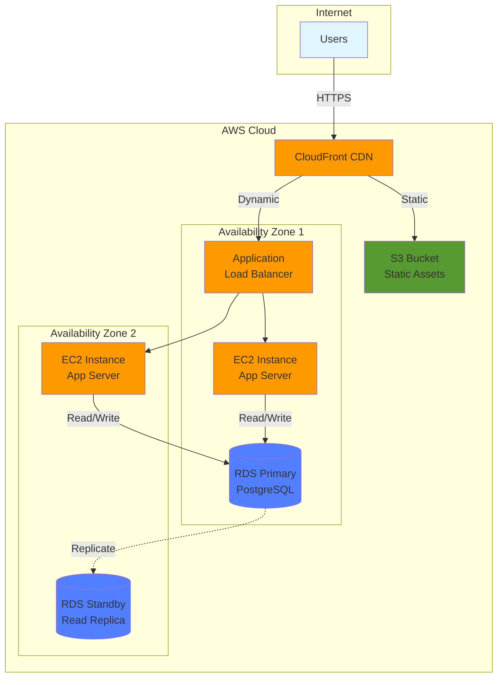
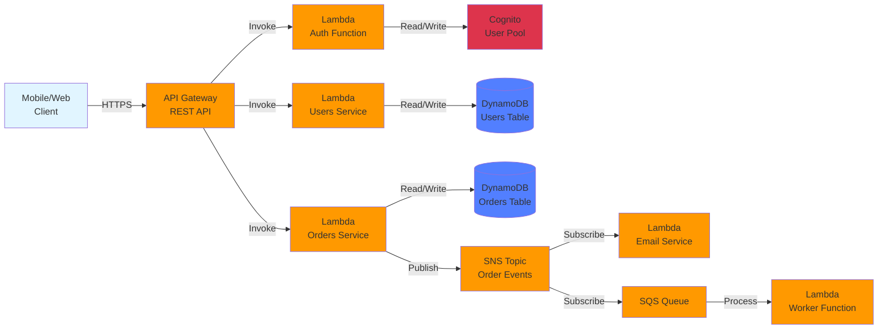
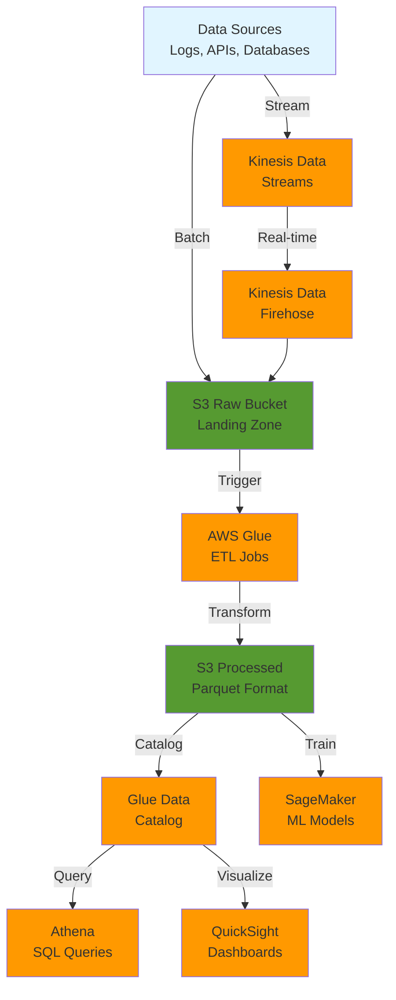

# :fontawesome-solid-sitemap: AWS Architecture Patterns

Common AWS architecture patterns for real-world applications.

!!! tip "Architecture Diagram Resources"
    **[AWS Architecture Icons](https://aws.amazon.com/architecture/icons/)** - Official icon set for creating AWS architecture diagrams (PPT, Draw.io, Visio formats). Essential for documentation and presentations.

## Three-Tier Web Application

Classic pattern: presentation, application, data layers with high availability.



**Components:**

- **CloudFront:** Global CDN, caches static assets at edge locations
- **S3:** Object storage for images, CSS, JavaScript
- **ALB:** Distributes traffic across EC2 instances in multiple AZs
- **EC2:** Application servers running in Auto Scaling group
- **RDS:** Managed PostgreSQL with multi-AZ failover

**Real talk:** This pattern handles 10k-100k requests/day. Add auto-scaling for growth.

## Serverless Microservices

Event-driven architecture with Lambda, API Gateway, and DynamoDB.



**Components:**

- **API Gateway:** RESTful API with authentication, rate limiting, caching
- **Lambda:** Stateless functions, auto-scale, pay-per-invocation
- **DynamoDB:** NoSQL database with single-digit millisecond latency
- **SNS/SQS:** Async messaging for decoupled microservices
- **Cognito:** User authentication and authorization

**Real talk:** Scales to millions of requests, costs pennies at low traffic. Cold starts are 100-500ms.

## Data Pipeline Architecture

ETL pattern for processing large datasets with S3, Glue, and Athena.



**Components:**

- **Kinesis:** Real-time data streaming (alternative to Kafka)
- **S3:** Data lake storage (raw and processed data)
- **Glue:** Serverless ETL, converts JSON/CSV to optimized Parquet
- **Athena:** Query S3 data with SQL, pay per query ($5/TB scanned)
- **QuickSight:** BI dashboards, ML-powered insights

**Real talk:** Processes terabytes for cents. Use Parquet format (10x cheaper queries than JSON).

---

## :fontawesome-solid-compass-drafting: Well-Architected Framework

AWS's five pillars for building reliable, secure, efficient systems.

### :fontawesome-solid-shield-halved: Security

**Design Principles:**

- **Identity and Access Management** - Use IAM roles, never embed credentials
- **Detective Controls** - Enable CloudTrail, GuardDuty, Config
- **Infrastructure Protection** - VPC isolation, security groups, NACLs
- **Data Protection** - Encrypt at rest (KMS) and in transit (TLS)
- **Incident Response** - Automated remediation with Lambda

??? example "Security Checklist"
    - [ ] Root account MFA enabled
    - [ ] IAM users have MFA
    - [ ] S3 buckets are private (no public access)
    - [ ] RDS encryption enabled
    - [ ] CloudTrail logging to S3
    - [ ] GuardDuty threat detection active
    - [ ] Security groups follow least privilege
    - [ ] Secrets stored in Secrets Manager
    - [ ] VPC Flow Logs enabled
    - [ ] AWS Config rules for compliance

### :fontawesome-solid-arrows-rotate: Reliability

**Design Principles:**

- **Multi-AZ Deployment** - RDS, ALB, EC2 across 2+ availability zones
- **Auto Scaling** - Respond to demand changes automatically
- **Backup and Recovery** - Automated snapshots, cross-region replication
- **Change Management** - Infrastructure as code (CloudFormation/Terraform)
- **Failure Isolation** - Bulkheads prevent cascading failures

??? example "Reliability Targets"
    | **Availability** | **Downtime/Year** | **Architecture** |
    |------------------|-------------------|------------------|
    | 99.0% (2 nines) | 3.65 days | Single AZ |
    | 99.9% (3 nines) | 8.76 hours | Multi-AZ |
    | 99.95% | 4.38 hours | Multi-AZ + Auto Scaling |
    | 99.99% (4 nines) | 52.56 minutes | Multi-region |
    | 99.999% (5 nines) | 5.26 minutes | Multi-region + Failover |

### :fontawesome-solid-gauge-high: Performance Efficiency

**Design Principles:**

- **Selection** - Choose right compute (EC2 vs Lambda vs Fargate)
- **Review** - Continuously evaluate new services
- **Monitoring** - CloudWatch metrics, X-Ray tracing
- **Trade-offs** - Consistency vs latency, normalization vs denormalization

??? example "Service Selection Guide"
    ```mermaid
    graph TD
        Start{Compute Need?} -->|Containers| Container{Orchestration?}
        Start -->|VMs| VM{Persistent?}
        Start -->|Functions| Lambda[Lambda<br/>Event-driven]

        Container -->|Yes| EKS[EKS<br/>Kubernetes]
        Container -->|No| ECS[ECS/Fargate<br/>Simpler]

        VM -->|Yes| EC2[EC2<br/>Full Control]
        VM -->|No| Batch[AWS Batch<br/>Job Scheduling]

        style Start fill:#e1f5ff
        style Lambda fill:#ff9900
        style EKS fill:#ff9900
        style ECS fill:#ff9900
        style EC2 fill:#ff9900
        style Batch fill:#ff9900
    ```

### :fontawesome-solid-dollar-sign: Cost Optimization

**Design Principles:**

- **Right Sizing** - Match instance size to workload (don't over-provision)
- **Elasticity** - Auto-scale down during off-peak hours
- **Pricing Models** - Reserved Instances (72% off), Spot (90% off)
- **Managed Services** - RDS cheaper than self-managed EC2 databases
- **Cost Allocation** - Tag everything for chargeback/showback

??? example "Cost Saving Strategies"
    | **Strategy** | **Savings** | **Best For** |
    |--------------|-------------|--------------|
    | Reserved Instances (1yr) | 40% | Predictable workloads |
    | Reserved Instances (3yr) | 72% | Long-term commitments |
    | Spot Instances | 90% | Fault-tolerant, flexible |
    | Savings Plans | 72% | Flexible compute usage |
    | S3 Intelligent-Tiering | 70% | Infrequently accessed data |
    | Lambda vs EC2 | 80% | Low-traffic APIs |
    | Graviton Instances | 40% | ARM-compatible workloads |

### :fontawesome-solid-leaf: Operational Excellence

**Design Principles:**

- **Operations as Code** - Infrastructure as code, runbooks as code
- **Frequent, Small Changes** - Reduce blast radius of failures
- **Refine Operations** - Learn from failures, improve processes
- **Anticipate Failure** - Chaos engineering, game days
- **Learn from Failures** - Post-mortems without blame

??? example "Operational Metrics"
    - **MTTR** - Mean Time To Recovery (target: <1 hour)
    - **Change Failure Rate** - Failed changes / total changes (target: <15%)
    - **Deployment Frequency** - Daily for high-performing teams
    - **Lead Time** - Code commit to production (target: <1 day)

---

**Last Updated:** 2026-01-31 | **Vibe Check:** :fontawesome-solid-compass: **Structural** - These patterns are industry-standard. Not innovative, but proven at scale. Use them unless you have a compelling reason not to.

**Tags:** aws, architecture, well-architected, patterns
