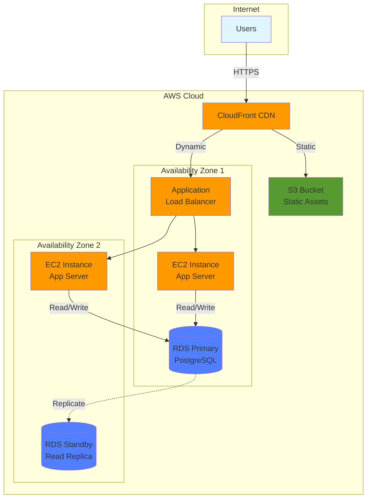
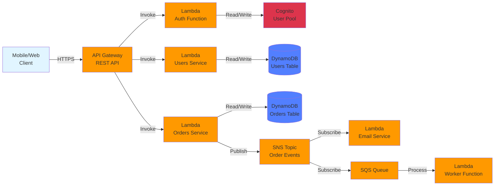
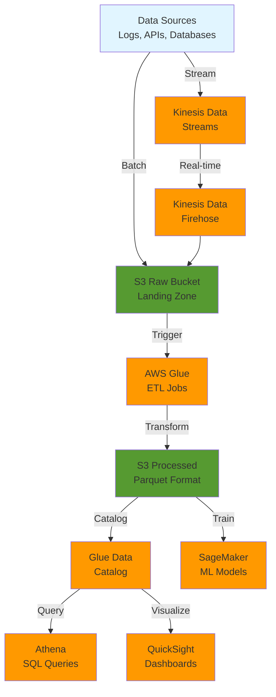

# :fontawesome-brands-aws: AWS (Amazon Web Services)

Cloud platform that runs half the internet. 200+ services (you'll use maybe 10). 33+ regions globally. Industry standard for cloud infrastructure. Pricing is a mystery, bills are scary, but it works.

!!! tip "2026 Update"
    AWS continues to dominate cloud infrastructure with over 200 services. Focus on core services (EC2, S3, Lambda, RDS) and learn IAM inside-out. Cost optimization is more critical than ever.

______________________________________________________________________

## :fontawesome-solid-bolt-lightning: Quick Hits

=== ":fontawesome-solid-list-check: Essential Services"

    ```bash
    # EC2 - Virtual machines (you'll use this)
    aws ec2 run-instances \
      --image-id ami-xxx \
      --instance-type t3.micro \
      --key-name my-key # (1)!

    # S3 - Object storage (everyone uses this)
    aws s3 cp file.txt s3://bucket-name/
    aws s3 sync ./local s3://bucket/path --delete # (2)!

    # Lambda - Serverless functions (scales like crazy)
    aws lambda invoke \
      --function-name my-function \
      --payload '{"key":"value"}' \
      output.txt # (3)!

    # RDS - Managed databases (don't run your own DB)
    aws rds describe-db-instances
    aws rds create-db-snapshot --db-instance-identifier prod-db # (4)!

    # IAM - Identity management (painful but critical)
    aws iam create-user --user-name dev-user
    aws sts get-caller-identity  # "Who the fuck am I?"
    aws iam list-attached-user-policies --user-name dev-user # (5)!

    # CloudWatch - Logs and monitoring (set billing alarms!)
    aws logs tail /aws/lambda/my-function --follow
    aws cloudwatch put-metric-alarm \
      --alarm-name BillingAlarm \
      --alarm-description "Alert when bill exceeds $100" \
      --metric-name EstimatedCharges \
      --threshold 100 # (6)!

    # ECS/EKS - Container orchestration
    aws ecs list-clusters
    aws eks list-clusters
    aws eks update-kubeconfig --name my-cluster # (7)!
    ```

    1. SSH key for instance access - create with `aws ec2 create-key-pair`
    2. `--delete` removes files from S3 that don't exist locally - dangerous!
    3. Lambda invoke is synchronous - use `--invocation-type Event` for async
    4. Always snapshot before major changes - saved my ass multiple times
    5. Check permissions when debugging "Access Denied" errors
    6. Set this up DAY ONE - learn from others' $10k+ billing surprises
    7. Updates your kubeconfig for kubectl access

    **Real talk:**

    - Start with EC2, S3, RDS - that's 80% of use cases
    - IAM is hell, but you MUST learn it - security nightmare otherwise
    - Enable MFA on root account RIGHT NOW (seriously, stop reading and do it)
    - us-east-1 is cheapest but goes down more often (Murphy's law applies)
    - Use `--profile` for multiple accounts (you'll have dev/staging/prod)

=== ":fontawesome-solid-bolt: Common Patterns"

    ```python
    import boto3
    from botocore.exceptions import ClientError

    # S3 upload with proper error handling
    def upload_to_s3(file_path, bucket, key):
        """Upload file to S3 with private ACL."""
        s3 = boto3.client('s3')
        try:
            s3.upload_file(
                file_path,
                bucket,
                key,
                ExtraArgs={'ACL': 'private'}  # Don't leak shit # (1)!
            )
            return True
        except ClientError as e:
            print(f"Upload failed: {e}")
            return False

    # Lambda handler pattern (use this)
    def lambda_handler(event, context):
        """Standard Lambda handler with proper error handling."""
        try:
            # Parse event (API Gateway, SQS, etc.)
            body = json.loads(event.get('body', '{}'))

            # Do work
            result = process_data(body)

            # Return proper response
            return {
                'statusCode': 200,
                'headers': {
                    'Content-Type': 'application/json',
                    'Access-Control-Allow-Origin': '*'  # Adjust for prod # (2)!
                },
                'body': json.dumps(result)
            }
        except Exception as e:
            print(f"Error: {e}")  # Goes to CloudWatch # (3)!
            return {'statusCode': 500, 'body': 'Internal error'}

    # DynamoDB pattern (NoSQL done right)
    dynamodb = boto3.resource('dynamodb')
    table = dynamodb.Table('Users')

    # Query (efficient) - use this
    response = table.query(
        KeyConditionExpression='user_id = :uid',
        ExpressionAttributeValues={':uid': '12345'}
    ) # (4)!

    # Scan (expensive) - avoid in prod
    response = table.scan(Limit=100)  # Will cost $$$$ at scale # (5)!
    ```

    1. Always set ACL to private unless you specifically need public access
    2. Lock down CORS in production - `*` is for development only
    3. Lambda logs go to CloudWatch automatically - use structured logging for production
    4. Queries use indexes - fast and cheap
    5. Scans read entire table - slow and expensive, only for admin tasks

    ```yaml
    # CloudFormation/SAM pattern (infrastructure as code)
    AWSTemplateFormatVersion: '2010-09-09'
    Transform: AWS::Serverless-2016-10-31

    Resources:
      MyFunction:
        Type: AWS::Serverless::Function
        Properties:
          Runtime: python3.12  # Use latest runtime # (1)!
          Handler: app.lambda_handler
          Timeout: 30  # Seconds - adjust based on workload
          MemorySize: 512  # MB - more memory = faster CPU # (2)!
          Environment:
            Variables:
              TABLE_NAME: !Ref MyTable
          Policies:
            - DynamoDBCrudPolicy:
                TableName: !Ref MyTable  # Least privilege # (3)!

      MyTable:
        Type: AWS::DynamoDB::Table
        Properties:
          BillingMode: PAY_PER_REQUEST  # No capacity planning # (4)!
          AttributeDefinitions:
            - AttributeName: id
              AttributeType: S
          KeySchema:
            - AttributeName: id
              KeyType: HASH
          StreamSpecification:  # For DynamoDB Streams
            StreamViewType: NEW_AND_OLD_IMAGES # (5)!
    ```

    1. Python 3.12 available since 2024 - use latest for performance
    2. Lambda charges by GB-seconds - 512MB is sweet spot for most workloads
    3. Only grant permissions this function actually needs
    4. Pay per request - no provisioned capacity, scales automatically
    5. Streams enable event-driven architectures - trigger Lambda on changes

    **Why this works:**

    - Boto3 is official AWS SDK - well maintained, good docs
    - Error handling prevents silent failures
    - CloudFormation/SAM enables version control for infrastructure
    - DynamoDB queries scale better than scans (use indexes!)
    - Lambda handler pattern is battle-tested across millions of functions

=== ":fontawesome-solid-fire: Pro Tips & Gotchas"

    !!! success "Cost Optimization (your CFO will thank you)"
        - **Reserved Instances:** 72% savings for predictable workloads (1-3 year commitment)
        - **Spot Instances:** 90% savings for batch jobs (can be terminated with 2-min warning)
        - **S3 Intelligent-Tiering:** Automatic cost optimization based on access patterns
        - **CloudWatch billing alarms:** Set up IMMEDIATELY - prevent $10k+ surprises
        - **Delete unused resources:** Snapshots, AMIs, elastic IPs add up fast
        - **Use AWS Cost Explorer:** Analyze spending patterns, identify waste
        - **Tag everything:** Enable cost allocation by project/team/environment

    !!! warning "Security (don't get hacked)"
        - **Never hardcode credentials** - use IAM roles, instance profiles, or Systems Manager
        - **Enable CloudTrail + GuardDuty** - detect breaches before bankruptcy
        - **Systems Manager Parameter Store** - free for <10k parameters, encrypted at rest
        - **VPC Flow Logs** - network debugging and security analysis
        - **Least privilege IAM policies** - start restrictive, open up as needed
        - **MFA on root account** - this is non-negotiable, do it now
        - **AWS Security Hub** - centralized security findings (2026 standard)

    !!! tip "Performance"
        - **Same region/AZ traffic** - cross-region costs money + latency (100ms+)
        - **CloudFront CDN** - S3 alone is slow for users, CDN is sub-50ms globally
        - **RDS read replicas** - scale read-heavy workloads horizontally
        - **ElastiCache** - Redis/Memcached for sub-ms caching (game changer)
        - **Lambda provisioned concurrency** - eliminate cold starts for critical paths
        - **Use AWS PrivateLink** - avoid internet gateway for service-to-service

    !!! danger "Gotchas (learn from others' pain)"
        - **Data transfer OUT** - in is free, out costs $$$ (especially cross-region)
        - **NAT Gateway costs** - can exceed EC2 instance costs (use VPC endpoints instead)
        - **CloudWatch Logs** - verbose logging = expensive storage ($0.50/GB)
        - **DynamoDB scans** - will bankrupt you at scale, always use queries with indexes
        - **Lambda cold starts** - 1-2 seconds for large functions (use provisioned concurrency)
        - **EBS snapshots** - incremental but deletions are confusing (read the docs!)
        - **S3 bucket policies** - one wrong character = data leak (test with IAM simulator)

    !!! info "Monitoring & Observability"
        - **CloudWatch** - included but basic, good enough for small/medium workloads
        - **X-Ray** - distributed tracing for microservices debugging (2026 essential)
        - **Datadog/New Relic** - consider for serious production monitoring
        - **Set up alarms for:** billing, CPU >80%, disk >90%, error rates >1%
        - **Use CloudWatch Insights** - query logs with SQL-like syntax
        - **CloudWatch RUM** - real user monitoring for frontend performance (2026)

    !!! question "When NOT to use AWS"
        - **Small personal projects** - Vercel/Netlify/Railway way easier (and cheaper)
        - **Vendor lock-in concerns** - consider Kubernetes on any cloud
        - **Tiny budget** - free tier ends after 12 months, bills start
        - **No cloud experience** - steep learning curve, invest time in fundamentals first
        - **Compliance hell** - some industries require on-prem (banking, healthcare)

______________________________________________________________________

## :fontawesome-solid-graduation-cap: Learning Paths

### :fontawesome-solid-book-open: Free Resources

- **[AWS Skill Builder](https://skillbuilder.aws)** - Official training, tons of free courses (start here)
- **[AWS Free Tier](https://aws.amazon.com/free)** - 12 months free for core services (stay within limits!)
- **[freeCodeCamp AWS Course](https://www.youtube.com/watch?v=ulprqHHWlng)** - 10+ hour deep dive, quality content
- **[AWS Workshops](https://workshops.aws)** - Hands-on labs, various topics
- **[A Cloud Guru Free Tier](https://learn.acloud.guru/search?query=aws&type=free)** - Quality video courses
- **[AWS Getting Started Guides](https://aws.amazon.com/getting-started/)** - Official tutorials
- **[AWS re:Post](https://repost.aws/)** - Official Q&A platform (replaced forums in 2024)

### :fontawesome-solid-flask: Interactive Labs

- **[AWS Sandbox Accounts](https://aws.amazon.com/getting-started/hands-on/)** - Official hands-on tutorials in real AWS
- **[Qwiklabs AWS](https://www.cloudskillsboost.google/catalog?keywords=aws)** - Temporary accounts for safe experimentation
- **[Instruqt AWS Labs](https://play.instruqt.com/public/topics/aws)** - Browser-based scenarios
- **[LocalStack](https://localstack.cloud/)** - Run AWS locally for development (Pro version worth it)
- **[AWS CloudShell](https://aws.amazon.com/cloudshell/)** - Browser-based shell with AWS CLI pre-installed

### :fontawesome-solid-certificate: Certifications Worth It

!!! success "Recommended Path"
    1. **Solutions Architect Associate** - Most valuable, industry standard
    2. **Developer Associate** - If you code daily on AWS
    3. Skip others unless employer pays or senior role requires

- **[Cloud Practitioner](https://aws.amazon.com/certification/certified-cloud-practitioner/)** - $100, easiest, good starting point if totally new
- **[Solutions Architect Associate](https://aws.amazon.com/certification/certified-solutions-architect-associate/)** - $150, **most popular**, worth it for resume (this one matters)
- **[Developer Associate](https://aws.amazon.com/certification/certified-developer-associate/)** - $150, worth it if you code on AWS daily
- **[SysOps Administrator Associate](https://aws.amazon.com/certification/certified-sysops-admin-associate/)** - $150, operations-focused
- **Skip unless senior/employer pays:** Professional certs ($300), Specialty certs ($300) - overkill for most

**Reality check:**

- Solutions Architect Associate is the sweet spot (most job postings ask for this)
- Study 2-3 months with hands-on practice, exams are scenario-based
- Use [Tutorials Dojo practice exams](https://tutorialsdojo.com/) ($15, best investment)
- Join [r/AWSCertifications](https://reddit.com/r/AWSCertifications) for study tips

### :fontawesome-solid-rocket: Projects to Build

!!! example "Beginner (learn the basics)"
    - **Static website** - S3 + CloudFront + Route53 (learn storage + CDN)
    - **Serverless URL shortener** - Lambda + DynamoDB + API Gateway
    - **EC2 web server** - Deploy LAMP/NGINX stack manually

!!! example "Intermediate (portfolio-worthy)"
    - **REST API** - Lambda + API Gateway + DynamoDB + Cognito auth
    - **File processing pipeline** - S3 triggers Lambda, stores results in RDS
    - **CI/CD pipeline** - CodePipeline + CodeBuild + ECR + ECS
    - **Serverless blog** - Amplify + Lambda + DynamoDB + S3

!!! example "Advanced (job-interview flex)"
    - **Multi-region application** - Route 53 failover + RDS cross-region replicas
    - **Event-driven microservices** - SQS/SNS/EventBridge architecture
    - **Cost optimization dashboard** - Lambda + Cost Explorer API + QuickSight
    - **Real-time analytics** - Kinesis Data Streams + Lambda + Timestream

______________________________________________________________________

## :fontawesome-solid-sitemap: Architecture Patterns

Common AWS architecture patterns for real-world applications.

!!! tip "Architecture Diagram Resources"
    **[AWS Architecture Icons](https://aws.amazon.com/architecture/icons/)** - Official icon set for creating AWS architecture diagrams (PPT, Draw.io, Visio formats). Essential for documentation and presentations.

### Three-Tier Web Application

Classic pattern: presentation, application, data layers with high availability.



**Components:**

- **CloudFront:** Global CDN, caches static assets at edge locations
- **S3:** Object storage for images, CSS, JavaScript
- **ALB:** Distributes traffic across EC2 instances in multiple AZs
- **EC2:** Application servers running in Auto Scaling group
- **RDS:** Managed PostgreSQL with multi-AZ failover

**Real talk:** This pattern handles 10k-100k requests/day. Add auto-scaling for growth.

### Serverless Microservices

Event-driven architecture with Lambda, API Gateway, and DynamoDB.



**Components:**

- **API Gateway:** RESTful API with authentication, rate limiting, caching
- **Lambda:** Stateless functions, auto-scale, pay-per-invocation
- **DynamoDB:** NoSQL database with single-digit millisecond latency
- **SNS/SQS:** Async messaging for decoupled microservices
- **Cognito:** User authentication and authorization

**Real talk:** Scales to millions of requests, costs pennies at low traffic. Cold starts are 100-500ms.

### Data Pipeline Architecture

ETL pattern for processing large datasets with S3, Glue, and Athena.



**Components:**

- **Kinesis:** Real-time data streaming (alternative to Kafka)
- **S3:** Data lake storage (raw and processed data)
- **Glue:** Serverless ETL, converts JSON/CSV to optimized Parquet
- **Athena:** Query S3 data with SQL, pay per query ($5/TB scanned)
- **QuickSight:** BI dashboards, ML-powered insights

**Real talk:** Processes terabytes for cents. Use Parquet format (10x cheaper queries than JSON).

______________________________________________________________________

## :fontawesome-solid-compass-drafting: Well-Architected Framework

AWS's five pillars for building reliable, secure, efficient systems.

### :fontawesome-solid-shield-halved: Security

**Design Principles:**

- **Identity and Access Management** - Use IAM roles, never embed credentials
- **Detective Controls** - Enable CloudTrail, GuardDuty, Config
- **Infrastructure Protection** - VPC isolation, security groups, NACLs
- **Data Protection** - Encrypt at rest (KMS) and in transit (TLS)
- **Incident Response** - Automated remediation with Lambda

??? example "Security Checklist"
    - [ ] Root account MFA enabled
    - [ ] IAM users have MFA
    - [ ] S3 buckets are private (no public access)
    - [ ] RDS encryption enabled
    - [ ] CloudTrail logging to S3
    - [ ] GuardDuty threat detection active
    - [ ] Security groups follow least privilege
    - [ ] Secrets stored in Secrets Manager
    - [ ] VPC Flow Logs enabled
    - [ ] AWS Config rules for compliance

### :fontawesome-solid-arrows-rotate: Reliability

**Design Principles:**

- **Multi-AZ Deployment** - RDS, ALB, EC2 across 2+ availability zones
- **Auto Scaling** - Respond to demand changes automatically
- **Backup and Recovery** - Automated snapshots, cross-region replication
- **Change Management** - Infrastructure as code (CloudFormation/Terraform)
- **Failure Isolation** - Bulkheads prevent cascading failures

??? example "Reliability Targets"
    | **Availability** | **Downtime/Year** | **Architecture** |
    |------------------|-------------------|------------------|
    | 99.0% (2 nines) | 3.65 days | Single AZ |
    | 99.9% (3 nines) | 8.76 hours | Multi-AZ |
    | 99.95% | 4.38 hours | Multi-AZ + Auto Scaling |
    | 99.99% (4 nines) | 52.56 minutes | Multi-region |
    | 99.999% (5 nines) | 5.26 minutes | Multi-region + Failover |

### :fontawesome-solid-gauge-high: Performance Efficiency

**Design Principles:**

- **Selection** - Choose right compute (EC2 vs Lambda vs Fargate)
- **Review** - Continuously evaluate new services
- **Monitoring** - CloudWatch metrics, X-Ray tracing
- **Trade-offs** - Consistency vs latency, normalization vs denormalization

??? example "Service Selection Guide"
    ```mermaid
    graph TD
        Start{Compute Need?} -->|Containers| Container{Orchestration?}
        Start -->|VMs| VM{Persistent?}
        Start -->|Functions| Lambda[Lambda<br/>Event-driven]

        Container -->|Yes| EKS[EKS<br/>Kubernetes]
        Container -->|No| ECS[ECS/Fargate<br/>Simpler]

        VM -->|Yes| EC2[EC2<br/>Full Control]
        VM -->|No| Batch[AWS Batch<br/>Job Scheduling]

        style Start fill:#e1f5ff
        style Lambda fill:#ff9900
        style EKS fill:#ff9900
        style ECS fill:#ff9900
        style EC2 fill:#ff9900
        style Batch fill:#ff9900
    ```

### :fontawesome-solid-dollar-sign: Cost Optimization

**Design Principles:**

- **Right Sizing** - Match instance size to workload (don't over-provision)
- **Elasticity** - Auto-scale down during off-peak hours
- **Pricing Models** - Reserved Instances (72% off), Spot (90% off)
- **Managed Services** - RDS cheaper than self-managed EC2 databases
- **Cost Allocation** - Tag everything for chargeback/showback

??? example "Cost Saving Strategies"
    | **Strategy** | **Savings** | **Best For** |
    |--------------|-------------|--------------|
    | Reserved Instances (1yr) | 40% | Predictable workloads |
    | Reserved Instances (3yr) | 72% | Long-term commitments |
    | Spot Instances | 90% | Fault-tolerant, flexible |
    | Savings Plans | 72% | Flexible compute usage |
    | S3 Intelligent-Tiering | 70% | Infrequently accessed data |
    | Lambda vs EC2 | 80% | Low-traffic APIs |
    | Graviton Instances | 40% | ARM-compatible workloads |

### :fontawesome-solid-leaf: Operational Excellence

**Design Principles:**

- **Operations as Code** - Infrastructure as code, runbooks as code
- **Frequent, Small Changes** - Reduce blast radius of failures
- **Refine Operations** - Learn from failures, improve processes
- **Anticipate Failure** - Chaos engineering, game days
- **Learn from Failures** - Post-mortems without blame

??? example "Operational Metrics"
    - **MTTR** - Mean Time To Recovery (target: <1 hour)
    - **Change Failure Rate** - Failed changes / total changes (target: <15%)
    - **Deployment Frequency** - Daily for high-performing teams
    - **Lead Time** - Code commit to production (target: <1 day)

______________________________________________________________________

## :fontawesome-solid-heart-pulse: Community Pulse

### :fontawesome-solid-users: Who to Follow

**Twitter/X:**

- [@awscloud](https://twitter.com/awscloud) - Official updates, new service launches
- [@QuinnyPig](https://twitter.com/QuinnyPig) - Corey Quinn, AWS cost optimization, hilarious roasts
- [@ben11kehoe](https://twitter.com/ben11kehoe) - Serverless expert, AWS Community Builder
- [@nathankpeck](https://twitter.com/nathankpeck) - AWS Principal Dev Advocate, ECS/containers expert
- [@jeremy_daly](https://twitter.com/jeremy_daly) - Serverless champion, great technical insights
- [@neiltheblue](https://twitter.com/neiltheblue) - Solutions Architect, hands-on tutorials
- [@esh](https://twitter.com/esh) - AWS Chief Evangelist (Jeff Barr)

**YouTube/Streamers:**

- [AWS Online Tech Talks](https://www.youtube.com/c/AWSOnlineTechTalks) - Deep dives, re:Invent sessions
- [FooBar Serverless](https://www.youtube.com/c/FooBarServerless) - Serverless tutorials
- [Be A Better Dev](https://www.youtube.com/c/BeABetterDev) - Practical AWS projects
- [TechWorld with Nana](https://www.youtube.com/c/TechWorldwithNana) - DevOps + AWS tutorials
- [AWS Events](https://www.youtube.com/c/AWSEventsChannel) - Conference talks, workshops

### :fontawesome-solid-comments: Active Communities

- **[r/aws](https://reddit.com/r/aws)** - 250k+ members, active daily, mix of beginner + advanced (best community)
- **[AWS Community Discord](https://discord.gg/aws)** - Official, helpful, core team present
- **[Dev.to #aws](https://dev.to/t/aws)** - Quality tutorials, case studies, community posts
- **[AWS Community Builders](https://aws.amazon.com/developer/community/community-builders/)** - Official program, great networking
- **[AWS re:Post](https://repost.aws/)** - Official Q&A (replaces old forums)
- **[ServerlessLand Community](https://serverlessland.com/)** - Serverless-focused, active Slack/Discord

### :fontawesome-solid-podcast: Podcasts & Newsletters

**Podcasts:**

- **[AWS Podcast](https://aws.amazon.com/podcasts/aws-podcast/)** - Official, weekly, new features + customer stories
- **[Screaming in the Cloud](https://www.lastweekinaws.com/podcast/screaming-in-the-cloud/)** - Corey Quinn, hilarious, critical of AWS (in good way)
- **[AWS TechChat](https://aws.amazon.com/podcasts/aws-techchat/)** - Technical deep dives
- **[AWS Morning Brief](https://www.lastweekinaws.com/podcast/aws-morning-brief/)** - Short daily AWS news

**Newsletters:**

- **[Last Week in AWS](https://www.lastweekinaws.com/)** - Weekly, irreverent, critical analysis (subscribe now)
- **[Off-by-none](https://offbynone.io/)** - Serverless newsletter, Jeremy Daly, quality content
- **[AWS Week in Review](https://aws.amazon.com/blogs/aws/category/week-in-review/)** - Official blog, weekly updates
- **[AWS Open Source News](https://dev.to/aws/aws-open-source-newsletter-191-4e9b)** - Open source projects on AWS

### :fontawesome-solid-calendar: Events & Conferences

- **[AWS re:Invent](https://reinvent.awsevents.com/)** - Las Vegas, late November, 50k+ attendees, $2k+ (worth it once in career)
- **[AWS Summit](https://aws.amazon.com/events/summits/)** - Free, regional (20+ cities), good for networking
- **[AWS Community Day](https://www.awscommunity.day/)** - Free, community-organized, worldwide, quality talks
- **[ServerlessDays](https://serverlessdays.io/)** - Free/cheap, serverless-focused, technical talks

______________________________________________________________________

## :fontawesome-solid-star: Worth Checking

<div class="grid cards" markdown>

- :fontawesome-solid-book: __Official Docs__

    ______________________________________________________________________

    [AWS Documentation](https://docs.aws.amazon.com/)

    [AWS CLI Reference](https://awscli.amazonaws.com/v2/documentation/api/latest/index.html)

    [AWS Architecture Center](https://aws.amazon.com/architecture/)

    [Well-Architected Framework](https://aws.amazon.com/architecture/well-architected/)

- :fontawesome-solid-flask: __Hands-on Practice__

    ______________________________________________________________________

    [AWS Free Tier](https://aws.amazon.com/free/)

    [AWS Workshops](https://workshops.aws/)

    [Qwiklabs AWS Track](https://www.cloudskillsboost.google/catalog?keywords=aws)

    [LocalStack](https://localstack.cloud/)

- :fontawesome-solid-code: __Code Examples__

    ______________________________________________________________________

    [Awesome AWS](https://github.com/donnemartin/awesome-aws)

    [AWS Samples (GitHub)](https://github.com/aws-samples)

    [Serverless Examples](https://www.serverless.com/examples/)

    [CDK Patterns](https://cdkpatterns.com/)

    [AWS CDK Examples](https://github.com/aws-samples/aws-cdk-examples)

- :fontawesome-solid-fire: __Deep Dives__

    ______________________________________________________________________

    [AWS Well-Architected](https://aws.amazon.com/architecture/well-architected/)

    [Last Week in AWS Blog](https://www.lastweekinaws.com/blog/)

    [AWS Heroes Blogs](https://aws.amazon.com/developer/community/heroes/)

    [AWS This Week Newsletter](https://aweeklydigest.com/)

    [Corey Quinn's Blog](https://www.lastweekinaws.com/blog/)

- :fontawesome-solid-screwdriver-wrench: __Tools & CLIs__

    ______________________________________________________________________

    [AWS CLI v2](https://aws.amazon.com/cli/)

    [AWS CDK](https://aws.amazon.com/cdk/) (Infrastructure as Code)

    [Serverless Framework](https://www.serverless.com/)

    [AWS SAM](https://aws.amazon.com/serverless/sam/)

    [AWS Toolkit for VSCode](https://aws.amazon.com/visualstudiocode/)

    [Steampipe](https://steampipe.io/) (SQL for AWS APIs)

- :fontawesome-solid-rss: __News & Updates__

    ______________________________________________________________________

    [AWS What's New](https://aws.amazon.com/new/)

    [AWS Blog](https://aws.amazon.com/blogs/)

    [r/aws Subreddit](https://reddit.com/r/aws)

    [Hacker News AWS](https://hn.algolia.com/?q=AWS)

    [AWS Status Dashboard](https://status.aws.amazon.com/)

</div>

______________________________________________________________________

**Last Updated:** 2026-01-31 | **Vibe Check:** :fontawesome-solid-globe: **Mainstream** - AWS is the default cloud. Not the coolest kid anymore (Vercel/Railway have better DX), but runs most production workloads. If you're doing cloud professionally, you're learning AWS.


**Tags:** aws, cloud
