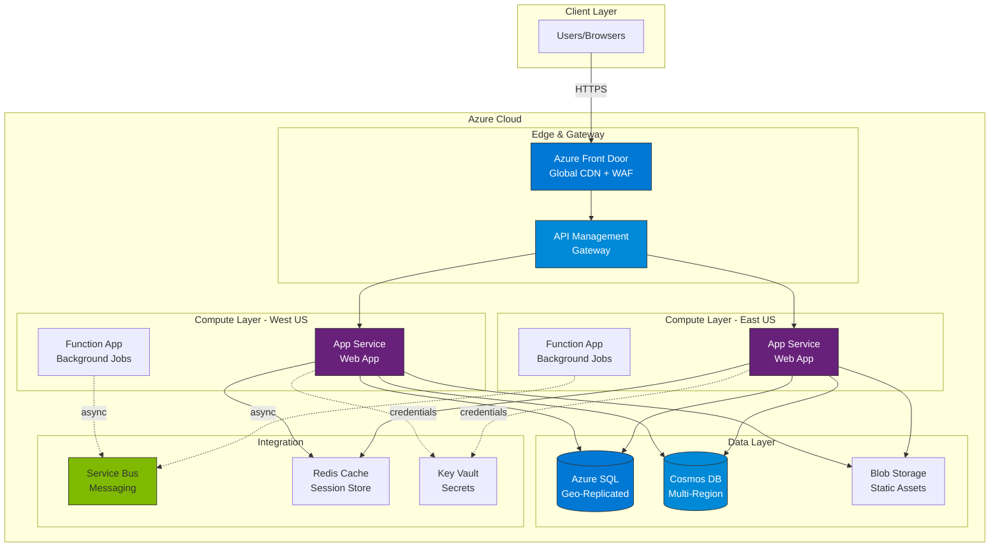
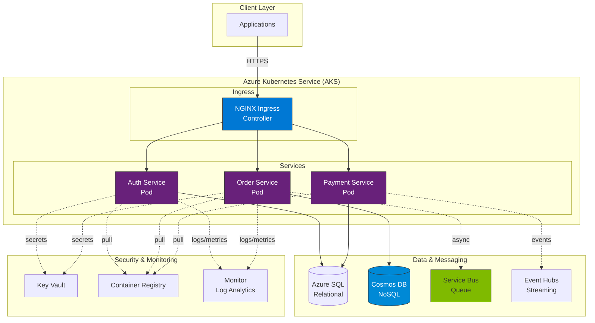
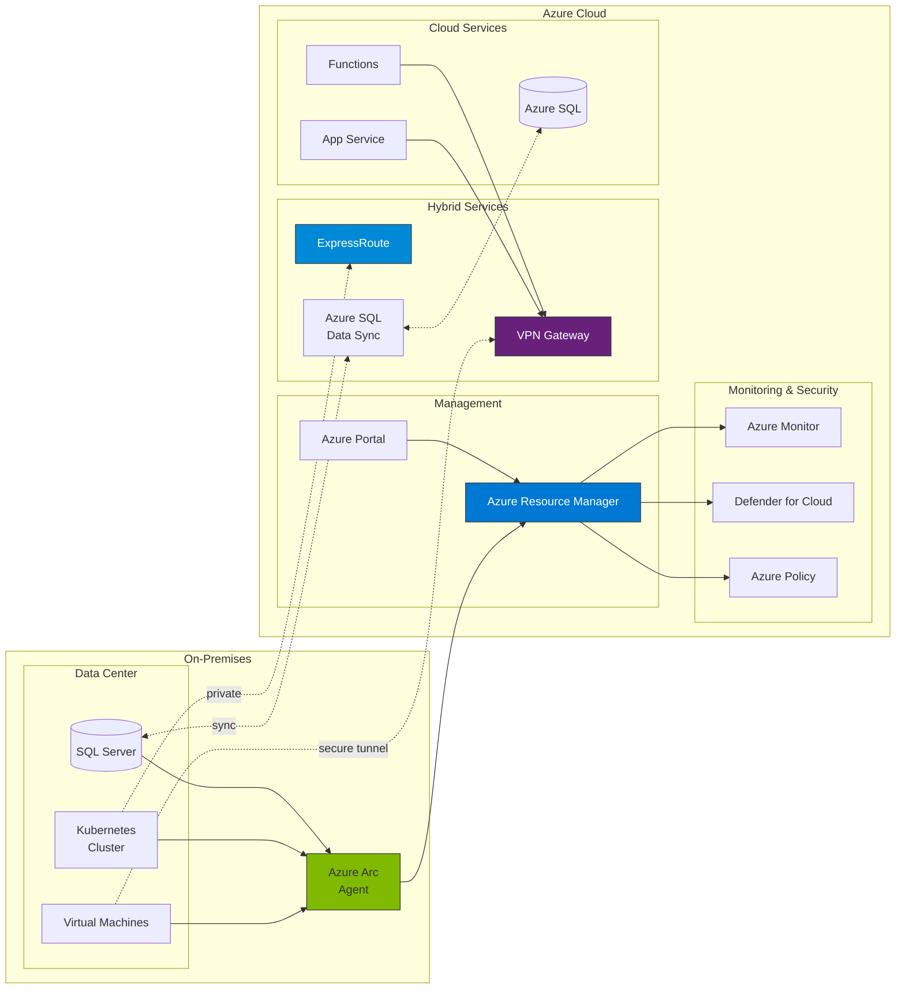

# :fontawesome-brands-microsoft: Microsoft Azure

Microsoft's cloud infrastructure platform. Second largest cloud provider (23% market share). Enterprise-focused with Active Directory integration. Excellent Windows/.NET support (obviously). Strong hybrid cloud story (on-prem + cloud). Naming is inconsistent (App Service, Functions, Logic Apps). Portal UI is slow but functional.

!!! tip "2026 Update"
    Azure continues strong growth in enterprise. Entra ID (formerly Azure AD) is rebranded. Azure Container Apps simplify container deployment. Bicep (infrastructure as code) is production-ready. Copilot integration in portal. Microsoft Defender for Cloud is comprehensive. Multi-cloud with Arc.

______________________________________________________________________

## :fontawesome-solid-bolt-lightning: Quick Hits

=== ":fontawesome-solid-list-check: Essential Services"

    ```bash
    # Azure CLI (cross-platform)
    az login                           # Authenticate
    az account list                    # List subscriptions
    az account set --subscription "My Subscription"

    # Virtual Machines (like AWS EC2)
    az vm create \
      --resource-group myResourceGroup \
      --name myVM \
      --image Ubuntu2204 \
      --size Standard_B1s \
      --admin-username azureuser \
      --generate-ssh-keys # (1)!

    # Blob Storage (like AWS S3)
    az storage account create \
      --name mystorageaccount \
      --resource-group myResourceGroup \
      --location eastus \
      --sku Standard_LRS # (2)!

    az storage blob upload \
      --account-name mystorageaccount \
      --container-name mycontainer \
      --name myblob \
      --file ./local-file.txt

    # App Service (PaaS for web apps)
    az webapp create \
      --resource-group myResourceGroup \
      --plan myAppServicePlan \
      --name myUniqueAppName \
      --runtime "PYTHON:3.11" # (3)!

    az webapp deployment source config-zip \
      --resource-group myResourceGroup \
      --name myUniqueAppName \
      --src ./app.zip

    # Azure Functions (serverless functions, like AWS Lambda)
    az functionapp create \
      --resource-group myResourceGroup \
      --consumption-plan-location eastus \
      --runtime python \
      --runtime-version 3.11 \
      --functions-version 4 \
      --name myFunctionApp \
      --storage-account mystorageaccount # (4)!

    # AKS - Azure Kubernetes Service
    az aks create \
      --resource-group myResourceGroup \
      --name myAKSCluster \
      --node-count 3 \
      --enable-managed-identity \
      --generate-ssh-keys # (5)!

    az aks get-credentials \
      --resource-group myResourceGroup \
      --name myAKSCluster

    # Azure SQL Database (managed SQL)
    az sql server create \
      --name myserver \
      --resource-group myResourceGroup \
      --location eastus \
      --admin-user myadmin \
      --admin-password 'P@ssw0rd123!' # (6)!

    az sql db create \
      --resource-group myResourceGroup \
      --server myserver \
      --name mydatabase \
      --service-objective S0  # DTU tier

    # Container Apps (like Cloud Run, easiest containers)
    az containerapp create \
      --name my-container-app \
      --resource-group myResourceGroup \
      --environment myEnvironment \
      --image mcr.microsoft.com/azuredocs/containerapps-helloworld:latest \
      --target-port 80 \
      --ingress external # (7)!

    # Azure AD / Entra ID (identity management)
    az ad user create \
      --display-name "John Doe" \
      --user-principal-name john@contoso.com \
      --password 'P@ssw0rd123!'

    # Resource Groups (container for resources)
    az group create --name myResourceGroup --location eastus # (8)!
    az group delete --name myResourceGroup --yes  # Delete everything
    ```

    1. SSH keys stored in ~/.ssh/, auto-generated if not exist
    2. Standard_LRS is locally redundant (cheapest), use GRS for geo-redundant
    3. App Service supports .NET, Java, Node.js, Python, PHP, Ruby
    4. Functions v4 is latest (Node.js 18+, Python 3.11+)
    5. Managed identity avoids service principal credentials
    6. Use Azure Key Vault for passwords in production, not CLI args
    7. Container Apps scale to zero, simpler than AKS
    8. Resource groups organize resources, delete group = delete all resources

    **Real talk:**

    - Resource groups are mandatory (everything belongs to one)
    - Portal is slow, use CLI for speed
    - Azure AD integration makes enterprise auth easy
    - Container Apps are simpler than AKS for most workloads
    - Naming convention: all service names are globally unique

=== ":fontawesome-solid-bolt: Common Patterns"

    ```python
    # Azure Storage Blob client (Python)
    from azure.storage.blob import BlobServiceClient

    def upload_to_blob(connection_string, container_name, blob_name, data):
        """Upload data to Azure Blob Storage."""
        blob_service_client = BlobServiceClient.from_connection_string(connection_string)
        blob_client = blob_service_client.get_blob_client(
            container=container_name,
            blob=blob_name
        )

        blob_client.upload_blob(data, overwrite=True)  # (1)!
        return blob_client.url

    # Azure Function handler (Python)
    import azure.functions as func
    import logging

    def main(req: func.HttpRequest) -> func.HttpResponse:
        """HTTP trigger function."""
        logging.info('Processing HTTP request')

        # Parse query params or JSON body
        name = req.params.get('name')
        if not name:
            try:
                req_body = req.get_json()
                name = req_body.get('name')
            except ValueError:
                pass

        if name:
            return func.HttpResponse(
                f"Hello, {name}!",
                status_code=200
            )  # (2)!
        else:
            return func.HttpResponse(
                "Please pass a name",
                status_code=400
            )

    # Azure SQL Database connection (Python)
    import pyodbc

    def connect_to_azure_sql():
        """Connect to Azure SQL using connection string."""
        server = 'myserver.database.windows.net'
        database = 'mydatabase'
        username = 'myadmin'
        password = os.environ['SQL_PASSWORD']  # (3)!

        conn_string = (
            f'DRIVER={{ODBC Driver 18 for SQL Server}};'
            f'SERVER={server};DATABASE={database};'
            f'UID={username};PWD={password}'
        )

        conn = pyodbc.connect(conn_string)
        cursor = conn.cursor()

        cursor.execute("SELECT TOP 10 * FROM users")
        rows = cursor.fetchall()
        return rows

    # Cosmos DB (NoSQL, multi-model)
    from azure.cosmos import CosmosClient, PartitionKey

    def cosmos_operations():
        """Cosmos DB CRUD operations."""
        endpoint = os.environ['COSMOS_ENDPOINT']
        key = os.environ['COSMOS_KEY']

        client = CosmosClient(endpoint, key)
        database = client.create_database_if_not_exists(id="mydb")
        container = database.create_container_if_not_exists(
            id="users",
            partition_key=PartitionKey(path="/userId")  # (4)!
        )

        # Create document
        container.create_item(body={
            'id': '1',
            'userId': 'user123',
            'name': 'Alice',
            'email': 'alice@example.com'
        })

        # Query documents
        query = "SELECT * FROM c WHERE c.userId = 'user123'"
        items = list(container.query_items(
            query=query,
            enable_cross_partition_query=True
        ))
        return items

    # Service Bus (message queue, like AWS SQS)
    from azure.servicebus import ServiceBusClient, ServiceBusMessage

    def send_message():
        """Send message to Service Bus queue."""
        connection_str = os.environ['SERVICE_BUS_CONNECTION']
        queue_name = "myqueue"

        with ServiceBusClient.from_connection_string(connection_str) as client:
            with client.get_queue_sender(queue_name) as sender:
                message = ServiceBusMessage("Hello, Service Bus!")
                sender.send_messages(message)  # (5)!
    ```

    1. overwrite=True replaces existing blob, False raises error
    2. Azure Functions return HttpResponse object with body and status
    3. Use Azure Key Vault or Managed Identity, never hardcode credentials
    4. Partition key is crucial for Cosmos DB performance and cost
    5. Service Bus supports FIFO, sessions, duplicate detection

    ```csharp
    // C# is first-class citizen on Azure
    // Azure Function (C#)
    using Microsoft.AspNetCore.Mvc;
    using Microsoft.Azure.WebJobs;
    using Microsoft.Azure.WebJobs.Extensions.Http;
    using Microsoft.AspNetCore.Http;

    public static class MyFunction
    {
        [FunctionName("HttpTrigger")]
        public static IActionResult Run(
            [HttpTrigger(AuthorizationLevel.Function, "get", "post")] HttpRequest req)
        {
            string name = req.Query["name"];
            return new OkObjectResult($"Hello, {name}");  // (1)!
        }
    }

    // Blob Storage (C#)
    using Azure.Storage.Blobs;

    var connectionString = Environment.GetEnvironmentVariable("STORAGE_CONNECTION");
    var blobServiceClient = new BlobServiceClient(connectionString);
    var containerClient = blobServiceClient.GetBlobContainerClient("mycontainer");

    var blobClient = containerClient.GetBlobClient("myblob.txt");
    await blobClient.UploadAsync("./local-file.txt", overwrite: true);  // (2)!

    // Azure SQL with Entity Framework Core
    using Microsoft.EntityFrameworkCore;

    public class ApplicationDbContext : DbContext
    {
        public DbSet<User> Users { get; set; }

        protected override void OnConfiguring(DbContextOptionsBuilder options)
        {
            options.UseSqlServer(
                Environment.GetEnvironmentVariable("SQL_CONNECTION")
            );  // (3)!
        }
    }

    // Use:
    using var db = new ApplicationDbContext();
    var users = await db.Users.Where(u => u.Active).ToListAsync();
    ```

    1. Azure Functions in C# have excellent IntelliSense and tooling
    2. Azure SDK for .NET is most mature (Microsoft obviously)
    3. Entity Framework Core works seamlessly with Azure SQL

    ```json
    // Bicep (Infrastructure as Code, Azure native)
    // main.bicep
    param location string = resourceGroup().location
    param appName string

    // App Service Plan
    resource appServicePlan 'Microsoft.Web/serverfarms@2022-03-01' = {
      name: '${appName}-plan'
      location: location
      sku: {
        name: 'B1'  // (1)!
        tier: 'Basic'
      }
    }

    // Web App
    resource webApp 'Microsoft.Web/sites@2022-03-01' = {
      name: appName
      location: location
      properties: {
        serverFarmId: appServicePlan.id
        httpsOnly: true  // (2)!
        siteConfig: {
          pythonVersion: '3.11'
          appSettings: [
            {
              name: 'WEBSITE_RUN_FROM_PACKAGE'
              value: '1'
            }
          ]
        }
      }
    }

    output webAppUrl string = 'https://${webApp.properties.defaultHostName}'

    // Deploy: az deployment group create --resource-group myRG --template-file main.bicep
    ```

    1. B1 is cheapest paid tier ($13/month), F1 is free (limited)
    2. httpsOnly enforces TLS, always use in production

    **Why this works:**

    - Resource groups organize related resources
    - Managed Identity eliminates credential management
    - Azure SDK libraries handle auth automatically
    - Bicep is cleaner than ARM JSON templates
    - .NET integration is best-in-class

=== ":fontawesome-solid-fire: Pro Tips & Gotchas"

    !!! success "Cost Optimization"
        - **Reserved Instances** - 72% savings for 1-3 year commitment
        - **Azure Hybrid Benefit** - Reuse Windows/SQL Server licenses (huge savings)
        - **B-series VMs** - Burstable, cheap for low-utilization workloads
        - **Azure Advisor** - Free recommendations for cost, security, performance
        - **Spot VMs** - 90% discount, can be evicted (batch jobs)
        - **Dev/Test pricing** - Discounted for non-production (requires subscription)
        - **Budgets and alerts** - Set up in Cost Management

    !!! warning "Security"
        - **Managed Identity** - No passwords, use for app-to-Azure auth
        - **Azure Key Vault** - Store secrets, certificates, keys
        - **Entra ID (Azure AD)** - Single sign-on, MFA, conditional access
        - **Network Security Groups** - Firewall rules for VMs
        - **Microsoft Defender for Cloud** - Security posture management
        - **Private Link** - Access PaaS over private network (no public internet)
        - **RBAC** - Role-based access control (Owner, Contributor, Reader)

    !!! tip "Performance"
        - **Azure CDN** - Edge caching, multiple providers (Microsoft, Verizon, Akamai)
        - **Premium Storage** - SSD-backed, 99.9% SLA
        - **Accelerated Networking** - SR-IOV for high throughput
        - **Azure Front Door** - Global load balancer with WAF
        - **Redis Cache** - Managed Redis (standard on Azure)
        - **Availability Zones** - 99.99% SLA (vs 99.9% single zone)

    !!! danger "Gotchas"
        - **Naming globally unique** - Storage accounts, App Services (frustrating)
        - **Subscription limits** - 100 VMs per region default, need support ticket
        - **Portal is slow** - Use CLI or PowerShell for speed
        - **Resource group deletion** - Deletes EVERYTHING in the group (careful!)
        - **Service Principal expiry** - Credentials expire, use Managed Identity instead
        - **Egress costs** - Bandwidth out is expensive ($0.087/GB)
        - **Free tier limits** - 12 months, then paid (set billing alerts)

    !!! info "Azure vs AWS vs GCP"
        - **Market share** - AWS 32%, Azure 23%, GCP 10%
        - **Enterprise** - Azure wins (AD integration, hybrid cloud)
        - **Windows/.NET** - Azure obvious choice (best tooling)
        - **Linux** - Azure fine, but AWS/GCP have edge
        - **Pricing** - Similar to AWS, 20-30% more expensive than GCP
        - **Hybrid cloud** - Azure Arc beats AWS Outposts
        - **Learning curve** - Steeper than AWS (inconsistent naming)

______________________________________________________________________

## :fontawesome-solid-graduation-cap: Learning Paths

### :fontawesome-solid-book-open: Free Resources

- **[Microsoft Learn](https://docs.microsoft.com/learn/)** - Official training, interactive modules
- **[Azure Free Account](https://azure.microsoft.com/free/)** - $200 credit (30 days) + always free services
- **[Azure Fundamentals Learning Path](https://docs.microsoft.com/learn/paths/az-900-describe-cloud-concepts/)** - Start here
- **[Azure Documentation](https://docs.microsoft.com/azure/)** - Comprehensive docs
- **[Azure Architecture Center](https://docs.microsoft.com/azure/architecture/)** - Best practices and patterns
- **[Azure Friday](https://azure.microsoft.com/en-us/resources/videos/azure-friday/)** - Weekly video series

### :fontawesome-solid-certificate: Certifications Worth It

!!! success "Recommended Path"
    1. **AZ-900 Fundamentals** - $99, non-technical, good starting point
    2. **AZ-104 Administrator** - $165, most popular, infrastructure focus
    3. **AZ-204 Developer** - $165, application development focus
    4. **AZ-305 Architect** - $165, design solutions (harder)

- **[AZ-900: Fundamentals](https://docs.microsoft.com/certifications/azure-fundamentals/)** - $99, beginner-friendly
- **[AZ-104: Administrator](https://docs.microsoft.com/certifications/azure-administrator/)** - $165, most valuable for ops
- **[AZ-204: Developer](https://docs.microsoft.com/certifications/azure-developer/)** - $165, for developers
- **[AZ-305: Solutions Architect](https://docs.microsoft.com/certifications/azure-solutions-architect/)** - $165, design expertise
- **[AZ-400: DevOps Engineer](https://docs.microsoft.com/certifications/devops-engineer/)** - $165, CI/CD focus

**Reality check:**

- AZ-900 is easy (study 1 week, good for resume)
- AZ-104 most requested by employers
- Study 2-3 months with hands-on practice
- Use [Microsoft Learn](https://docs.microsoft.com/learn/) (free)
- Practice exams on [Whizlabs](https://www.whizlabs.com/) or [MeasureUp](https://www.measureup.com/)

### :fontawesome-solid-rocket: Projects to Build

!!! example "Beginner"
    - **Static website** - Blob Storage + CDN
    - **Web app** - App Service + Azure SQL
    - **Serverless API** - Azure Functions + Cosmos DB

!!! example "Intermediate"
    - **Container app** - Container Apps + Blob Storage
    - **Microservices** - AKS + Service Bus + Redis
    - **Data pipeline** - Event Hubs + Stream Analytics + SQL
    - **CI/CD** - Azure DevOps + App Service

!!! example "Advanced"
    - **Multi-region** - Traffic Manager + Cosmos DB global replication
    - **Hybrid cloud** - Azure Arc + on-prem Kubernetes
    - **ML pipeline** - Azure ML + Databricks + Data Lake
    - **Enterprise integration** - Logic Apps + API Management + Service Bus

______________________________________________________________________

## :fontawesome-solid-sitemap: Architecture Patterns

Common Azure architecture patterns for enterprise and hybrid cloud solutions.

!!! tip "Architecture Diagram Resources"
    **[Azure Architecture Icons](https://learn.microsoft.com/en-us/azure/architecture/icons/)** - Official icon collection for creating Azure architecture diagrams (SVG, PNG formats). Includes Azure services, hybrid solutions, and Microsoft technologies.

### Enterprise Web Application



**Why this works:**

- Front Door provides global CDN, WAF, and geo-routing
- API Management centralizes API versioning, auth, rate limiting
- App Service handles web hosting (Linux or Windows)
- Azure SQL geo-replication for disaster recovery
- Service Bus decouples services (guaranteed delivery)
- Key Vault eliminates hardcoded credentials

### Container Microservices



**Real talk:**

- AKS with managed identity (no passwords)
- Container Registry for private images
- Service Bus for reliable async messaging
- Event Hubs for high-throughput event streaming
- Log Analytics aggregates all cluster logs
- Pod Managed Identity for Key Vault access

### Hybrid Cloud Architecture



**Why Azure Arc:**

- Manage on-prem Kubernetes as Azure resources
- Apply Azure Policy to on-prem servers
- Unified monitoring across cloud + on-prem
- Extend Azure services to any infrastructure
- SQL Server anywhere with Azure management

______________________________________________________________________

## :fontawesome-solid-shield-halved: Well-Architected Framework

Azure's [Well-Architected Framework](https://docs.microsoft.com/azure/architecture/framework/) covers five pillars.

### Cost Optimization

??? example "Cost Management Strategies"

    | Strategy | Savings | Use Case |
    |----------|---------|----------|
    | Reserved Instances (1-3 year) | 72% | Steady-state workloads |
    | Azure Hybrid Benefit | 40% | Reuse Windows/SQL licenses |
    | Spot VMs | 90% | Fault-tolerant batch jobs |
    | B-series VMs | 60% | Burstable, low CPU usage |
    | Dev/Test pricing | 15-20% | Non-production environments |
    | Autoscaling | 30-50% | Variable workloads |

    **Cost Monitoring:**

    ```bash
    # View current costs
    az consumption usage list \
      --start-date 2026-01-01 \
      --end-date 2026-01-31

    # Set up budget alert
    az consumption budget create \
      --budget-name MonthlyBudget \
      --amount 1000 \
      --time-grain Monthly \
      --start-date 2026-01-01 \
      --end-date 2026-12-31

    # Get cost recommendations
    az advisor recommendation list \
      --category Cost
    ```

    **Right-Sizing:**

    ```bash
    # Azure Advisor shows underutilized VMs
    az advisor recommendation list \
      --category Cost \
      --query "[?category=='Cost'].{Name:impactedValue, Savings:extendedProperties.savingsAmount}"

    # Resize VM based on recommendations
    az vm resize \
      --resource-group myRG \
      --name myVM \
      --size Standard_B2s  # Smaller, cheaper
    ```

    **Storage Optimization:**

    ```bash
    # Lifecycle management (auto-tier to cool/archive)
    az storage account management-policy create \
      --account-name mystorageaccount \
      --policy @policy.json

    # policy.json: Move to Cool after 30 days, Archive after 90, Delete after 365
    {
      "rules": [
        {
          "enabled": true,
          "name": "archive-old-data",
          "type": "Lifecycle",
          "definition": {
            "actions": {
              "baseBlob": {
                "tierToCool": {"daysAfterModificationGreaterThan": 30},
                "tierToArchive": {"daysAfterModificationGreaterThan": 90},
                "delete": {"daysAfterModificationGreaterThan": 365}
              }
            },
            "filters": {
              "blobTypes": ["blockBlob"]
            }
          }
        }
      ]
    }
    ```

### Operational Excellence

??? example "DevOps & Monitoring"

    **CI/CD Pipeline:**

    ```yaml
    # azure-pipelines.yml (Azure DevOps)
    trigger:
      - main

    pool:
      vmImage: 'ubuntu-latest'

    steps:
    - task: UsePythonVersion@0
      inputs:
        versionSpec: '3.11'

    - script: |
        pip install -r requirements.txt
        pytest tests/
      displayName: 'Run tests'

    - task: Docker@2
      inputs:
        command: buildAndPush
        repository: myapp
        dockerfile: Dockerfile
        containerRegistry: myACR
        tags: |
          $(Build.BuildId)
          latest

    - task: AzureWebAppContainer@1
      inputs:
        azureSubscription: 'MySubscription'
        appName: 'myapp'
        containers: 'myACR.azurecr.io/myapp:$(Build.BuildId)'
    ```

    **Monitoring with Azure Monitor:**

    ```bash
    # Create Log Analytics workspace
    az monitor log-analytics workspace create \
      --resource-group myRG \
      --workspace-name myWorkspace

    # Enable Application Insights (automatic instrumentation)
    az monitor app-insights component create \
      --app myapp \
      --location eastus \
      --resource-group myRG \
      --application-type web

    # Query logs with KQL (Kusto Query Language)
    az monitor log-analytics query \
      --workspace myWorkspace \
      --analytics-query "AppRequests | where TimeGenerated > ago(1h) | summarize count() by ResultCode"

    # Create alert rule
    az monitor metrics alert create \
      --name HighCPU \
      --resource-group myRG \
      --scopes /subscriptions/.../resourceGroups/myRG/providers/Microsoft.Compute/virtualMachines/myVM \
      --condition "avg Percentage CPU > 80" \
      --window-size 5m \
      --evaluation-frequency 1m
    ```

    **SRE Metrics:**

    | Metric | Target | Alert |
    |--------|--------|-------|
    | Availability | 99.9% | <99.5% (5 min window) |
    | Latency (p95) | <300ms | >500ms (5 min window) |
    | Error rate | <1% | >5% (1 min window) |
    | CPU utilization | <70% | >85% (10 min sustained) |

### Performance Efficiency

??? example "Performance Optimization"

    **Compute Selection:**

    ```mermaid
    graph TD
        START{Workload Type?}
        START -->|Web app| WEB
        START -->|API| API
        START -->|Batch| BATCH
        START -->|Containers| CONT

        WEB{Traffic?}
        WEB -->|Steady| AS[App Service<br/>Standard tier]
        WEB -->|Variable| ASP[App Service<br/>Premium w/Autoscale]

        API{Load?}
        API -->|Light| FUNC[Azure Functions<br/>Consumption]
        API -->|Heavy| APIM_AS[API Management<br/>+ App Service]

        BATCH{Frequency?}
        BATCH -->|Scheduled| FUNC_TIMER[Functions<br/>Timer trigger]
        BATCH -->|On-demand| BATCH_VM[Batch Service<br/>VMs]

        CONT{Complexity?}
        CONT -->|Simple| CA[Container Apps<br/>Managed]
        CONT -->|Complex| AKS[AKS<br/>Full K8s]
    ```

    **Caching Strategies:**

    ```bash
    # Azure Redis Cache (session store, cache)
    az redis create \
      --name myredis \
      --resource-group myRG \
      --location eastus \
      --sku Basic \
      --vm-size c0  # Smallest (250MB)

    # Azure CDN (static assets)
    az cdn endpoint create \
      --name myendpoint \
      --profile-name mycdnprofile \
      --resource-group myRG \
      --origin mystorageaccount.blob.core.windows.net \
      --origin-host-header mystorageaccount.blob.core.windows.net

    # Front Door (global routing + caching)
    az network front-door create \
      --resource-group myRG \
      --name myfrontdoor \
      --backend-address myapp.azurewebsites.net
    ```

    **Database Performance:**

    | Database | Use Case | Performance Tier |
    |----------|----------|------------------|
    | Azure SQL | Relational, OLTP | vCore (8-32 cores) |
    | Cosmos DB | NoSQL, global | Provisioned throughput (RU/s) |
    | PostgreSQL | Relational, open-source | Flexible Server (2-64 vCores) |
    | Redis Cache | In-memory, cache | Premium (clustering, persistence) |
    | Table Storage | Simple key-value | Automatic scaling |

### Reliability

??? example "High Availability & DR"

    **Availability Zones:**

    ```bash
    # Deploy VM across zones (99.99% SLA)
    az vm create \
      --resource-group myRG \
      --name myVM \
      --image Ubuntu2204 \
      --zones 1 2 3  # Zones 1, 2, 3

    # AKS with availability zones
    az aks create \
      --resource-group myRG \
      --name myAKSCluster \
      --node-count 3 \
      --zones 1 2 3 \
      --enable-cluster-autoscaler \
      --min-count 1 \
      --max-count 10

    # Azure SQL with zone redundancy
    az sql db create \
      --resource-group myRG \
      --server myserver \
      --name mydatabase \
      --service-objective GP_Gen5_2 \
      --zone-redundant  # Multi-zone HA
    ```

    **SLA Comparison:**

    | Configuration | SLA | Monthly Downtime |
    |---------------|-----|------------------|
    | Single VM (SSD) | 99.9% | 43.8 minutes |
    | Availability Set | 99.95% | 21.9 minutes |
    | Availability Zones | 99.99% | 4.38 minutes |
    | Multi-region | 99.999% | 26 seconds |

    **Disaster Recovery:**

    ```bash
    # Azure Site Recovery (VM replication)
    az backup vault create \
      --resource-group myRG \
      --name myVault \
      --location eastus

    # SQL geo-replication
    az sql db replica create \
      --name mydatabase \
      --resource-group myRG \
      --server myserver \
      --partner-server myserver-secondary \
      --partner-resource-group myRG-secondary

    # Cosmos DB multi-region write
    az cosmosdb create \
      --name mycosmosdb \
      --resource-group myRG \
      --locations regionName=eastus failoverPriority=0 \
      --locations regionName=westus failoverPriority=1 \
      --enable-multiple-write-locations
    ```

### Security

??? example "Security Best Practices"

    **Identity & Access:**

    - [ ] Use Managed Identity for app-to-Azure authentication
    - [ ] Enable MFA for all user accounts (Entra ID)
    - [ ] Implement RBAC (Owner, Contributor, Reader roles)
    - [ ] Use Azure AD Conditional Access (block risky sign-ins)
    - [ ] Store secrets in Key Vault (never in code)
    - [ ] Enable Just-In-Time (JIT) VM access
    - [ ] Use service principals with certificate auth (not passwords)

    ```bash
    # Create managed identity for App Service
    az webapp identity assign \
      --name myapp \
      --resource-group myRG

    # Grant Key Vault access to managed identity
    az keyvault set-policy \
      --name mykeyvault \
      --object-id <MANAGED_IDENTITY_ID> \
      --secret-permissions get list

    # Store secret in Key Vault
    az keyvault secret set \
      --vault-name mykeyvault \
      --name ConnectionString \
      --value "Server=..."
    ```

    **Network Security:**

    ```bash
    # Network Security Group (firewall rules)
    az network nsg rule create \
      --resource-group myRG \
      --nsg-name myNSG \
      --name AllowHTTPS \
      --priority 100 \
      --source-address-prefixes '*' \
      --destination-port-ranges 443 \
      --access Allow \
      --protocol Tcp

    # Private Endpoint (no public internet)
    az network private-endpoint create \
      --name myPrivateEndpoint \
      --resource-group myRG \
      --vnet-name myVNet \
      --subnet mySubnet \
      --private-connection-resource-id /subscriptions/.../Microsoft.Sql/servers/myserver \
      --connection-name myConnection

    # Azure Firewall (enterprise-grade)
    az network firewall create \
      --name myFirewall \
      --resource-group myRG \
      --location eastus
    ```

    **Microsoft Defender for Cloud:**

    ```bash
    # Enable Defender (formerly Security Center)
    az security pricing create \
      --name VirtualMachines \
      --tier Standard

    # Get security recommendations
    az security assessment list

    # Get security alerts
    az security alert list
    ```

______________________________________________________________________

## :fontawesome-solid-heart-pulse: Community Pulse

### :fontawesome-solid-users: Who to Follow

**Twitter/X:**

- [@Azure](https://twitter.com/Azure) - Official Azure account
- [@Scott_Guthrie](https://twitter.com/Scott_Guthrie) - EVP Cloud + AI
- [@shanselman](https://twitter.com/shanselman) - Scott Hanselman, .NET legend
- [@BrianBenz](https://twitter.com/BrianBenz) - Azure Developer Advocate
- [@Azure_Thompson](https://twitter.com/Azure_Thompson) - Azure MVP

**YouTube:**

- [Microsoft Azure](https://www.youtube.com/c/MicrosoftAzure) - Official channel
- [Azure Friday](https://www.youtube.com/c/AzureFriday) - Weekly demos
- [John Savill's Technical Training](https://www.youtube.com/@NTFAQGuy) - Deep dives, cert prep

### :fontawesome-solid-comments: Active Communities

- **[r/AZURE](https://reddit.com/r/AZURE)** - 150k+ members, very active
- **[Microsoft Tech Community](https://techcommunity.microsoft.com/t5/azure/ct-p/Azure)** - Official forums
- **[Stack Overflow [azure]](https://stackoverflow.com/questions/tagged/azure)** - Quick answers
- **[Dev.to #azure](https://dev.to/t/azure)** - Tutorials and articles
- **[Azure Facebook Group](https://www.facebook.com/groups/MicrosoftAzure/)** - Active community

### :fontawesome-solid-calendar: Events

- **[Microsoft Ignite](https://ignite.microsoft.com/)** - November, major announcements
- **[Microsoft Build](https://build.microsoft.com/)** - May, developer-focused
- **[Azure Community Conferences](https://www.azurecommunityday.org/)** - Free, local meetups

______________________________________________________________________

## :fontawesome-solid-star: Worth Checking

<div class="grid cards" markdown>

- :fontawesome-solid-book: __Official Docs__

    ______________________________________________________________________

    [Azure Documentation](https://docs.microsoft.com/azure/)

    [Azure CLI Reference](https://docs.microsoft.com/cli/azure/)

    [Architecture Center](https://docs.microsoft.com/azure/architecture/)

    [Best Practices](https://docs.microsoft.com/azure/architecture/best-practices/)

- :fontawesome-solid-flask: __Hands-on Practice__

    ______________________________________________________________________

    [Azure Free Account](https://azure.microsoft.com/free/)

    [Microsoft Learn](https://docs.microsoft.com/learn/)

    [Azure Labs](https://azurecitadel.com/)

    [Azure Quickstarts](https://github.com/Azure/azure-quickstart-templates)

- :fontawesome-solid-code: __Tools & SDKs__

    ______________________________________________________________________

    [Azure CLI](https://docs.microsoft.com/cli/azure/)

    [Azure Portal](https://portal.azure.com/)

    [Azure Cloud Shell](https://shell.azure.com/)

    [Bicep](https://docs.microsoft.com/azure/azure-resource-manager/bicep/)

    [Terraform Azure Provider](https://registry.terraform.io/providers/hashicorp/azurerm/latest/docs)

- :fontawesome-solid-rss: __News & Updates__

    ______________________________________________________________________

    [Azure Blog](https://azure.microsoft.com/blog/)

    [Azure Updates](https://azure.microsoft.com/updates/)

    [r/AZURE](https://reddit.com/r/AZURE)

    [Azure Weekly](https://azureweekly.info/)

</div>

______________________________________________________________________

**Last Updated:** 2026-02-02 | **Vibe Check:** :fontawesome-solid-building: **Enterprise Standard** - Azure is the enterprise choice. Active Directory integration, hybrid cloud leadership, Windows/.NET best-in-class. Portal is slow but functional. Second largest cloud (23% share). If your company runs Microsoft stack, Azure is the path of least resistance.


**Tags:** azure, microsoft, cloud
