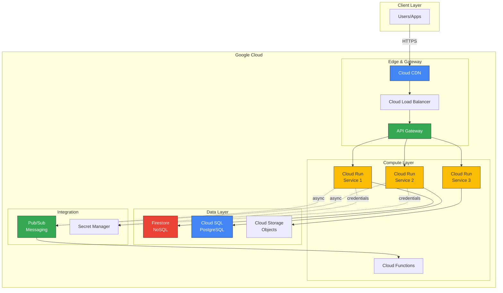
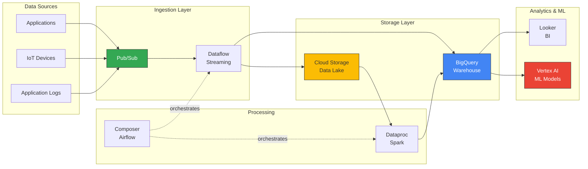

# :fontawesome-brands-google: Google Cloud Platform (GCP)

Google's cloud infrastructure platform. Born from Google's internal systems (Kubernetes, Borg, BigTable). Strong in data analytics, ML/AI, and container orchestration. Generally cheaper than AWS, better per-core performance. Smaller market share (10%) but solid engineering. IAM is more sensible than AWS. Kubernetes runs best here (they invented it).

!!! tip "2026 Update"
    GCP continues strong in AI/ML with Vertex AI and Gemini integration. Cloud Run is the easiest serverless platform. BigQuery remains unbeatable for analytics. Multi-region is now standard. GKE Autopilot eliminates cluster management. Pricing is still 20-30% cheaper than AWS for compute.

______________________________________________________________________

## :fontawesome-solid-bolt-lightning: Quick Hits

=== ":fontawesome-solid-list-check: Essential Services"

    ```bash
    # Compute Engine - VMs (like AWS EC2)
    gcloud compute instances create my-instance \
      --machine-type=e2-micro \
      --image-family=debian-11 \
      --image-project=debian-cloud \
      --zone=us-central1-a # (1)!

    # Cloud Storage - Object storage (like AWS S3)
    gsutil cp file.txt gs://my-bucket/
    gsutil mb gs://my-new-bucket  # Make bucket
    gsutil rsync -r ./local gs://bucket/path # (2)!

    # Cloud Run - Serverless containers (easiest deployment ever)
    gcloud run deploy my-service \
      --image gcr.io/project/image:tag \
      --platform managed \
      --region us-central1 \
      --allow-unauthenticated # (3)!

    # GKE - Kubernetes (Google invented it)
    gcloud container clusters create my-cluster \
      --num-nodes=3 \
      --enable-autoscaling \
      --min-nodes=1 \
      --max-nodes=5 \
      --zone=us-central1-a # (4)!

    gcloud container clusters get-credentials my-cluster  # Configure kubectl

    # Cloud SQL - Managed databases
    gcloud sql instances create my-db \
      --database-version=POSTGRES_15 \
      --tier=db-f1-micro \
      --region=us-central1 # (5)!

    gcloud sql connect my-db --user=postgres

    # BigQuery - Serverless analytics (unique to GCP, no AWS equivalent)
    bq query --use_legacy_sql=false \
      'SELECT name, COUNT(*) as cnt FROM `project.dataset.table` GROUP BY name' # (6)!

    # Cloud Functions - Serverless functions (like AWS Lambda)
    gcloud functions deploy my-function \
      --runtime=python312 \
      --trigger-http \
      --entry-point=main \
      --allow-unauthenticated # (7)!

    # IAM - Identity and Access Management
    gcloud iam service-accounts create my-sa
    gcloud projects add-iam-policy-binding PROJECT_ID \
      --member=serviceAccount:my-sa@project.iam.gserviceaccount.com \
      --role=roles/storage.objectViewer # (8)!

    # Logging - View logs
    gcloud logging read "resource.type=cloud_run_revision" --limit 50
    gcloud logging read "severity>=ERROR" --limit 100 # (9)!
    ```

    1. Zones are region-letter (us-central1-a), cheaper than AWS for same specs
    2. `gsutil` is fast and reliable, works like rsync
    3. Cloud Run deploys containers in seconds, auto-scales to zero (no idle costs)
    4. GKE Autopilot mode (add --enable-autopilot) removes cluster management
    5. Cloud SQL supports PostgreSQL, MySQL, SQL Server
    6. BigQuery is columnar, scales to petabytes, pay per query
    7. Cloud Functions Gen2 uses Cloud Run under the hood (faster cold starts)
    8. IAM roles are hierarchical (organization → folder → project → resource)
    9. Cloud Logging aggregates all logs automatically

    **Real talk:**

    - Cloud Run is the best serverless platform (containers > functions)
    - BigQuery is unmatched for analytics (query terabytes in seconds)
    - GKE Autopilot means you never touch cluster config
    - IAM is more logical than AWS (fewer gotchas)
    - Pricing calculator is accurate (unlike AWS surprises)

=== ":fontawesome-solid-bolt: Common Patterns"

    ```python
    # Cloud Storage client library (Python)
    from google.cloud import storage

    def upload_to_gcs(bucket_name, source_file, destination_blob):
        """Upload file to GCS bucket."""
        storage_client = storage.Client()
        bucket = storage_client.bucket(bucket_name)
        blob = bucket.blob(destination_blob)

        blob.upload_from_filename(source_file)  # (1)!

        # Make public (if needed)
        blob.make_public()
        return blob.public_url

    # Cloud Function handler (Python)
    import functions_framework

    @functions_framework.http
    def main(request):
        """HTTP Cloud Function handler."""
        # Parse JSON request
        request_json = request.get_json(silent=True)

        # Business logic
        name = request_json.get('name', 'World')

        return {'message': f'Hello, {name}!'}, 200  # (2)!

    # Cloud Run service (FastAPI)
    from fastapi import FastAPI
    import uvicorn

    app = FastAPI()

    @app.get("/health")
    def health_check():
        return {"status": "healthy"}

    @app.get("/api/data")
    def get_data():
        # Cloud SQL connection using Cloud SQL Proxy
        # Or use public IP with Cloud SQL IAM auth
        return {"data": [1, 2, 3]}

    if __name__ == "__main__":
        import os
        port = int(os.environ.get("PORT", 8080))  # (3)!
        uvicorn.run(app, host="0.0.0.0", port=port)

    # BigQuery query (Python)
    from google.cloud import bigquery

    def query_bigquery():
        """Query BigQuery dataset."""
        client = bigquery.Client()

        query = """
            SELECT name, COUNT(*) as count
            FROM `project.dataset.users`
            WHERE created_at > TIMESTAMP_SUB(CURRENT_TIMESTAMP(), INTERVAL 7 DAY)
            GROUP BY name
            ORDER BY count DESC
            LIMIT 10
        """  # (4)!

        query_job = client.query(query)
        results = query_job.result()

        return [dict(row) for row in results]

    # Firestore (NoSQL document database)
    from google.cloud import firestore

    def write_to_firestore():
        """Write document to Firestore."""
        db = firestore.Client()

        doc_ref = db.collection('users').document('user123')
        doc_ref.set({
            'name': 'Alice',
            'email': 'alice@example.com',
            'created_at': firestore.SERVER_TIMESTAMP
        })  # (5)!

        # Query documents
        users = db.collection('users').where('name', '==', 'Alice').stream()
        return [doc.to_dict() for doc in users]
    ```

    1. Upload with automatic retry and resumable uploads for large files
    2. Return tuple (body, status_code) or dict for JSON response
    3. Cloud Run sets PORT env variable, always use it (not hardcoded 8080)
    4. BigQuery SQL is standard SQL (not proprietary like old AWS Redshift)
    5. SERVER_TIMESTAMP is set server-side (accurate, not client time)

    ```yaml
    # Cloud Run service definition (YAML)
    apiVersion: serving.knative.dev/v1
    kind: Service
    metadata:
      name: my-service
    spec:
      template:
        metadata:
          annotations:
            autoscaling.knative.dev/minScale: "0"  # (1)!
            autoscaling.knative.dev/maxScale: "100"
        spec:
          containerConcurrency: 80  # (2)!
          containers:
          - image: gcr.io/project/image:tag
            ports:
            - containerPort: 8080
            env:
            - name: DATABASE_URL
              valueFrom:
                secretKeyRef:
                  name: db-credentials
                  key: url  # (3)!
            resources:
              limits:
                memory: 512Mi
                cpu: "1"  # (4)!

    # Deployment via gcloud
    # gcloud run services replace service.yaml --region=us-central1
    ```

    1. minScale=0 means scale to zero (no idle costs), great for dev/staging
    2. containerConcurrency controls requests per instance (80-100 is sweet spot)
    3. Secret Manager integration, secrets never in code
    4. CPU only allocated during request processing (billing is per 100ms)

    ```terraform
    # Terraform for GCP infrastructure
    terraform {
      required_providers {
        google = {
          source  = "hashicorp/google"
          version = "~> 5.0"
        }
      }
    }

    provider "google" {
      project = "my-project"
      region  = "us-central1"
    }

    # Cloud Run service
    resource "google_cloud_run_service" "api" {
      name     = "api-service"
      location = "us-central1"

      template {
        spec {
          containers {
            image = "gcr.io/my-project/api:latest"

            resources {
              limits = {
                memory = "512Mi"
                cpu    = "1"
              }
            }
          }
        }
      }

      traffic {
        percent         = 100
        latest_revision = true  # (1)!
      }
    }

    # Make service public
    resource "google_cloud_run_service_iam_member" "public" {
      service  = google_cloud_run_service.api.name
      location = google_cloud_run_service.api.location
      role     = "roles/run.invoker"
      member   = "allUsers"  # (2)!
    }

    # Cloud Storage bucket
    resource "google_storage_bucket" "data" {
      name          = "my-data-bucket"
      location      = "US"
      force_destroy = false  # (3)!

      lifecycle_rule {
        action {
          type = "Delete"
        }
        condition {
          age = 365  # Delete after 1 year
        }
      }
    }
    ```

    1. Always route to latest revision (or use blue-green with traffic splits)
    2. allUsers makes public, remove for authentication requirement
    3. force_destroy=false prevents accidental data loss (Terraform won't delete non-empty bucket)

    **Why this works:**

    - Cloud Run is simpler than Kubernetes for most workloads
    - BigQuery scales without provisioning (pay per query)
    - IAM is hierarchical (inherit permissions from project/org)
    - Client libraries handle auth automatically (no key management)
    - Infrastructure as code (Terraform) enables version control

=== ":fontawesome-solid-fire: Pro Tips & Gotchas"

    !!! success "Cost Optimization"
        - **Committed use discounts** - 57% savings for 1-3 year commitment
        - **Preemptible VMs** - 80% cheaper, can be terminated (24 hour max)
        - **Sustained use discounts** - Automatic 30% discount for consistent usage
        - **Cloud Run scale-to-zero** - No idle costs (unlike Cloud Functions Gen1)
        - **BigQuery slots** - Flat-rate pricing for predictable workloads
        - **Cloud CDN** - Cheaper than CloudFront, excellent cache hit rates
        - **Budget alerts** - Set up immediately in Billing console

    !!! warning "Security"
        - **IAM roles** - Use predefined roles (viewer, editor, owner) or custom
        - **Service accounts** - Never use user accounts for applications
        - **Workload Identity** - GKE pods authenticate as service accounts (no keys)
        - **VPC Service Controls** - Prevent data exfiltration (required for compliance)
        - **Security Command Center** - Centralized security findings (standard tier free)
        - **Secret Manager** - Store API keys, passwords (encrypted at rest)
        - **Binary Authorization** - Only deploy signed container images

    !!! tip "Performance"
        - **Cloud Run** - Sub-second cold starts, scales instantly
        - **Cloud CDN** - Edge caching with Anycast IPs (sub-50ms globally)
        - **Premium Network Tier** - Google's private fiber (faster, more expensive)
        - **GKE Autopilot** - Auto-scaling without node management
        - **Memorystore** - Managed Redis/Memcached (sub-ms latency)
        - **Cloud Spanner** - Globally distributed SQL (strong consistency)

    !!! danger "Gotchas"
        - **Egress costs** - Out to internet is expensive ($0.12/GB), use CDN
        - **API quotas** - Default quotas are low, request increases proactively
        - **Project limits** - 100 VMs default, need quota increase for scale
        - **Cloud Functions Gen1** - Avoid (use Gen2 or Cloud Run instead)
        - **Firestore vs Datastore** - Different APIs, can't use both in same project
        - **BigQuery costs** - Full table scans = $$$, use partitioning/clustering
        - **Zone outages** - Multi-region is not automatic, design for it

    !!! info "GCP vs AWS Comparison"
        - **Pricing** - GCP 20-30% cheaper for compute, more predictable
        - **Performance** - Better per-core performance (Intel Ice Lake default)
        - **Networking** - Premium tier uses Google's private network (faster)
        - **Kubernetes** - GKE is best-in-class (Google invented K8s)
        - **ML/AI** - Vertex AI simpler than AWS SageMaker
        - **Analytics** - BigQuery has no AWS equivalent (Redshift is different)
        - **Market share** - AWS 32%, Azure 23%, GCP 10% (smaller but growing)

______________________________________________________________________

## :fontawesome-solid-graduation-cap: Learning Paths

### :fontawesome-solid-book-open: Free Resources

- **[Google Cloud Skills Boost](https://www.cloudskillsboost.google/)** - Official training with labs
- **[GCP Free Tier](https://cloud.google.com/free)** - Always free products + $300 credit (3 months)
- **[Coursera GCP Specializations](https://www.coursera.org/google-cloud)** - Google-created courses
- **[GCP Documentation](https://cloud.google.com/docs)** - Excellent docs, better than AWS
- **[Qwiklabs](https://www.qwiklabs.com/)** - Hands-on labs in real GCP (some free)
- **[GCP Podcast](https://www.gcppodcast.com/)** - Weekly podcast with product teams

### :fontawesome-solid-certificate: Certifications Worth It

!!! success "Recommended Path"
    1. **Cloud Digital Leader** - $99, non-technical, good for business roles
    2. **Associate Cloud Engineer** - $125, most popular, hands-on
    3. **Professional Cloud Architect** - $200, prestigious, harder than AWS SAA
    4. Specialty certs if needed (Data Engineer, Security Engineer, etc.)

- **[Associate Cloud Engineer](https://cloud.google.com/certification/cloud-engineer)** - $125, most valuable for engineers
- **[Professional Cloud Architect](https://cloud.google.com/certification/cloud-architect)** - $200, design and manage solutions
- **[Professional Data Engineer](https://cloud.google.com/certification/data-engineer)** - $200, BigQuery, Dataflow, ML
- **[Professional Cloud Developer](https://cloud.google.com/certification/cloud-developer)** - $200, application development

**Reality check:**

- GCP certs are hands-on (no multiple choice like AWS)
- Cloud Architect is harder than AWS Solutions Architect
- Study 2-3 months with hands-on practice
- Use [Official Practice Exams](https://cloud.google.com/certification/practice-exam) ($20)
- Join [r/googlecloud](https://reddit.com/r/googlecloud) for tips

### :fontawesome-solid-rocket: Projects to Build

!!! example "Beginner"
    - **Static website** - Cloud Storage + Cloud CDN
    - **Serverless API** - Cloud Run + Cloud SQL
    - **Image processing** - Cloud Functions + Cloud Storage triggers

!!! example "Intermediate"
    - **Full-stack app** - Cloud Run + Firestore + Cloud CDN
    - **Data pipeline** - Pub/Sub + Dataflow + BigQuery
    - **ML model serving** - Vertex AI + Cloud Run
    - **GKE microservices** - GKE Autopilot + Cloud SQL

!!! example "Advanced"
    - **Multi-region app** - Global load balancer + Cloud Spanner
    - **Real-time analytics** - Pub/Sub + Dataflow + BigQuery streaming
    - **Cost optimization dashboard** - Billing API + Cloud Functions + BigQuery
    - **Hybrid cloud** - Anthos for on-prem + GCP

______________________________________________________________________

## :fontawesome-solid-sitemap: Architecture Patterns

Common GCP architecture patterns for modern cloud-native applications.

!!! tip "Architecture Diagram Resources"
    **[Google Cloud Architecture Icons](https://cloud.google.com/icons)** - Official icon library for creating GCP architecture diagrams (SVG, PNG formats). Includes all GCP products and services.

### Serverless Microservices



**Why this works:**

- Cloud Run scales to zero (no idle costs)
- API Gateway handles auth, rate limiting, versioning
- Pub/Sub decouples services (async processing)
- Firestore for real-time, Cloud SQL for relational
- Secret Manager eliminates hardcoded credentials

### Data Analytics Pipeline



**Real talk:**

- Pub/Sub handles millions of events/sec (auto-scaling)
- Dataflow is managed Apache Beam (no infrastructure)
- BigQuery queries petabytes in seconds (columnar storage)
- Looker replaces Tableau/PowerBI (Google acquired it)
- Vertex AI simplifies ML pipeline (training, deployment, monitoring)

### Multi-Region Web Application

```mermaid
graph TB
    subgraph "Global Edge"
        CF[Cloud CDN<br/>Anycast IP]
        GCLB[Global Load Balancer<br/>HTTP(S)]
    end

    subgraph "Region: us-central1"
        CR_US[Cloud Run<br/>US]
        SPAN_US[(Cloud Spanner<br/>US Primary)]
    end

    subgraph "Region: europe-west1"
        CR_EU[Cloud Run<br/>EU]
        SPAN_EU[(Cloud Spanner<br/>EU Replica)]
    end

    subgraph "Region: asia-east1"
        CR_ASIA[Cloud Run<br/>Asia]
        SPAN_ASIA[(Cloud Spanner<br/>Asia Replica)]
    end

    subgraph "Shared Services"
        MEM[Memorystore<br/>Redis]
        GCS[Cloud Storage<br/>Multi-Region]
        PS[Pub/Sub<br/>Global]
    end

    CF --> GCLB
    GCLB -->|geo-routing| CR_US
    GCLB -->|geo-routing| CR_EU
    GCLB -->|geo-routing| CR_ASIA

    CR_US --> SPAN_US
    CR_EU --> SPAN_EU
    CR_ASIA --> SPAN_ASIA

    SPAN_US -.->|sync replication| SPAN_EU
    SPAN_EU -.->|sync replication| SPAN_ASIA
    SPAN_ASIA -.->|sync replication| SPAN_US

    CR_US --> MEM
    CR_US --> GCS
    CR_US --> PS

    style CF fill:#4285F4,stroke:#333,color:#fff
    style GCLB fill:#34A853,stroke:#333,color:#fff
    style SPAN_US fill:#EA4335,stroke:#333,color:#fff
    style SPAN_EU fill:#EA4335,stroke:#333,color:#fff
    style SPAN_ASIA fill:#EA4335,stroke:#333,color:#fff
```

**Why Cloud Spanner:**

- Globally distributed SQL (strong consistency)
- 99.999% SLA (five 9s uptime)
- Automatic replication across regions
- No manual sharding (scales horizontally)
- More expensive than Cloud SQL but worth it for global apps

______________________________________________________________________

## :fontawesome-solid-shield-halved: Well-Architected Framework

Google Cloud's [Architecture Framework](https://cloud.google.com/architecture/framework) covers six pillars.

### Security

??? example "Security Best Practices"

    **Key Principles:**

    - [ ] Use service accounts for applications (never user accounts)
    - [ ] Enable VPC Service Controls (prevent data exfiltration)
    - [ ] Implement least privilege IAM (roles, not permissions)
    - [ ] Use Workload Identity for GKE (no service account keys)
    - [ ] Enable Binary Authorization (only signed containers)
    - [ ] Store secrets in Secret Manager (not env vars)
    - [ ] Enable Cloud Audit Logs (who did what, when)
    - [ ] Use Private Google Access (no public internet required)

    **Identity & Access:**

    ```bash
    # Grant minimal permissions
    gcloud projects add-iam-policy-binding PROJECT_ID \
      --member=serviceAccount:sa@project.iam.gserviceaccount.com \
      --role=roles/storage.objectViewer  # Read-only

    # Use predefined roles (not custom unless necessary)
    # roles/viewer - Read-only access
    # roles/editor - Modify but not IAM
    # roles/owner - Full control

    # Enable Workload Identity (GKE)
    gcloud container clusters update CLUSTER \
      --workload-pool=PROJECT_ID.svc.id.goog
    ```

    **Network Security:**

    - **VPC Service Controls** - Create security perimeters around resources
    - **Private Google Access** - Access GCP APIs without public IPs
    - **Cloud Armor** - DDoS protection, WAF rules
    - **BeyondCorp** - Zero-trust access (VPN replacement)

### Reliability

??? example "Availability Strategies"

    | Service | Single Zone | Multi-Zone | Multi-Region |
    |---------|-------------|------------|--------------|
    | Compute Engine | 99.5% | 99.9% | 99.99% |
    | Cloud Run | 99.5% | 99.95% | Manual setup |
    | GKE | 99.5% | 99.95% | Manual setup |
    | Cloud SQL | 99.95% | 99.95% | Manual failover |
    | Cloud Spanner | N/A | 99.99% | 99.999% |
    | Cloud Storage | 99.9% | N/A | 99.95% |

    **Deployment Patterns:**

    ```bash
    # Cloud Run with gradual rollout
    gcloud run deploy SERVICE --image=IMAGE:v2 \
      --traffic latest=20,previous=80  # Canary deployment

    # GKE regional cluster (multi-zone)
    gcloud container clusters create CLUSTER \
      --region=us-central1 \
      --num-nodes=1 \
      --enable-autoscaling \
      --min-nodes=1 \
      --max-nodes=10

    # Cloud SQL with HA configuration
    gcloud sql instances create INSTANCE \
      --database-version=POSTGRES_15 \
      --tier=db-custom-2-8192 \
      --region=us-central1 \
      --availability-type=REGIONAL  # Multi-zone HA
    ```

    **Disaster Recovery:**

    - **RTO (Recovery Time Objective)** - How long can you be down?
    - **RPO (Recovery Point Objective)** - How much data loss is acceptable?
    - Use Cloud Storage versioning for point-in-time recovery
    - Automate backups with Cloud Scheduler + Cloud Functions
    - Test failover procedures quarterly

### Performance Efficiency

??? example "Performance Optimization"

    ```mermaid
    graph TD
        START{What's the workload?}
        START -->|Web app| COMPUTE
        START -->|Batch job| BATCH
        START -->|Container| CONTAINER
        START -->|Database| DB

        COMPUTE{Traffic pattern?}
        COMPUTE -->|Steady| CE[Compute Engine<br/>Sustained use discounts]
        COMPUTE -->|Spiky| CR[Cloud Run<br/>Auto-scale to zero]

        BATCH{Duration?}
        BATCH -->|<15 min| CF[Cloud Functions<br/>Event-driven]
        BATCH -->|>15 min| DF[Dataflow<br/>Managed pipeline]

        CONTAINER{Management level?}
        CONTAINER -->|Full control| GKE[GKE Standard<br/>Node pools]
        CONTAINER -->|Hands-off| AUTO[GKE Autopilot<br/>No nodes]

        DB{Data model?}
        DB -->|Relational| SQL[Cloud SQL<br/>Regional HA]
        DB -->|NoSQL| FS[Firestore<br/>Real-time]
        DB -->|Analytics| BQ[BigQuery<br/>Serverless]
        DB -->|Global| SPAN[Cloud Spanner<br/>Multi-region]
    ```

    **Compute Selection:**

    | Workload | Best Choice | Why |
    |----------|-------------|-----|
    | Web API | Cloud Run | Auto-scale, pay per request |
    | Batch processing | Compute Engine + Preemptible | 80% cost savings |
    | Container orchestration | GKE Autopilot | No cluster management |
    | Event-driven functions | Cloud Functions Gen2 | Faster cold starts |
    | Long-running jobs | Compute Engine | Sustained use discounts |

    **Caching Strategy:**

    ```bash
    # Cloud CDN for static assets
    gcloud compute backend-buckets create BUCKET_BACKEND \
      --gcs-bucket-name=BUCKET \
      --enable-cdn

    # Memorystore Redis for session/cache
    gcloud redis instances create CACHE \
      --size=1 \
      --region=us-central1 \
      --tier=basic  # Or standard for HA
    ```

### Cost Optimization

??? example "Cost Reduction Strategies"

    | Strategy | Savings | Use Case |
    |----------|---------|----------|
    | Committed use discounts | 57% | Predictable workloads |
    | Preemptible VMs | 80% | Batch jobs, fault-tolerant |
    | Sustained use discounts | 30% | Automatic (VMs >25% month) |
    | Cloud Run scale-to-zero | 100% idle | Dev/staging environments |
    | Custom machine types | 10-40% | Right-size CPU/memory |
    | BigQuery flat-rate | Variable | Heavy analytics usage |

    **Right-Sizing:**

    ```bash
    # Use recommender API for cost savings
    gcloud recommender recommendations list \
      --project=PROJECT_ID \
      --location=us-central1 \
      --recommender=google.compute.instance.MachineTypeRecommender

    # Check cost breakdown
    gcloud billing accounts list
    gcloud billing projects describe PROJECT_ID

    # Set budget alerts
    gcloud billing budgets create \
      --billing-account=ACCOUNT_ID \
      --display-name="Monthly Budget" \
      --budget-amount=1000 \
      --threshold-rule=percent=50 \
      --threshold-rule=percent=90
    ```

    **Storage Lifecycle:**

    ```bash
    # Automatically archive old data
    gsutil lifecycle set lifecycle.json gs://BUCKET

    # lifecycle.json:
    {
      "lifecycle": {
        "rule": [
          {
            "action": {"type": "SetStorageClass", "storageClass": "NEARLINE"},
            "condition": {"age": 30}
          },
          {
            "action": {"type": "SetStorageClass", "storageClass": "COLDLINE"},
            "condition": {"age": 90}
          },
          {
            "action": {"type": "Delete"},
            "condition": {"age": 365}
          }
        ]
      }
    }
    ```

### Operational Excellence

??? example "Operations & Monitoring"

    **Observability Stack:**

    ```bash
    # Cloud Logging (aggregates all logs)
    gcloud logging read "resource.type=cloud_run_revision" \
      --limit=50 \
      --format=json

    # Cloud Monitoring (metrics, alerts)
    gcloud alpha monitoring dashboards create \
      --config-from-file=dashboard.json

    # Cloud Trace (distributed tracing)
    # Automatically enabled for Cloud Run, App Engine

    # Cloud Profiler (CPU/memory profiling)
    # Add google-cloud-profiler to application
    ```

    **SLIs, SLOs, SLAs:**

    | Metric | Target | Alert Threshold |
    |--------|--------|-----------------|
    | Availability | 99.9% | <99.5% (5 min) |
    | Latency (p95) | <200ms | >300ms (5 min) |
    | Error rate | <0.1% | >1% (1 min) |
    | Saturation | <80% CPU | >90% CPU (10 min) |

    **Infrastructure as Code:**

    ```bash
    # Terraform for GCP (preferred)
    terraform init
    terraform plan
    terraform apply

    # Deployment Manager (GCP native, but Terraform better)
    gcloud deployment-manager deployments create DEPLOYMENT \
      --config=config.yaml

    # Cloud Build for CI/CD
    gcloud builds submit --config=cloudbuild.yaml
    ```

______________________________________________________________________

## :fontawesome-solid-heart-pulse: Community Pulse

### :fontawesome-solid-users: Who to Follow

**Twitter/X:**

- [@gcpcloud](https://twitter.com/gcpcloud) - Official GCP account
- [@kelseyhightower](https://twitter.com/kelseyhightower) - Kubernetes legend, Google staff
- [@gregsramblings](https://twitter.com/gregsramblings) - GCP Developer Advocate
- [@steren](https://twitter.com/steren) - Cloud Run PM
- [@bretmcg](https://twitter.com/bretmcg) - VP Engineering, runs GCP

**YouTube:**

- [Google Cloud Tech](https://www.youtube.com/@googlecloudtech) - Official channel, product deep dives
- [GCP Podcast](https://www.gcppodcast.com/) - Weekly interviews with product teams

### :fontawesome-solid-comments: Active Communities

- **[r/googlecloud](https://reddit.com/r/googlecloud)** - 50k+ members, helpful community
- **[GCP Slack](https://bit.ly/gcp-slack)** - Active community Slack workspace
- **[Stack Overflow [google-cloud-platform]](https://stackoverflow.com/questions/tagged/google-cloud-platform)** - Quick answers
- **[Google Cloud Community](https://www.googlecloudcommunity.com/)** - Official forums
- **[Dev.to #gcp](https://dev.to/t/gcp)** - Tutorials and case studies

### :fontawesome-solid-calendar: Events

- **[Google Cloud Next](https://cloud.withgoogle.com/next)** - Annual conference, April, free virtual
- **[Google I/O](https://io.google/)** - May, consumer + cloud products
- **[GDG Cloud](https://gdg.community.dev/)** - Local meetups worldwide

______________________________________________________________________

## :fontawesome-solid-star: Worth Checking

<div class="grid cards" markdown>

- :fontawesome-solid-book: __Official Docs__

    ______________________________________________________________________

    [GCP Documentation](https://cloud.google.com/docs)

    [gcloud CLI Reference](https://cloud.google.com/sdk/gcloud/reference)

    [Architecture Center](https://cloud.google.com/architecture)

    [Best Practices](https://cloud.google.com/architecture/framework)

- :fontawesome-solid-flask: __Hands-on Practice__

    ______________________________________________________________________

    [GCP Free Tier](https://cloud.google.com/free)

    [Cloud Skills Boost](https://www.cloudskillsboost.google/)

    [Qwiklabs](https://www.qwiklabs.com/)

    [Codelabs](https://codelabs.developers.google.com/cloud)

- :fontawesome-solid-code: __Tools & CLIs__

    ______________________________________________________________________

    [gcloud CLI](https://cloud.google.com/sdk/gcloud)

    [Cloud Console](https://console.cloud.google.com/)

    [Cloud Shell](https://cloud.google.com/shell)

    [Terraform GCP Provider](https://registry.terraform.io/providers/hashicorp/google/latest/docs)

- :fontawesome-solid-rss: __News & Updates__

    ______________________________________________________________________

    [GCP Blog](https://cloud.google.com/blog/)

    [Release Notes](https://cloud.google.com/release-notes)

    [r/googlecloud](https://reddit.com/r/googlecloud)

    [GCP Podcast](https://www.gcppodcast.com/)

</div>

______________________________________________________________________

**Last Updated:** 2026-02-02 | **Vibe Check:** :fontawesome-solid-rocket: **Smart Choice** - GCP is cheaper and faster than AWS for most workloads. Cloud Run is the best serverless platform. BigQuery is unmatched for analytics. GKE Autopilot removes Kubernetes pain. Smaller market share but solid engineering. If you're starting fresh, GCP is compelling.


**Tags:** gcp, google-cloud, cloud
