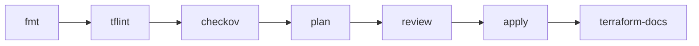

# :lucide-workflow: DevSecOps

A misconfiguration caught in the pipeline costs a code review comment; the same misconfiguration caught in production costs an incident and someone's weekend. This section covers baking verification into the infrastructure pipeline instead of auditing after launch. Four tools carry the weight: format, lint, scan, plan, apply — then regenerate the docs so they describe what actually exists rather than what someone meant to build.

!!! tip "2026 Update"
    The landscape settled this year. tfsec is end-of-life — absorbed by Trivy. Terraform ships under IBM's BSL license, with OpenTofu as the MPL fork. And after the March 2026 TeamPCP supply-chain attack on IaC actions (CVE-2026-33634), every Action reference gets pinned to a commit SHA — @latest is how attacks ship.

---

## :lucide-git-branch: The Pipeline

DevSecOps is not a dashboard, a role, or a meeting. It is a habit: every infrastructure change passes automated gates before it touches the cloud, and documentation refreshes after every apply so it never lies. The stages run in a fixed order because each one assumes the previous stage passed:

Each gate catches a different class of failure:

| Tool | Role | Catches |
|------|------|---------|
| terraform | provisioning engine | state drift, wrong resources |
| tflint | HCL linter | invalid instance types, deprecated syntax, unused declarations |
| checkov | security scanner | public buckets, open security groups, weak encryption, exposed secrets |
| terraform-docs | doc generator | stale module READMEs |

Linting before scanning feeds the scanner valid code. Scanning before plan means the reviewed plan describes code that already passed policy. Documenting after apply captures reality, not intention. Run the stages out of order and you get false confidence — which is worse than no confidence, because nobody goes looking for problems the tools already claimed to have checked.

---

## Reference

**Documentation:**

- :lucide-book: [Terraform Docs](https://developer.hashicorp.com/terraform)
- :lucide-book: [OpenTofu](https://opentofu.org)
- :lucide-book: [Terraform Release Tracker](https://endoflife.date/terraform)

**Related:**

- :lucide-wrench: __Terraform__
- :lucide-wrench: __tflint__
- :lucide-wrench: __checkov__
- :lucide-wrench: __terraform-docs__

---

**Last Updated:** 2026-08-22 | **Vibe Check:** :lucide-globe: **Pipeline Mindset** - four tools, one habit: verify before apply, document after.

**Tags:** iac, devsecops, automation
