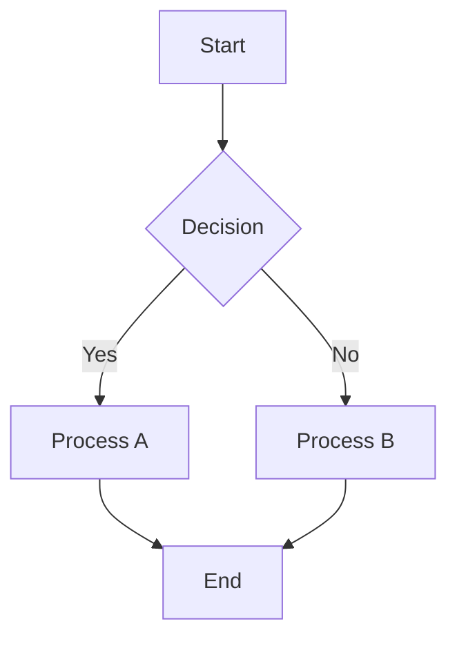
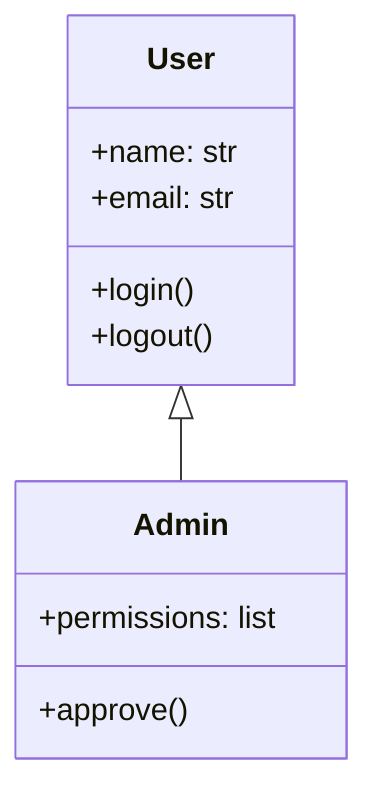
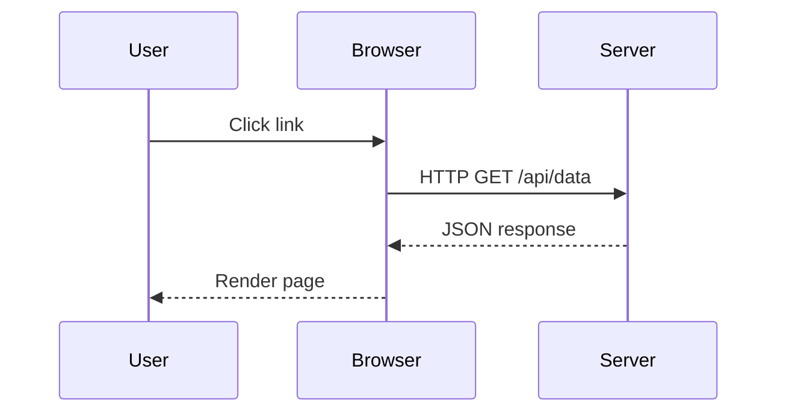

# :fontawesome-solid-wand-magic-sparkles: Material for MkDocs Feature Showcase

**Kitchen sink documentation** — Every feature, pattern, and capability of the Material theme ecosystem. Use this as reference for what's possible, copy/paste examples, or generate new documentation.

Last Updated: 2026-03-22 | Theme: Material 9.7.1

______________________________________________________________________

## :fontawesome-solid-layer-group: Theme Features Overview

This site uses Material for MkDocs 9.7.1 with all major features enabled. Below is the complete reference.

### Navigation Features

=== "Instant Loading (SPA)"

    ```markdown
    # Automatic with Material
    - Pages load without full refresh
    - URL updates smoothly
    - Preserves scroll position
    - Prefetches linked pages on hover
    ```

    When enabled, navigation behaves like a single-page application. Click links and the page transitions smoothly without reloading. Enabled via `navigation.instant.loading` and `navigation.instant.prefetch` in `mkdocs.yml`.

=== "Breadcrumbs"

    Enabled via `navigation.breadcrumbs` feature. Shows the path:

    > Home > Awesome > Showcase

    Helps users understand location and navigate backwards.

=== "Navigation Sections"

    Sections are collapsible/expandable. With `navigation.expand`, all sections expand by default. Try collapsing the left sidebar sections.

=== "Table of Contents (Right Sidebar)"

    The right sidebar shows page sections with `toc.follow` — it highlights the current section as you scroll.

______________________________________________________________________

## :fontawesome-solid-palette: Typography & Colors

### Headings

# Heading 1 — Page title
## Heading 2 — Major section
### Heading 3 — Subsection
#### Heading 4 — Sub-subsection
##### Heading 5 — Minor heading
###### Heading 6 — Smallest heading

### Text Formatting

This is **bold text** and this is *italic text*. You can also use ***bold italic***.

~~Strikethrough text~~ is supported. `Inline code looks like this` with syntax highlighting.

Superscript: H^2^O
Subscript: H~2~O

### Lists

**Unordered lists:**

- Item 1
- Item 2
  - Nested item 2a
  - Nested item 2b
- Item 3

**Ordered lists:**

1. First step
2. Second step
   1. Sub-step 2.1
   2. Sub-step 2.2
3. Third step

**Definition lists:**

`Term`
:   Definition of the term goes here. Can be multiple lines.

`Another term`
:   Explanation of another term.

**Task lists:**

- [x] Completed task
- [ ] Incomplete task
- [x] Another completed task

______________________________________________________________________

## :fontawesome-solid-cube: Code Blocks & Syntax Highlighting

### Basic Code Block

```bash
# Install dependencies
source venv/bin/activate
pip install -r requirements.txt

# Run server
mkdocs serve
```

### Python with Annotations

```python
import requests  # (1)!

def fetch_api(url: str) -> dict:  # (2)!
    """Fetch data from API."""
    response = requests.get(url)
    return response.json()  # (3)!

data = fetch_api("https://api.example.com/data")  # (4)!
```

1. Import the requests library
2. Type hints for clarity
3. Return parsed JSON
4. Call the function

### Code with Line Numbers

```yaml
# mkdocs.yml — Material theme config
site_name: Documentation
theme:
  name: material
  features:
    - navigation.instant.loading
    - search.suggest
plugins:
  - search
  - minify
```

### Multiple Languages Tabbed

=== "Bash"

    ```bash
    curl -X GET https://api.example.com/users
    ```

=== "Python"

    ```python
    import requests
    response = requests.get("https://api.example.com/users")
    users = response.json()
    ```

=== "JavaScript"

    ```javascript
    const response = await fetch("https://api.example.com/users");
    const users = await response.json();
    ```

=== "Go"

    ```go
    resp, err := http.Get("https://api.example.com/users")
    defer resp.Body.Close()
    data := json.NewDecoder(resp.Body)
    ```

### Inline Code

Use backticks for `inline code`. For highlighting within text: `python`, `bash`, `yaml`.

______________________________________________________________________

## :fontawesome-solid-message: Admonitions

Admonitions draw attention to important information. Eleven types available:

!!! note "Note"
    This is a note. Use for additional information that doesn't fit elsewhere.

!!! abstract "Abstract"
    Short summary or overview of the section. Good for TL;DR sections.

!!! info "Info"
    General informational content. Similar to note but slightly different tone.

!!! tip "Tip"
    Helpful advice or best practice. How to do something better.

!!! success "Success"
    Positive outcome, successful operation, or confirmation.

!!! warning "Warning"
    Caution required. Potential issues or things to watch out for.

!!! danger "Danger"
    Critical warning. Do NOT do this or serious consequences may occur.

!!! bug "Bug"
    Known issue or limitation. Workaround may be available.

!!! example "Example"
    Code example or usage demonstration.

!!! question "Question"
    FAQ entry or common question.

!!! quote "Quote"
    Quote from external source.

### Collapsible Admonitions

??? note "Click to expand"
    This note is collapsible. Click the header to expand/collapse.

??? warning "Expandable warning"
    This warning starts closed. Great for side notes that might clutter the page.

??? danger "Nested collapsible with admonition"
    You can nest admonitions inside collapsibles.

    !!! bug "Bug inside collapsible"
        This bug is inside a collapsible admonition.

______________________________________________________________________

## :fontawesome-solid-table: Tables

| Feature | Material | Docusaurus | Jekyll | Status |
|---------|----------|-----------|--------|--------|
| Setup Time | :fontawesome-solid-bolt: 5 min | :fontawesome-solid-hourglass: 15 min | :fontawesome-solid-hourglass: 20 min | :fontawesome-solid-circle-check: |
| Customization | :fontawesome-solid-star: Excellent | :fontawesome-solid-star: Excellent | :fontawesome-solid-star: Good | :fontawesome-solid-circle-check: |
| Performance | :fontawesome-solid-rocket: Fast | :fontawesome-solid-rocket: Fast | :fontawesome-solid-snail: Slow | :fontawesome-solid-circle-check: |
| Learning Curve | :fontawesome-solid-chart-line: Easy | :fontawesome-solid-chart-line: Moderate | :fontawesome-solid-chart-line: Easy | :fontawesome-solid-circle-check: |

**Table with alignment:**

| Left | Center | Right |
|:-----|:------:|------:|
| Aligned left | Centered | Aligned right |
| Git is | Version | Control |

### Data Table from Markdown

```markdown
| Header 1 | Header 2 | Header 3 |
|----------|----------|----------|
| Cell     | Cell     | Cell     |
```

______________________________________________________________________

## :fontawesome-solid-icons: Icons & Emojis

### FontAwesome Icons

Solid icons: :fontawesome-solid-star: :fontawesome-solid-heart: :fontawesome-solid-rocket: :fontawesome-solid-skull: :fontawesome-solid-bug:

Brand icons: :fontawesome-brands-github: :fontawesome-brands-gitlab: :fontawesome-brands-docker: :fontawesome-brands-python: :fontawesome-brands-react:

Regular icons: :fontawesome-regular-star: :fontawesome-regular-heart: :fontawesome-regular-file:

### Icon Collections

| Category | Icons |
|----------|-------|
| Development | :fontawesome-brands-github: :fontawesome-brands-gitlab: :fontawesome-solid-code: :fontawesome-solid-git: |
| Deployment | :fontawesome-solid-rocket: :fontawesome-brands-docker: :fontawesome-solid-server: :fontawesome-solid-cloud: |
| Security | :fontawesome-solid-lock: :fontawesome-solid-key: :fontawesome-solid-shield: :fontawesome-solid-bug: |
| Status | :fontawesome-solid-circle-check: :fontawesome-solid-circle-xmark: :fontawesome-solid-hourglass: :fontawesome-solid-triangle-exclamation: |

______________________________________________________________________

## :fontawesome-solid-link: Links & References

### Internal Links

- [Go to index](index.md)
- [Cloud & DevOps section](cloud/)
- [GitHub API documentation](api/github-rest-api.service.md)

### External Links

- [Material for MkDocs Documentation](https://squidfunk.github.io/mkdocs-material/)
- [MkDocs Official Docs](https://www.mkdocs.org/)
- [Python](https://www.python.org/)

### Automatic Link Detection

Visit https://github.com/cosckoya/cosckoya.github.io or check out https://squidfunk.github.io/mkdocs-material/ for more.

### Anchor Links (Footnotes)

This text has a footnote[^1].

[^1]: This is the footnote content. Can be multiple lines and paragraphs.

Another footnote reference[^2] in the text.

[^2]: Footnotes appear at the bottom of the page and are clickable.

______________________________________________________________________

## :fontawesome-solid-images: Images

### Basic Image

{ width="200" }

### Image with Caption


This is a caption below the image.

### Image Alignment

Left aligned:

{ align="left" width="150" }

Lorem ipsum dolor sit amet, consectetur adipiscing elit. The image floats to the left with text wrapping around it.

Right aligned:

{ align="right" width="150" }

Lorem ipsum dolor sit amet, consectetur adipiscing elit. The image floats to the right with text wrapping around it.

Centered (default):

{ width="150" }

______________________________________________________________________

## :fontawesome-solid-square-up: Abbreviations

The HTML specification is maintained by the W3C.

*[HTML]: Hyper Text Markup Language
*[W3C]: World Wide Web Consortium

Hover over "HTML" or "W3C" to see the abbreviation tooltip.

______________________________________________________________________

## :fontawesome-solid-bars: Horizontal Rules

Text before rule.

---

Text after rule. Use horizontal rules to separate major sections visually.

______________________________________________________________________

## :fontawesome-solid-code-branch: Code Snippets & Includes

Code snippets can be included from external files or inline highlighted sections.

### Inline Snippet Example

```python
# This is inline code - copy/paste ready
def hello_world():
    print("Hello, World!")

if __name__ == "__main__":
    hello_world()
```

### Mermaid Diagrams

Diagrams are rendered via `pymdownx.superfences` with mermaid support:



### Class Diagram



### Sequence Diagram



______________________________________________________________________

## :fontawesome-solid-toggle-on: Tabs & Panels

Tabbed content with persistent state across pages:

=== "Getting Started"

    # Installation

    ```bash
    pip install mkdocs-material
    mkdocs new my-site
    cd my-site
    ```

=== "Configuration"

    # mkdocs.yml

    ```yaml
    site_name: My Site
    theme:
      name: material
    ```

=== "Deployment"

    # Deploy to GitHub Pages

    ```bash
    mkdocs gh-deploy
    ```

### Multiple Platform Tabs

!!! warning "Nested tabs not supported"
    `pymdownx.tabbed` does NOT support nested tabs. Tabs must be flat at the same level.
    Use separate tab groups if you need multiple dimensions.

**Tab group 1 — By OS:**

=== "Linux"

    ```bash
    sudo apt-get install python3-pip
    pip install mkdocs-material
    ```

=== "macOS"

    ```bash
    brew install python3
    pip install mkdocs-material
    ```

=== "Windows"

    ```cmd
    python -m pip install mkdocs-material
    mkdocs serve
    ```

**Tab group 2 — By package manager:**

=== "pip"

    ```bash
    pip install mkdocs-material
    ```

=== "conda"

    ```bash
    conda install mkdocs-material
    ```

=== "poetry"

    ```bash
    poetry add mkdocs-material
    ```

______________________________________________________________________

## :fontawesome-solid-list: Advanced Lists

### Nested Lists with Mixed Content

- **Feature 1**: Description here
  - Sub-feature 1a
    - Detail 1a1
    - Detail 1a2
  - Sub-feature 1b
- **Feature 2**: Another description
  - With code example:
    ```bash
    mkdocs serve
    ```
  - And some text

### Lists with Admonitions

- First item
  !!! note "Note about item"
      This is a note about the first item
- Second item
- Third item with warning
  !!! warning "Be careful"
      Do not skip this step

______________________________________________________________________

## :fontawesome-solid-comments: Comments & Annotations

Comments can be added using HTML comments (they won't be rendered):

<!-- This comment is invisible to users -->

Code can have inline annotations as shown in the "Code with Annotations" section above.

### Keyboard Input

Press ++ctrl+alt+delete++ to reboot.

Use ++cmd+s++ on Mac to save.

______________________________________________________________________

## :fontawesome-solid-strikethrough: Text Decorations

~~Strikethrough~~ text shows what was removed.

<u>Underlined text</u> for emphasis.

*Italic for emphasis*

**Bold for strong emphasis**

***Bold italic for maximum emphasis***

### Mark/Highlight

This is ==highlighted text== using mark extension.

______________________________________________________________________

## :fontawesome-solid-sliders: Content Actions

Pages can have action buttons (edit/view source):

These are controlled by:
```yaml
features:
  - content.action.edit
  - content.action.view
```

Buttons appear in the header (if configured).

______________________________________________________________________

## :fontawesome-solid-book-open: Blockquotes

> This is a simple blockquote.
> It can span multiple lines.
> — Author Name

> This is a longer blockquote with more content.
>
> It has multiple paragraphs and can include other elements.
>
> - Lists
> - Even lists!
>
> And ***formatting***.

______________________________________________________________________

## :fontawesome-solid-calculator: Math & Formulas

!!! warning "Requires additional setup"
    Math rendering requires `pymdownx.arithmatex` extension **plus** MathJax or KaTeX JavaScript.
    Add to `mkdocs.yml`:
    ```yaml
    markdown_extensions:
      - pymdownx.arithmatex:
          generic: true
    extra_javascript:
      - https://unpkg.com/mathjax@3/es5/tex-mml-chtml.js
    ```
    Not enabled by default on this site — examples below are syntax references only.

Inline math syntax: `$E = mc^2$`

Block math syntax:

```
$$
\frac{-b \pm \sqrt{b^2 - 4ac}}{2a}
$$
```

```
$$
\begin{align}
a &= b + c \\
d &= e + f \\
g &= h + i
\end{align}
$$
```

______________________________________________________________________

## :fontawesome-solid-plug: Material Plugins in Action

### Search

Search is built-in via `search` plugin. Try the search box (top right on desktop).

- Powered by client-side indexing
- Supports stemming (running → run)
- Highlights matches
- Shares search results via URL

### Tags

Pages can be tagged for organization:

!!! info "Tags"
    This page is tagged with: `material`, `showcase`, `features`, `markdown`, `theme`

### Minify

HTML, CSS, and JavaScript are minified for smaller file size and faster loading.

### Same Directory

The `same-dir` plugin allows static files (CSS, JS, images) to live alongside markdown in the same directory structure.

### Section Index

With `section-index` plugin, sections with `index.md` files become clickable navigation items.

### Literate Navigation

Navigation is defined in `SUMMARY.md` files (literate navigation) for readability and maintainability.

______________________________________________________________________

## :fontawesome-solid-browser: Responsive Design

This page is fully responsive. Try resizing your browser:

- Desktop: Full navigation sidebar
- Tablet: Collapsible navigation
- Mobile: Navigation drawer

### Mobile Menu

On mobile/tablet, click the hamburger menu (three lines) to toggle the navigation sidebar.

### Breakpoints

Material uses these breakpoints:

- **Small** (< 768px): Mobile
- **Medium** (768-1216px): Tablet
- **Large** (> 1216px): Desktop

______________________________________________________________________

## :fontawesome-solid-palette: Dark & Light Mode

Toggle between dark (Maleficent theme) and light (Deep Purple + Teal) modes using the button in the top right.

Color schemes are defined in `mkdocs.yml`:

```yaml
palette:
  - scheme: slate
    primary: purple
    accent: lime
  - scheme: default
    primary: deep purple
    accent: teal
```

______________________________________________________________________

## :fontawesome-solid-gears: Configuration Reference

### Key Theme Options

```yaml
theme:
  name: material
  logo: path/to/logo.png
  favicon: path/to/favicon.png
  language: en
  direction: ltr  # or rtl for right-to-left
  palette:        # Color schemes
  features:       # Feature toggles
  icon:           # Icon configuration
```

### Essential Features

```yaml
features:
  # Navigation
  - navigation.sections
  - navigation.expand
  - navigation.breadcrumbs
  - navigation.instant.loading
  - navigation.instant.prefetch
  - navigation.instant.progress

  # Search
  - search.suggest
  - search.highlight
  - search.share

  # Content
  - content.code.copy
  - content.code.annotate
  - content.tabs.link
  - toc.follow
```

______________________________________________________________________

## :fontawesome-solid-circle-question: Common Patterns

### "Real Talk" Pattern

!!! note "Real talk:"
    - This is how real things work
    - Practical advice for production
    - What actually matters
    - Skip the marketing speak

### Pro Tips & Gotchas Pattern

!!! tip "Pro Tips"
    - Use feature X for Y reason
    - Combine with Z for best results
    - Consider edge case ABC

!!! danger "Gotchas"
    - Don't do X (it breaks Y)
    - Watch out for Z behavior
    - This is a common mistake

### Three-Tab Quick Hits Pattern

=== ":fontawesome-solid-list-check: Essential"
    Key commands and basic usage
    ```
    command --flag argument
    ```

=== ":fontawesome-solid-bolt: Common Patterns"
    Real-world use cases
    ```
    command pattern example
    ```

=== ":fontawesome-solid-fire: Pro Tips & Gotchas"
    Advanced usage and warnings
    - Tip 1
    - Gotcha 1

______________________________________________________________________

## :fontawesome-solid-rocket: Performance Tips

### 1. Use Instant Loading

Already enabled. Pages load without full refresh.

### 2. Minify Assets

Enabled via `minify` plugin. HTML, CSS, JS are compressed.

### 3. Lazy Load Images

Use markdown image syntax with proper alt text:

```markdown
{ alt="Detailed description" }
```

### 4. Organize Navigation

Use `SUMMARY.md` for clean, maintainable navigation structure.

### 5. Optimize Images

- Compress images before adding to docs
- Use WebP format when possible
- Set width/height attributes

### 6. Cache-Friendly URLs

Material generates static URLs that leverage browser caching.

______________________________________________________________________

## :fontawesome-solid-shield: Accessibility (WCAG 2.1 AA)

This site aims for WCAG 2.1 AA compliance:

- Color contrast: 4.5:1 minimum for text
- Keyboard navigation: Fully functional
- Screen reader support: Semantic HTML
- Focus indicators: Visible on all interactive elements
- Alt text: All images have descriptions

### Keyboard Shortcuts

- ++search++: Focus search
- ++esc++: Close modals
- ++tab++: Navigate elements
- ++enter++: Activate buttons

______________________________________________________________________

## :fontawesome-solid-file: File Organization

```
docs/
├── SUMMARY.md               # Main navigation (literate-nav)
├── index.md                 # Homepage
├── showcase.md              # This file (feature reference)
├── toolbox/                 # CLI tools: asdf, kitty, neovim, tmux, zsh
│   └── SUMMARY.md
├── os/                      # Operating systems: linux, macos, windows
│   └── SUMMARY.md
├── containers/              # Docker (+ Compose), Kubernetes
│   ├── SUMMARY.md
│   └── tools/               # helm, krew, kubectx, dive, popeye
│       └── SUMMARY.md
├── databases/               # Database tooling
│   ├── SUMMARY.md
│   └── tools/               # dbcli, oracledb-cli
│       └── SUMMARY.md
├── cloud/                   # Cloud & DevOps (AWS + merged tools)
│   ├── SUMMARY.md
│   ├── aws.cloud.md
│   └── tools/               # terraform, prowler, checkov, github, azure-devops, snyk, sonarcloud, trivy
│       └── SUMMARY.md
├── api/                     # API references
│   ├── SUMMARY.md
│   └── github-rest-api.service.md
├── code/                    # Programming languages + tools
│   ├── SUMMARY.md
│   └── tools/               # gitleaks, shellcheck, etc.
│       └── SUMMARY.md
├── ai/                      # AI tools: Claude Code, Copilot, Gemini
│   ├── SUMMARY.md
│   └── tools/
│       └── SUMMARY.md
├── 1337/                    # Security / CTF content
│   └── SUMMARY.md
├── awesome/                 # Curated references
│   └── SUMMARY.md
├── templates/               # Doc generation templates
│   ├── README.md
│   ├── tech-reference.template.md
│   └── tool-reference.template.md
└── resources/
    ├── css/
    │   ├── snape.css        # Custom styling (single file, DRY)
    │   └── images.css
    └── img/
        ├── logo.png
        └── favicon.png
```

______________________________________________________________________

## :fontawesome-solid-check: Validation Checklist

When creating new documentation, use this checklist:

- [ ] Page has `title` and `description` in frontmatter
- [ ] All links are relative paths
- [ ] All images have alt text
- [ ] FontAwesome icons used (no plain emojis)
- [ ] Code blocks have language specified
- [ ] Admonitions used appropriately
- [ ] "Real talk" sections for practical advice
- [ ] Pro tips separated from gotchas
- [ ] Tags placed at bottom of page
- [ ] `mkdocs build --strict` passes
- [ ] Tone is cynical/realistic (not aspirational)

______________________________________________________________________

## :fontawesome-solid-lightbulb: Tips for Content Creation

### 1. Use Templates

Start with `tech-reference.template.md` or `tool-reference.template.md` for consistency.

### 2. Three-Tab Structure

Essential → Common Patterns → Pro Tips & Gotchas structure works for most content.

### 3. Practical Examples

Copy-paste code examples that actually work. Include inline comments.

### 4. Honest Tone

Say "this is painful" instead of "this is challenging." Marketing-speak has no place here.

### 5. Link Everything

Internal links help users navigate. Use relative paths.

### 6. Organize with Sections

Use heading hierarchy (h2, h3, h4) to structure content logically.

______________________________________________________________________

## :fontawesome-solid-graduation-cap: Learning Resources

**External Resources:**

- :fontawesome-solid-book: [Material for MkDocs Official Documentation](https://squidfunk.github.io/mkdocs-material/)
- :fontawesome-solid-book: [MkDocs Documentation](https://www.mkdocs.org/)
- :fontawesome-solid-book: [Python-Markdown Extensions](https://python-markdown.github.io/)
- :fontawesome-brands-github: [squidfunk/mkdocs-material](https://github.com/squidfunk/mkdocs-material)

**Related Topics:**

- :fontawesome-solid-code: Markdown syntax and best practices
- :fontawesome-solid-palette: Color theory and accessibility
- :fontawesome-solid-layer-group: Static site generation
- :fontawesome-solid-search: Full-text search optimization

______________________________________________________________________

**Last Updated:** 2026-03-22
**Tags:** material, showcase, features, markdown, theme, documentation
