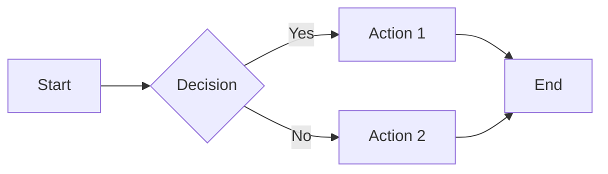

# MkDocs Material Design Best Practices - Research Report

**Research Date:** 2026-01-13
**Purpose:** Find beautiful design examples, card/grid techniques, CSS customization, and modern presentation methods for MkDocs Material documentation

---

## 1. Beautiful MkDocs Material Examples in the Wild

### Real-World Showcase Sites

Based on research, here are exemplary MkDocs Material implementations:

#### **Privacy Guides** (3.8k stars)
- **URL:** https://github.com/privacyguides/privacyguides.org
- **Live Site:** https://www.privacyguides.org
- **Why it's beautiful:** Professional implementation with clean structure, minimal custom CSS (3.7%), focuses on semantic organization and content clarity
- **Approach:** Leverages Material's built-in components rather than extensive customization

#### **MkDocs Material's Own Documentation**
- **URL:** https://squidfunk.github.io/mkdocs-material/
- **Design Techniques:**
  - Parallax-style layered imagery for depth
  - Card-based grid system for features
  - Dynamic color palette system with CSS variables
  - Social proof integration with user testimonials
  - Feature spotlighting sections with imagery
  - Event-driven interactions for engagement tracking

#### **Kubernetes Documentation**
- **URL:** https://kubernetes.io/docs/home/
- **Design Elements:**
  - Hierarchical card-based content organization
  - Action-oriented headings with value propositions
  - Consistent card pattern: heading → subtitle → bullet links → CTA
  - Progressive complexity flow (understand → try → set up → use)
  - Responsive split-pane layout (20/80 sidebar/content)
  - Distinctive brand color (#326ce5) as accent throughout

#### **GitHub Docs**
- **URL:** https://docs.github.com
- **Design Patterns:**
  - Icon-paired categories for visual scanning
  - Multi-column card grids for "Getting started" sections
  - Cards combine title + description + links for preview without clicking
  - Consistent card dimensions for visual predictability
  - Responsive grouping based on user expertise

#### **Microsoft Learn**
- **URL:** https://learn.microsoft.com/
- **Visual Elements:**
  - Modular card system with hero cards and icons
  - SVG icons for product categories
  - Strategic CTA link placement
  - Hierarchical section organization
  - Theme toggle (Light/Dark/High contrast)
  - Credential badging for trust signals

#### **Other Notable Examples**
- **Python Documentation** (https://docs.python.org) - Progressive disclosure model, clean whitespace, semantic structure
- **Spark SQL Internals** (483 stars) - Complex technical content well-organized
- **AWS Nuke** (1.1k stars) - Clean CLI tool documentation
- **Python Blueprint** (706 stars) - Best practices showcase
- **Obsidian Publish MkDocs** (638 stars) - Template for converting notes to sites

---

## 2. Making Links More Attractive in MkDocs Material

### Card Grids - The Ultimate Link Presentation Tool

**Required Configuration:**
```yaml
markdown_extensions:
  - attr_list
  - md_in_html
```

#### **List Syntax - Simple Card Grids**
```html
<div class="grid cards" markdown>

- :material-rocket-launch: __Getting Started__ – Quick introduction to our platform
- :fontawesome-solid-book: __User Guide__ – Comprehensive documentation
- :octicons-code-16: __API Reference__ – Technical specifications
- :simple-github: __GitHub__ – Source code and issues

</div>
```

**Features:**
- Cards "levitate on hover" - automatic hover effects
- Icons from 10,000+ available (Material, FontAwesome, Octicons, Simple Icons)
- Responsive - adapts to viewport (full width on mobile, 3+ columns on desktop)
- Supports Markdown within cards

#### **Block Syntax - Mixed Content Cards**
```html
<div class="grid" markdown>

<div class="card" markdown>
### Feature Title
Description text with **formatting** and [links](url)
</div>

<div class="card" markdown>
!!! tip "Pro Tip"
    You can nest admonitions in cards!
</div>

</div>
```

#### **Generic Grids - For Complex Layouts**
```html
<div class="grid" markdown>

!!! note "Documentation"
    Links to docs

!!! tip "Tutorials"
    Links to tutorials

``` python
# Code blocks work too!
print("Hello")
```

</div>
```

**Use Cases:**
- Index pages with section overviews
- Resource link collections (much better than bullet lists)
- Feature showcases
- Learning path presentations
- Tool comparisons

---

### Buttons - Call-to-Action Links

**Configuration:**
```yaml
markdown_extensions:
  - attr_list
```

**Syntax Examples:**

**Standard Button:**
```markdown
[View Documentation](#){ .md-button }
```

**Primary Button (filled, emphasized):**
```markdown
[Get Started](#){ .md-button .md-button--primary }
```

**Icon Buttons:**
```markdown
[Send :fontawesome-solid-paper-plane:](#){ .md-button }
[GitHub :fontawesome-brands-github:](#){ .md-button .md-button--primary }
```

**Best Practices:**
- Use primary buttons for main CTAs
- Combine with icons for visual appeal
- Great for landing pages and section introductions
- Buttons inherit site's primary and accent colors

---

### Admonitions - Highlighted Link Sections

**Configuration:**
```yaml
markdown_extensions:
  - admonition
  - pymdownx.details
```

**15 Built-in Types:** note, abstract, info, tip, success, question, warning, failure, danger, bug, example, quote

**Usage for Link Presentation:**
```markdown
!!! tip "Quick Links"
    - [Installation Guide](install.md)
    - [Configuration](config.md)
    - [Troubleshooting](troubleshoot.md)

??? info "External Resources"
    - [Official Docs](https://example.com)
    - [Community Forum](https://forum.example.com)
```

**Advanced Features:**
- Collapsible sections (use `???` instead of `!!!`)
- Inline placement (`inline` and `inline end` modifiers)
- Custom titles
- Nesting support
- Each type has distinct icon and color scheme

---

### Content Tabs - Organized Link Groups

**Configuration:**
```yaml
markdown_extensions:
  - pymdownx.superfences
  - pymdownx.tabbed:
      alternate_style: true

theme:
  features:
    - content.tabs.link  # Link tabs across pages
```

**Usage:**
```markdown
=== "Beginner Resources"
    - [Tutorial 1](tutorial1.md)
    - [Getting Started](start.md)
    - [Basic Concepts](basics.md)

=== "Advanced Resources"
    - [Architecture Guide](arch.md)
    - [Performance Tuning](perf.md)
    - [Expert Tips](expert.md)

=== "Tools & Downloads"
    [:fontawesome-brands-github: GitHub](https://github.com){ .md-button }
    [:fontawesome-solid-download: Download](download){ .md-button }
```

**Benefits:**
- Tabs linked across entire site (selection persists)
- Automatic anchor links for sharing
- Clean organization of alternative content
- Works great for categorizing links by audience or purpose

---

### Icons & Emojis - Visual Link Enhancement

**Configuration:**
```yaml
markdown_extensions:
  - attr_list
  - pymdownx.emoji:
      emoji_index: !!python/name:material.extensions.emoji.twemoji
      emoji_generator: !!python/name:material.extensions.emoji.to_svg
```

**Available Icon Sets (10,000+ total):**
- Material Design (Pictogrammers)
- FontAwesome (free tier)
- Octicons (GitHub)
- Simple Icons

**Syntax:**
```markdown
:material-rocket-launch: [Launch Tutorial](tutorial.md)
:fontawesome-brands-github: [GitHub Repository](https://github.com)
:octicons-code-16: [API Docs](api.md)
:simple-docker: [Docker Hub](https://hub.docker.com)
```

**Custom Icon Styling:**
```css
.youtube { color: #EE0F0F; }
```
```markdown
:fontawesome-brands-youtube:{ .youtube } [Watch Tutorial](https://youtube.com)
```

---

## 3. Best Practices for Reference Documentation

### Visual Presentation Techniques

#### **1. Hierarchical Card Organization**
Based on Kubernetes docs pattern:
- Action-oriented headings
- Brief value proposition subtitle
- 3-5 key entry points as bullets
- Clear CTA button at bottom

#### **2. Progressive Disclosure**
From Python docs:
- Multiple entry points for different user levels
- Self-selection based on role (beginner, maintainer, expert)
- No forced linear navigation
- Quick scanning with short descriptions

#### **3. Icon-Paired Categories**
GitHub/Microsoft Learn pattern:
- Visual icons reduce cognitive load
- Consistent card dimensions
- Introductory microcopy prevents context switching
- Role-based rather than alphabetical organization

#### **4. Data Tables with Sorting**
**Configuration:**
```yaml
markdown_extensions:
  - tables
```

**Features:**
- Standard Markdown syntax
- Column alignment (`:---`, `:---:`, `---:`)
- Supports inline code, icons, emojis
- Optional Tablesort library for interactive sorting
- Import from CSV/Excel with mkdocs-table-reader-plugin

**Usage:**
```markdown
| Feature | Description | Link |
|:--------|:------------|:----:|
| Cards | Grid layouts | [:material-arrow-right:](cards.md) |
| Buttons | CTAs | [:material-arrow-right:](buttons.md) |
```

#### **5. Definition Lists for API References**
**Configuration:**
```yaml
markdown_extensions:
  - def_list
```

**Syntax:**
```markdown
`function_name(param1, param2)`
:   Brief description of the function

    **Parameters:**
    - `param1` - First parameter
    - `param2` - Second parameter

    **Returns:** Description of return value
```

#### **6. Task Lists for Feature Status**
**Configuration:**
```yaml
markdown_extensions:
  - pymdownx.tasklist:
      custom_checkbox: true
```

**Usage:**
```markdown
Feature Support:

- [x] Basic authentication
- [x] OAuth2 integration
- [ ] SAML support (coming soon)
- [ ] LDAP integration (planned)
```

---

## 4. CSS Customization Options

### Adding Custom Stylesheets

**Directory Structure:**
```
docs/
├─ stylesheets/
│  └─ extra.css
└─ mkdocs.yml
```

**Configuration:**
```yaml
extra_css:
  - stylesheets/extra.css
```

### Color Customization

#### **Built-in Palettes**
```yaml
theme:
  palette:
    scheme: slate  # or 'default'
    primary: deep purple  # 20 options
    accent: teal  # 15 options
```

**Available Primary Colors:** red, pink, purple, deep purple, indigo, blue, light blue, cyan, teal, green, light green, lime, yellow, amber, orange, deep orange, brown, grey, blue grey, black, white

**Available Accent Colors:** red, pink, purple, deep purple, indigo, blue, light blue, cyan, teal, green, light green, lime, yellow, amber, deep orange

#### **Custom Brand Colors**
```yaml
theme:
  palette:
    primary: custom
    accent: custom
```

**In extra.css:**
```css
:root {
  --md-primary-fg-color: #FF5722;
  --md-primary-fg-color--light: #FF7043;
  --md-primary-fg-color--dark: #E64A19;
  --md-accent-fg-color: #00BCD4;
}
```

#### **Custom Color Schemes**
```css
[data-md-color-scheme="brand"] {
  --md-primary-fg-color: #1976D2;
  --md-primary-bg-color: #FFFFFF;
  --md-accent-fg-color: #FFC107;
}
```

**Then in mkdocs.yml:**
```yaml
theme:
  palette:
    scheme: brand
```

#### **Palette Toggle (Light/Dark)**
```yaml
theme:
  palette:
    - media: "(prefers-color-scheme: light)"
      scheme: default
      primary: indigo
      accent: indigo
      toggle:
        icon: material/brightness-7
        name: Switch to dark mode
    - media: "(prefers-color-scheme: dark)"
      scheme: slate
      primary: blue
      accent: blue
      toggle:
        icon: material/brightness-4
        name: Switch to light mode
```

### Typography Customization

#### **Google Fonts Integration**
```yaml
theme:
  font:
    text: Roboto  # Body text (default)
    code: Roboto Mono  # Code blocks (default)
```

**Weights loaded:** 300, 400, 400i, 700 for text; 400 for code

#### **Custom Fonts (Self-hosted)**
```yaml
theme:
  font: false  # Disable Google Fonts for privacy
```

**In extra.css:**
```css
@font-face {
  font-family: "Custom Font";
  src: url("../fonts/custom-font.woff2") format("woff2");
}

:root {
  --md-text-font: "Custom Font";
  --md-code-font: "JetBrains Mono";
}
```

### Advanced CSS Techniques

#### **Card Grid Styling**
```css
/* Custom card colors */
.md-typeset .grid.cards > div {
  background-color: var(--md-code-bg-color);
  border: 1px solid var(--md-default-fg-color--lightest);
  border-radius: 0.2rem;
}

/* Hover effects */
.md-typeset .grid.cards > div:hover {
  border-color: var(--md-accent-fg-color);
  box-shadow: 0 4px 8px rgba(0,0,0,0.1);
}

/* Custom card padding */
.md-typeset .grid.cards > div {
  padding: 1.5rem;
}
```

#### **Button Styling**
```css
/* Custom button colors */
.md-button {
  background-color: var(--md-primary-fg-color);
  border-radius: 0.3rem;
  transition: all 0.3s ease;
}

.md-button:hover {
  background-color: var(--md-accent-fg-color);
  transform: translateY(-2px);
  box-shadow: 0 4px 8px rgba(0,0,0,0.2);
}

/* Outline button style */
.md-button--outline {
  background-color: transparent;
  border: 2px solid var(--md-primary-fg-color);
  color: var(--md-primary-fg-color);
}
```

#### **Image Alignment (Current Site Implementation)**
```css
/* Already in use at docs/resources/stylesheets/images.css */
img[src*='#left'] {
    float: left;
}
img[src*='#right'] {
    float: right;
}
img[src*='#center'] {
    display: block;
    margin: auto;
}
```

**Usage:**
```markdown


```

#### **Icon Styling**
```css
/* Colored icons */
.icon-github { color: #333; }
.icon-twitter { color: #1DA1F2; }
.icon-linkedin { color: #0077B5; }
.icon-docker { color: #2496ED; }

/* Icon sizes */
.icon-large {
  font-size: 2rem;
}

.icon-xl {
  font-size: 3rem;
}
```

#### **Admonition Customization**
```css
/* Custom admonition colors */
.md-typeset .admonition.resource {
  border-left-color: #00BCD4;
}

.md-typeset .admonition.resource > .admonition-title {
  background-color: rgba(0, 188, 212, 0.1);
}

/* Custom icon for admonition */
.md-typeset .admonition.resource > .admonition-title::before {
  content: "\f0c1"; /* FontAwesome link icon */
  font-family: "Font Awesome 5 Free";
}
```

#### **Table Styling**
```css
/* Striped tables */
.md-typeset table tbody tr:nth-child(odd) {
  background-color: var(--md-code-bg-color);
}

/* Hover effect */
.md-typeset table tbody tr:hover {
  background-color: rgba(var(--md-accent-fg-color), 0.1);
}

/* Compact tables */
.md-typeset .compact-table td,
.md-typeset .compact-table th {
  padding: 0.5rem;
}
```

#### **Grid Layouts for Custom Designs**
```css
/* Two-column layout */
.two-column {
  display: grid;
  grid-template-columns: 1fr 1fr;
  gap: 2rem;
}

/* Three-column layout */
.three-column {
  display: grid;
  grid-template-columns: repeat(3, 1fr);
  gap: 1.5rem;
}

/* Responsive grid */
.responsive-grid {
  display: grid;
  grid-template-columns: repeat(auto-fit, minmax(250px, 1fr));
  gap: 1.5rem;
}

@media screen and (max-width: 768px) {
  .two-column,
  .three-column {
    grid-template-columns: 1fr;
  }
}
```

### Theme Extension via custom_dir

For extensive customization:

```yaml
theme:
  name: material
  custom_dir: overrides
```

**Directory structure:**
```
overrides/
├─ .icons/          # Custom icons
├─ partials/        # Override specific templates
│  ├─ header.html
│  ├─ footer.html
│  └─ copyright.html
└─ main.html        # Base template overrides
```

---

## 5. Additional Visual Enhancement Features

### Diagrams (Mermaid.js Integration)

**Configuration:**
```yaml
markdown_extensions:
  - pymdownx.superfences:
      custom_fences:
        - name: mermaid
          class: mermaid
          format: !!python/name:pymdownx.superfences.fence_code_format
```

**Supported Types:**
- Flowcharts
- Sequence diagrams
- State diagrams
- Class diagrams
- Entity-relationship diagrams
- Pie charts, Gantt charts, Git graphs

**Features:**
- Auto-applies fonts and colors from theme
- Supports light/dark modes
- Works with instant loading

**Example:**
````markdown

````

### Image Enhancement

**Configuration:**
```yaml
markdown_extensions:
  - attr_list
  - md_in_html
```

**Features:**

1. **Lazy Loading:**
```markdown
{ loading=lazy }
```

2. **Alignment:**
```markdown
{ align=left }
{ align=right }
```

3. **Lightbox (requires plugin):**
```bash
pip install mkdocs-glightbox
```
```yaml
plugins:
  - glightbox
```

4. **Captions:**
```html
<figure markdown>
  
  <figcaption>Image caption here</figcaption>
</figure>
```

5. **Theme-Aware Images:**
```markdown


```

### Social Cards

**Configuration:**
```yaml
plugins:
  - social:
      cards_layout: default/variant
```

**Features:**
- Auto-generates preview cards for social sharing
- Multiple layouts (default, accent, invert)
- Customizable colors, fonts, logos
- Self-hosted (no external services)
- Intelligent caching

### Annotations

**Configuration:**
```yaml
markdown_extensions:
  - attr_list
  - md_in_html
  - pymdownx.superfences
```

**Usage:**
```markdown
Lorem ipsum dolor sit amet (1) consectetur adipiscing elit.
{ .annotate }

1. This is an annotation with **markdown support**
```

**Features:**
- Interactive tooltips
- Works in code blocks, admonitions, tabs
- Supports nesting
- Customizable icons (v9.2.0+)

### Header Enhancements

**Auto-hide Header:**
```yaml
theme:
  features:
    - header.autohide
```

**Announcement Bar:**
Override `announce` block in custom template:
```html

  <div class="md-banner">
    <div class="md-banner__inner">
      🎉 New release available! <a href="/release">Learn more</a>
    </div>
  </div>

```

**Dismissible Announcements:**
```yaml
theme:
  features:
    - announce.dismiss
```

### Footer Customization

**Navigation Links:**
```yaml
theme:
  features:
    - navigation.footer
```

**Social Links:**
```yaml
extra:
  social:
    - icon: fontawesome/brands/github
      link: https://github.com/username
    - icon: fontawesome/brands/twitter
      link: https://twitter.com/username
```

**Copyright:**
```yaml
copyright: Copyright &copy; 2024 Your Name
```

### Navigation Features

**Key Features for Better UX:**
```yaml
theme:
  features:
    - navigation.instant        # SPA-like loading
    - navigation.tracking       # URL updates with scroll
    - navigation.tabs           # Top-level tabs
    - navigation.tabs.sticky    # Sticky tabs
    - navigation.sections       # Grouped sidebar
    - navigation.expand         # Auto-expand subsections
    - navigation.indexes        # Section index pages
    - navigation.top            # Back-to-top button
    - toc.follow                # ToC follows scroll
    - toc.integrate             # Integrate ToC in nav
```

### Search Enhancement

**Features:**
```yaml
plugins:
  - search:
      separator: '[\s\-,:!=\[\]()"/]+|(?!\b)(?=[A-Z][a-z])|\.(?!\d)|&[lg]t;'
```

---

## 6. Practical Implementation Examples

### Example 1: Beautiful Resource Links Page

```markdown
# Resources

## Quick Start

<div class="grid cards" markdown>

- :material-rocket-launch: __Getting Started__

    ---

    New to our platform? Start here!

    [:octicons-arrow-right-24: Tutorial](tutorial.md)

- :material-book-open-variant: __Documentation__

    ---

    Complete reference documentation

    [:octicons-arrow-right-24: Read Docs](docs.md)

- :material-help-circle: __FAQ__

    ---

    Common questions answered

    [:octicons-arrow-right-24: View FAQ](faq.md)

- :material-video: __Video Tutorials__

    ---

    Learn by watching

    [:octicons-arrow-right-24: Watch Now](videos.md)

</div>

## Learning Paths

=== "Beginner"

    Perfect for newcomers to the technology

    1. [Introduction](intro.md)
    2. [Basic Concepts](concepts.md)
    3. [Your First Project](first-project.md)
    4. [Common Patterns](patterns.md)

=== "Intermediate"

    For those with basic knowledge

    1. [Advanced Features](advanced.md)
    2. [Best Practices](best-practices.md)
    3. [Performance Optimization](performance.md)
    4. [Troubleshooting](troubleshooting.md)

=== "Expert"

    Deep dives and advanced topics

    1. [Architecture](architecture.md)
    2. [Internals](internals.md)
    3. [Contributing](contributing.md)
    4. [API Reference](api.md)

## External Resources

!!! tip "Community Resources"

    - :fontawesome-brands-github: [GitHub Repository](https://github.com)
    - :fontawesome-brands-discord: [Discord Community](https://discord.com)
    - :fontawesome-brands-stack-overflow: [Stack Overflow](https://stackoverflow.com)

!!! info "Official Links"

    - :fontawesome-solid-globe: [Official Website](https://example.com)
    - :fontawesome-solid-newspaper: [Blog](https://blog.example.com)
    - :fontawesome-solid-file-pdf: [PDF Guide](guide.pdf)

## Tools & Downloads

<div class="grid" markdown>

[:fontawesome-solid-download: Download v2.0](download.md){ .md-button .md-button--primary }

[:fontawesome-brands-docker: Docker Image](docker.md){ .md-button }

[:fontawesome-solid-terminal: CLI Tool](cli.md){ .md-button }

</div>
```

### Example 2: API Reference with Tables

```markdown
# API Reference

## Authentication Methods

| Method | Description | Security Level | Documentation |
|:-------|:------------|:--------------:|:-------------:|
| API Key | Simple key-based auth | :material-check: Low | [:material-arrow-right:](auth/api-key.md) |
| OAuth 2.0 | Industry standard | :material-check-all: High | [:material-arrow-right:](auth/oauth2.md) |
| JWT | Token-based auth | :material-check-all: High | [:material-arrow-right:](auth/jwt.md) |

## Endpoints

### User Management

`GET /api/users`
:   Retrieve a list of users

    **Authentication:** Required
    **Rate Limit:** 100 requests/minute

    [:octicons-arrow-right-24: View Details](endpoints/users/list.md){ .md-button }

`POST /api/users`
:   Create a new user

    **Authentication:** Required (Admin)
    **Rate Limit:** 10 requests/minute

    [:octicons-arrow-right-24: View Details](endpoints/users/create.md){ .md-button }

### Data Operations

<div class="grid" markdown>

!!! example "Read Operations"

    - `GET /api/data` - List all
    - `GET /api/data/{id}` - Get one
    - `GET /api/data/search` - Search

    [:octicons-arrow-right-24: Read Docs](data/read.md)

!!! example "Write Operations"

    - `POST /api/data` - Create
    - `PUT /api/data/{id}` - Update
    - `DELETE /api/data/{id}` - Delete

    [:octicons-arrow-right-24: Write Docs](data/write.md)

</div>
```

### Example 3: Feature Showcase Page

```markdown
# Features

## Core Capabilities

<div class="grid cards" markdown>

- :material-lightning-bolt: __Blazing Fast__

    Built for performance from the ground up. Handle millions of requests per second.

- :material-shield-check: __Secure by Default__

    Enterprise-grade security with automatic encryption and best practices.

- :material-scale-balance: __Highly Scalable__

    Scale horizontally with ease. From prototype to production.

- :material-puzzle: __Extensible__

    Rich plugin ecosystem. Customize and extend as needed.

- :material-code-tags: __Developer Friendly__

    Clean APIs, comprehensive docs, and great DX.

- :material-heart: __Open Source__

    MIT licensed. Community-driven development.

</div>

## What Users Say

!!! quote "Amazing performance!"

    "Switched from our old system and saw 10x improvement in response times."

    — Jane Doe, Lead Engineer @ TechCorp

!!! quote "Easiest integration ever"

    "Setup took 15 minutes. Documentation is crystal clear."

    — John Smith, CTO @ StartupCo

## Ready to Get Started?

<div class="grid" markdown>

[:material-rocket-launch: Quick Start](quickstart.md){ .md-button .md-button--primary }

[:material-book: Read Documentation](docs.md){ .md-button }

[:fontawesome-brands-github: View on GitHub](https://github.com){ .md-button }

</div>
```

---

## 7. Key Takeaways

### Design Principles from Top Sites

1. **Progressive Disclosure** - Don't overwhelm users; provide multiple entry points
2. **Visual Hierarchy** - Use cards, colors, and spacing to guide attention
3. **Consistent Patterns** - Maintain similar card/button styles throughout
4. **Responsive Design** - Mobile-first, scales to desktop beautifully
5. **Icon Support** - Visual indicators reduce cognitive load
6. **Action-Oriented** - Clear CTAs and value propositions
7. **Scannability** - Users should grasp content at a glance

### Instead of Bullet Lists, Use:

✅ **Card Grids** - Visual, organized, hover effects
✅ **Content Tabs** - Categorize by audience/purpose
✅ **Admonitions** - Highlight important link collections
✅ **Buttons** - Strong CTAs for key actions
✅ **Definition Lists** - Great for API/reference docs
✅ **Tables with Icons** - Structured comparison data

❌ **Plain Bullet Lists** - Boring, hard to scan, no visual appeal

### Quick Wins for Better Design

1. **Enable card grids** - Transform boring link lists instantly
2. **Add icons** - Visual markers improve scanning
3. **Use buttons for CTAs** - Draw attention to key actions
4. **Implement tabs** - Organize content by audience
5. **Custom colors** - Match your brand
6. **Better typography** - Choose readable fonts
7. **Add diagrams** - Visual learning aids
8. **Enable social cards** - Better sharing previews

### CSS Customization Priority

**Must Have:**
1. Custom color palette matching brand
2. Button hover effects
3. Card styling enhancements
4. Icon color coding
5. Responsive grid utilities

**Nice to Have:**
1. Custom fonts
2. Admonition variants
3. Table striping
4. Animation effects
5. Custom layout grids

---

## 8. Implementation Checklist

### Phase 1: Foundation
- [ ] Enable attr_list and md_in_html extensions
- [ ] Enable pymdownx.emoji for icons
- [ ] Configure custom color palette
- [ ] Add custom stylesheet (extra.css)
- [ ] Set up proper font stack

### Phase 2: Component Library
- [ ] Create card grid examples
- [ ] Design button styles
- [ ] Set up admonition types
- [ ] Configure content tabs
- [ ] Add icon library

### Phase 3: Content Migration
- [ ] Convert bullet list links to cards
- [ ] Add icons to all links
- [ ] Implement tabs for multi-audience content
- [ ] Create feature showcase pages
- [ ] Build visual API reference

### Phase 4: Polish
- [ ] Add hover effects
- [ ] Implement responsive grids
- [ ] Create custom admonitions
- [ ] Add diagrams where helpful
- [ ] Enable social cards
- [ ] Test on mobile devices

---

## 9. Recommended Tools & Plugins

### Essential
- **mkdocs-material** - Base theme
- **mkdocs-glightbox** - Image lightbox
- **pymdownx extensions** - Enhanced markdown

### Optional but Useful
- **mkdocs-minify-plugin** - Optimize output
- **mkdocs-git-revision-date-localized-plugin** - Show update dates
- **mkdocs-table-reader-plugin** - Import CSV/Excel
- **mkdocs-awesome-pages-plugin** - Better nav control

---

## 10. Resources & References

### Official Documentation
- [MkDocs Material Documentation](https://squidfunk.github.io/mkdocs-material/)
- [MkDocs Material Reference](https://squidfunk.github.io/mkdocs-material/reference/)
- [MkDocs Material Setup](https://squidfunk.github.io/mkdocs-material/setup/)

### Icon Resources
- [Material Design Icons](https://pictogrammers.com/library/mdi/)
- [FontAwesome Icons](https://fontawesome.com/icons)
- [Simple Icons](https://simpleicons.org/)
- [Octicons](https://primer.style/octicons/)

### Inspiration
- [Privacy Guides](https://www.privacyguides.org) - Clean, professional
- [Kubernetes Docs](https://kubernetes.io/docs/) - Card-based organization
- [Microsoft Learn](https://learn.microsoft.com/) - Icon-driven navigation
- [GitHub Docs](https://docs.github.com) - Grid layouts

### Color Tools
- [Material Design Color Tool](https://material.io/resources/color/)
- [Coolors](https://coolors.co/) - Palette generator
- [Adobe Color](https://color.adobe.com/) - Color schemes

### Typography
- [Google Fonts](https://fonts.google.com/)
- [Font Pair](https://fontpair.co/) - Font combinations
- [Type Scale](https://type-scale.com/) - Typography calculator

---

**End of Research Report**

*This research provides actionable techniques for transforming standard documentation into visually appealing, modern, and user-friendly reference materials using MkDocs Material.*
